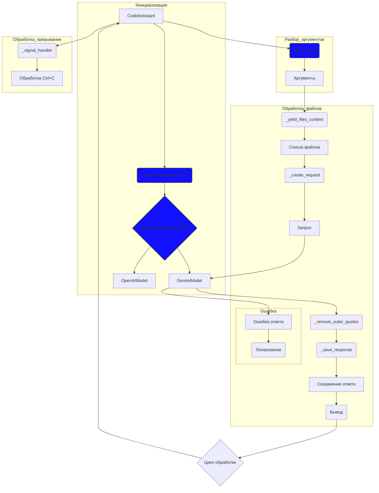

## Анализ кода `code_assistant.mmd`

### <алгоритм>
1. **Инициализация**:
   - Создается экземпляр `CodeAssistant`.
   - Загружается конфигурация приложения. Например, считываются параметры из файла или переменных окружения.
   - Инициализируются модели: `GeminiModel` и `OpenAIModel`.
    - **Пример**:
      - `A` - Объект `CodeAssistant`.
      - `B` - Загружает настройки из `config.yaml` или подобного.
      - `C` - Инициализирует экземпляры `GeminiModel` и `OpenAIModel`.

2. **Разбор аргументов**:
   - Метод `parse_args` обрабатывает аргументы командной строки, которые переданы пользователем.
   - Полученные аргументы сохраняются в переменную (объект) `Аргументы`.
    - **Пример**:
      - `F` - Метод, который анализирует `sys.argv`.
      - `G` - Содержит, например, путь к файлу, параметры запроса и другие данные, введенные пользователем.

3. **Обработка файлов**:
   -  Функция `_yield_files_content` генерирует содержимое файлов (текст) из списка файлов, полученного из аргументов.
   - Функция `_create_request` формирует запрос на основе содержимого файла и аргументов.
    - Запрос отправляется в модель `GeminiModel` (или `OpenAIModel` в зависимости от конфигурации).
   - Функция `_remove_outer_quotes` удаляет внешние кавычки из ответа модели.
   - Ответ модели сохраняется с помощью `_save_response` в файл или выводится на экран.
   - Результат выводится в консоль.
    - **Пример**:
        - `H` -  Проходит по файлам, читает их содержимое.
        - `I` - Список путей к файлам, которые нужно обработать.
        - `J` -  Генерирует запрос с инструкцией и содержимым файла.
        - `K` -  Строка, которую отправляем в модель.
        - `L` - Экземпляр `GeminiModel`.
        - `M` -  Очищает ответ от кавычек.
        - `N` - Сохраняет ответ в файл или выводит в консоль.
        - `O` -  Сохраненный или выведенный результат.
        - `P` -  Показывает результат пользователю.

4. **Обработка ошибок**:
  - Если при запросе к модели `GeminiModel` возникает ошибка, то эта ошибка логируется.
    - **Пример**:
      - `Q` - Объект исключения или сообщения об ошибке от модели.
      - `R` - Метод записи ошибки в файл журнала.

5. **Обработка прерывания**:
   - Функция `_signal_handler` обрабатывает сигнал `Ctrl+C` и обеспечивает корректное завершение программы.
   -  **Пример**:
        - `S` - Функция, которая реагирует на `Ctrl+C`.
        - `T` -  Завершение цикла обработки.
6. **Цикл обработки**:
    - Программа может работать в цикле, обрабатывая запросы один за другим.

### <mermaid>

### <объяснение>
**Импорты:**
- Данный код не содержит явных импортов. Предполагается, что все необходимые модули (`GeminiModel`, `OpenAIModel`, и функции для работы с файлами, аргументами, логгированием, сигналами) находятся в том же пакете `src.endpoints.hypo69.code_assistant` или импортируются внутри `CodeAssistant`.

**Классы:**
- `CodeAssistant`: Это основной класс, который управляет всем процессом. 
  - **Атрибуты**: Скорее всего, он содержит атрибуты для хранения конфигурации, моделей, аргументов командной строки.
  - **Методы**: 
      - `parse_args()`: Разбирает аргументы командной строки.
      - `_yield_files_content()`:  Генерирует содержимое файлов.
      - `_create_request()`: Формирует запрос к модели.
      - `_remove_outer_quotes()`: Удаляет кавычки из ответа модели.
      - `_save_response()`: Сохраняет или выводит ответ.
      - `_signal_handler()`: Обрабатывает прерывание (`Ctrl+C`).
      - Возможно другие методы для настройки, логирования и управления моделями.
- `GeminiModel`, `OpenAIModel`: Это классы, которые представляют интерфейсы к соответствующим моделям. Они содержат методы для отправки запросов и получения ответов.

**Функции:**
- `parse_args()`:
  - **Аргументы**: Аргументы командной строки (обычно `sys.argv`).
  - **Возвращаемое значение**: Объект, содержащий разобранные аргументы.
  - **Назначение**: Разбирает аргументы, переданные при запуске программы, для определения файлов для обработки, типа модели и других параметров.
  - **Пример**: `python code_assistant.py --model gemini --file file1.txt file2.txt`
- `_yield_files_content()`:
  - **Аргументы**: Список путей к файлам.
  - **Возвращаемое значение**: Генератор, возвращающий содержимое файлов по одному.
  - **Назначение**: Читает содержимое указанных файлов.
  - **Пример**: `for content in _yield_files_content(["file1.txt", "file2.txt"]): print(content)`
- `_create_request()`:
  - **Аргументы**: Содержимое файла, разобранные аргументы.
  - **Возвращаемое значение**: Строка - запрос для отправки в модель.
  - **Назначение**: Формирует текстовый запрос на основе содержимого файла и параметров запроса.
  - **Пример**: Создает запрос с инструкцией, например "Напиши краткое описание файла:\n" + `content`.
- `_remove_outer_quotes()`:
  - **Аргументы**: Строка ответа от модели.
  - **Возвращаемое значение**: Строка с удаленными кавычками.
  - **Назначение**: Очищает ответ модели от лишних кавычек, для того чтобы вывод был чище.
  - **Пример**: `_remove_outer_quotes('"Привет!"')` вернет `Привет!`.
- `_save_response()`:
  - **Аргументы**: Ответ модели, аргументы командной строки.
  - **Возвращаемое значение**: Нет.
  - **Назначение**: Сохраняет ответ модели в файл или выводит его в консоль.
- `_signal_handler()`:
    - **Аргументы**: Сигнальный номер (например, `signal.SIGINT`).
    - **Возвращаемое значение**: Нет.
    - **Назначение**: Обрабатывает сигнал прерывания (обычно вызываемый `Ctrl+C`) и корректно завершает работу программы.

**Переменные:**
- `Аргументы`: Объект, хранящий разобранные аргументы командной строки. Содержит информацию о файлах для обработки, выбранной модели, параметрах запроса и т.д.
- `Список файлов`: Список путей к файлам, которые нужно обработать.
- `Запрос`: Текстовый запрос, который отправляется в модель.
- `Ответ`: Ответ от модели `GeminiModel` или `OpenAIModel`.
- `Сохраненный ответ`: Результат сохранения или вывода ответа.
- Все остальные переменные, как правило, являются локальными переменными внутри функций или методах, которые используются для временного хранения данных.

**Потенциальные ошибки и области улучшения:**
- **Обработка исключений:** Код предполагает наличие блока обработки ошибок, но детали не показаны. Важно обрабатывать исключения на каждом этапе, включая загрузку файлов, отправку запросов, обработку ответов.
- **Выбор модели:** Код показывает использование двух моделей (`GeminiModel`, `OpenAIModel`), но не раскрывает логику их выбора. Необходимо добавить механизм для выбора модели, например, на основе аргументов командной строки.
- **Логирование:** Логирование ошибок должно быть подробным и настраиваемым, включая время, место ошибки, и т.д.
- **Модульность**: Код можно улучшить, разделив его на более мелкие модули, для того, чтобы сделать его более читаемым.
- **Асинхронность**: При работе с большим количеством файлов или долгих запросов к моделям можно использовать асинхронное программирование.

**Взаимосвязь с другими частями проекта:**
- Данный код является частью проекта `src.endpoints.hypo69.code_assistant`, что говорит о его возможной интеграции с другими частями проекта.
- Вероятно, `GeminiModel` и `OpenAIModel` являются частью более общего пакета или проекта, предоставляющего интерфейсы для различных моделей.
- Механизм загрузки конфигурации может взаимодействовать с другими модулями для настройки приложения.
- `_signal_handler()` может взаимодействовать с другими модулями для корректного завершения работы других частей проекта.