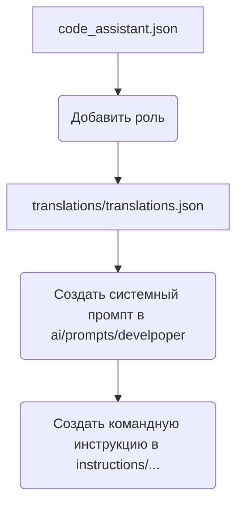

# Анализ кода create_role.mmd

**1. <input code>**

```%% порядок действий для создания новой роли
graph TD
    A[Файл `code_assistant.json`] --> B[Добавить роль в список ролей]
    B --> C[Добавить роль в файл переводов `translations/translations.json`]
    C --> D[Создать системный промпт в `ai/prompts/develpoper`]
    D --> E[Создать командную инструкцию в `instructions/...`]

    %% Настройка стилей блоков
    style A width: 300px
    style B width: 300px
    style C width: 300px
    style D width: 300px
    style E width: 300px
```

**2. <algorithm>**

Этот код представляет собой блок-схему, описывающую последовательность действий для создания новой роли в системе. Алгоритм выглядит следующим образом:

1. **Шаг A:**  Получение данных о роли из файла `code_assistant.json`. (Пример: `{ "role_name": "new_role" }`)
2. **Шаг B:** Добавление новой роли в список ролей в файле `code_assistant.json`. (Пример: Список ролей дополняется записью "new_role")
3. **Шаг C:** Добавление новой роли и соответствующего перевода в файл `translations/translations.json`. (Пример: Добавляются строки для перевода названия новой роли на разные языки).
4. **Шаг D:** Создание системного промпта для новой роли в директории `ai/prompts/develpoper`. (Пример: Создание файла `new_role_prompt.txt` с текстом промпта).
5. **Шаг E:** Создание командной инструкции для работы с новой ролью в директории `instructions/...` (Пример: Создание файла `new_role_instruction.txt` с инструкциями).

**3. <mermaid>**



**4. <explanation>**

* **Импорты:**  В данном коде отсутствуют импорты.  Код представляет собой описание процесса, а не код программы на языке программирования.  Это  MMD (Mermaid Markdown Diagram) описание последовательности действий.
* **Классы:** Нет классов.
* **Функции:** Нет функций.
* **Переменные:** Нет переменных.
* **Возможные ошибки или области для улучшений:**  Описание не содержит кода программы, поэтому не может быть ошибок синтаксиса. Но описание должно быть более подробным, что бы пояснить, как данные роли будут обрабатываться другими частями приложения, какие поля будут добавлены в `code_assistant.json` и `translations/translations.json`, и что конкретно содержится в файлах промптов и инструкций.  Полезно было бы уточнить типы данных в `code_assistant.json` и `translations/translations.json`.
* **Взаимосвязи с другими частями проекта:**  Описание указывает на взаимодействие с файлами `code_assistant.json`, `translations/translations.json`, `ai/prompts/develpoper`, и `instructions/...`.  Это указывает на то, что  процесс создания новой роли влияет на структуру и содержание этих файлов. В дальнейшем необходимо будет описать, *как* эти файлы взаимодействуют,  например, как измененный `code_assistant.json` будет использоваться другими частями приложения.

**Вывод:**

Код представляет собой описание процесса создания новой роли, а не код программы. Он показывает последовательность шагов, но не детали реализации каждого шага, не описывает, как данные из этих файлов будут использованы дальше. Для полноценного анализа необходимо больше контекста о структуре файлов и логике их использования.