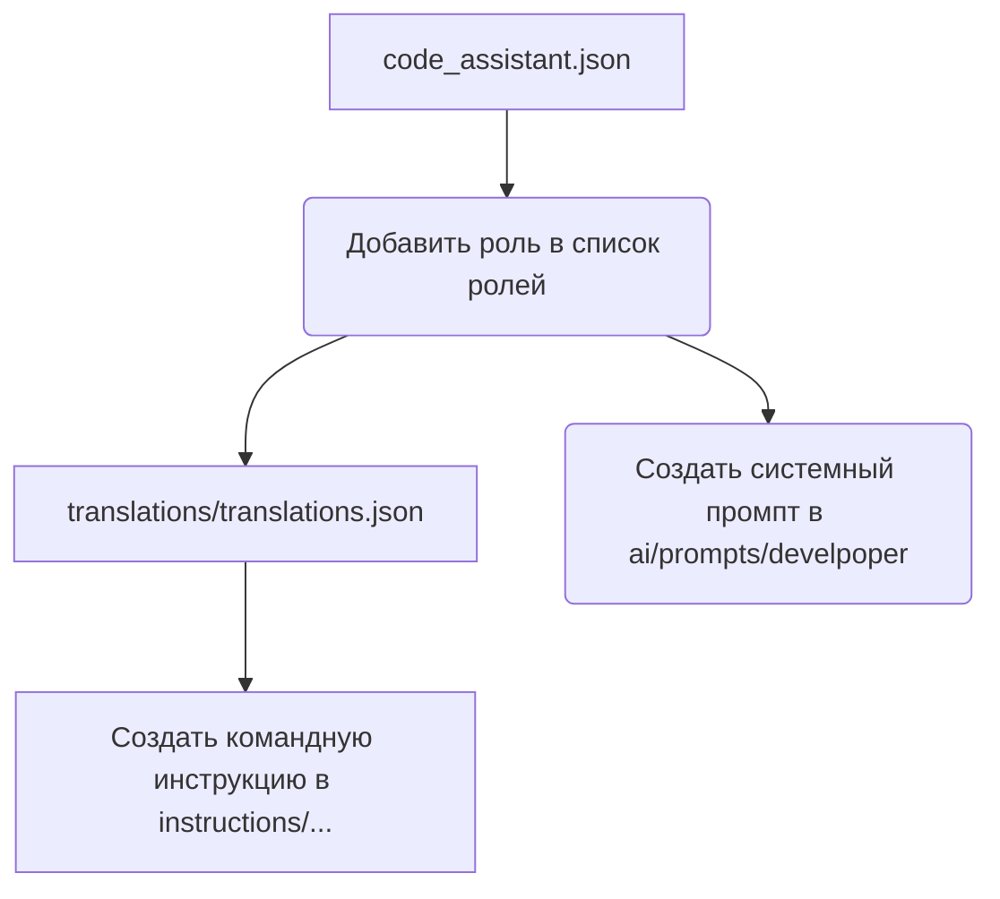

```MD
# Анализ кода create_role.mmd

**1. <input code>**

```%% порядок действий для создания новой роли
graph TD
    A[Файл `code_assistant.json`] --> B[Добавить роль в список ролей]
    B --> C[Добавить роль в файл переводов `translations/translations.json`]
    C --> D[Создать системный промпт в `ai/prompts/develpoper`]
    D --> E[Создать командную инструкцию в `instructions/...`]

    %% Настройка стилей блоков
    style A width: 300px
    style B width: 300px
    style C width: 300px
    style D width: 300px
    style E width: 300px
```

**2. <algorithm>**

Алгоритм описывает последовательность действий для создания новой роли в системе.  Он представлен в виде блок-схемы, демонстрирующей порядок выполнения операций.

* **Шаг 1:** Начинается с файла `code_assistant.json`.
* **Шаг 2:** Добавляется новая роль в список ролей в `code_assistant.json`.
* **Шаг 3:** Добавляется перевод этой роли в файл `translations/translations.json`.
* **Шаг 4:** Создается системный промпт для этой роли в каталоге `ai/prompts/develpoper`.
* **Шаг 5:** Создается командная инструкция для этой роли в каталоге `instructions/...`.


**Пример:**

При добавлении новой роли "developer", эти шаги будут выполнены последовательно:  В файле `code_assistant.json` добавляется запись о роли "developer", затем перевод "developer" записывается в `translations/translations.json`, создается промпт для разработчика в `ai/prompts/develpoper`, и, наконец, соответствующая командная инструкция создается в `instructions/...`.


**3. <mermaid>**



**Объяснение к диаграмме:**  Диаграмма отображает последовательные шаги.  `code_assistant.json` - источник данных для остальных шагов.  Зависимости в данном коде задаются только как последовательность.

**4. <explanation>**

* **Импорты**: В данном коде нет импортов, это текстовая диаграмма, описывающая алгоритм действий, а не программный код.
* **Классы**: Нет классов.
* **Функции**: Нет функций.
* **Переменные**: Нет переменных.
* **Возможные ошибки или области для улучшений**:  Отсутствует описание формата файлов (`code_assistant.json`, `translations/translations.json`, `ai/prompts/develpoper`, `instructions/...`), что может усложнить автоматизацию. Отсутствует указание инструментов, которые будут использоваться для выполнения этих операций. Необходимо более подробно указать, как происходит добавление в эти файлы.

**Цепочка взаимосвязей с другими частями проекта:**

Код описывает процесс создания новой роли в системе. Этот процесс, очевидно, связан с системами обработки запросов, хранением данных и генерацией ответов в рамках проекта, так как для каждой роли нужно создать системный промпт, влияющий на работу AI.  Подразумевается, что последующие шаги (например, реализация роли) зависят от созданных элементов.