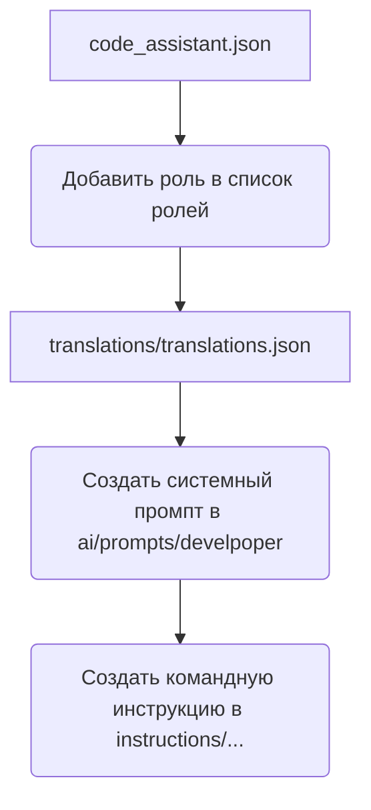

# Анализ кода create_role.mmd

**1. <input code>**

```
%% порядок действий для создания новой роли
graph TD
    A[Файл `code_assistant.json`] --> B[Добавить роль в список ролей]
    B --> C[Добавить роль в файл переводов `translations/translations.json`]
    C --> D[Создать системный промпт в `ai/prompts/develpoper`]
    D --> E[Создать командную инструкцию в `instructions/...`]

    %% Настройка стилей блоков
    style A width: 300px
    style B width: 300px
    style C width: 300px
    style D width: 300px
    style E width: 300px
```

**2. <algorithm>**

Этот код представляет собой блок-схему, описывающую последовательность действий для создания новой роли.  Алгоритм состоит из следующих шагов:

1. **Начало:** Начинается с файла `code_assistant.json`.
2. **Добавление роли в список ролей:** В файл `code_assistant.json` добавляется информация о новой роли.  Пример: добавляется ключ, содержащий данные о роли (название, описание, права).
3. **Добавление в файл переводов:** В файл `translations/translations.json` добавляются переводы для этой роли.  Например, переводы сообщений, которые будут отображаться пользователю в зависимости от роли.
4. **Создание системного промпта:** В директории `ai/prompts/develpoper` создаётся системный промпт (часть инструкции для ИИ), связанный с этой новой ролью. Пример: описание задач, которые должна выполнять эта роль.
5. **Создание командной инструкции:** В директории `instructions/...` создаётся командная инструкция, описывающая действия, которые пользователь должен выполнить с использованием данной роли. Пример: команды для работы с системой.
6. **Конец:** Процесс завершается.

**Пример данных:**

Предположим, мы создаём роль "Администратор".

- `code_assistant.json`: Добавляется запись `{"roles": [{"name": "Администратор", "permissions": ["create_users", "edit_settings"]}]}`.
- `translations/translations.json`: Добавляется перевод "Администратор" на разные языки.
- `ai/prompts/develpoper`: Создание промпта, который задаёт системные инструкции для ИИ при выполнении действий администратора.
- `instructions/...`: Создание документации для пользователя, описывающей доступные команды для роли "Администратор".

**3. <mermaid>**



**4. <explanation>**

* **Импорты:** Нет импортов в данном коде, это блок-схема.
* **Классы:** Нет классов.
* **Функции:** Нет функций.
* **Переменные:** Нет переменных.
* **Возможные ошибки или улучшения:**  Схема не содержит реализации, только описание процесса. Для практической реализации потребуется разработать конкретные функции для выполнения каждого шага (например, функцию для добавления роли в `code_assistant.json`).  Также нет указания на типы данных для каждой записи в json-файлах.
* **Взаимосвязи с другими частями проекта:** Блок-схема показывает взаимосвязи между файлами проекта (`code_assistant.json`, `translations/translations.json`, `ai/prompts/develpoper`, `instructions/...`). Это показывает, что создание новой роли в системе потребует изменения в нескольких местах.  Например, изменения в `code_assistant.json` должны сопровождаться изменениями в `translations` и `prompts`.  Схема указывает на то, что эти файлы взаимодействуют при добавлении новой роли.


**Выводы:**

Код представляет собой схему последовательности действий для создания новой роли в системе. Для практической реализации необходима детализация каждого шага, в частности, функций или методов для взаимодействия с JSON-файлами и создания файлов.  Необходимо определить типы данных, которые будут храниться в файлах конфигурации, что улучшит структуру данных и позволит избежать ошибок.