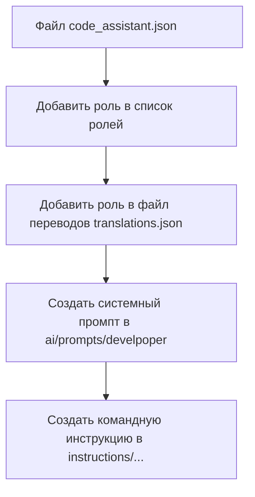

# Анализ кода для создания новой роли

## <алгоритм>

1.  **Начало**: Процесс начинается с редактирования файла `code_assistant.json`. Этот файл, вероятно, содержит общую конфигурацию и список доступных ролей.
    *   _Пример:_ Файл `code_assistant.json` содержит JSON-массив, в котором каждый элемент представляет собой роль с набором атрибутов, таких как `id`, `name`, `description` и т.д.  Нужно добавить новую запись в этот массив.

2.  **Добавление роли в список ролей**: Новая роль добавляется в список ролей, представленный в `code_assistant.json`.
    *   _Пример:_ В `code_assistant.json` добавляется новая запись с идентификатором, названием, описанием и другими необходимыми атрибутами для новой роли. Например, `{"id": "new_role_id", "name": "New Role", "description": "Описание новой роли"}`.

3.  **Добавление роли в файл переводов**: Новая роль также добавляется в файл `translations/translations.json`. Это нужно для поддержки мультиязычности и предоставления пользовательского интерфейса на разных языках.
    *   _Пример:_ В `translations/translations.json` добавляется запись с текстовым представлением названия новой роли для разных языков. Например: `"new_role_id": {"en": "New Role", "ru": "Новая Роль"}`.

4.  **Создание системного промпта**: Создается системный промпт в каталоге `ai/prompts/develpoper`. Этот промпт задает контекст и инструкции для языковой модели при использовании новой роли.
    *   _Пример:_ Создается файл `new_role_prompt.txt` в каталоге `ai/prompts/develpoper`, содержащий текст для системного промпта. Этот промпт описывает поведение, которое должна демонстрировать модель при использовании новой роли.

5.  **Создание командной инструкции**: Создается командная инструкция в каталоге `instructions/...`. Эта инструкция содержит конкретные указания для модели, как она должна выполнять задачи в контексте новой роли.
    *   _Пример:_ Создается файл `new_role_instruction.txt` в каталоге `instructions/...`, содержащий конкретные команды, которые модель должна выполнять при использовании новой роли.

## <mermaid>

**Объяснение:**

*   `code_assistant_json`:  Представляет файл `code_assistant.json`, содержащий конфигурацию и список ролей. Этот файл является отправной точкой для добавления новой роли.
*   `add_role_to_list`:  Представляет процесс добавления новой роли в список ролей, содержащийся в `code_assistant.json`.
*  `translations_json`: Представляет добавление перевода новой роли в файл `translations/translations.json`, который управляет мультиязычностью приложения.
*   `create_system_prompt`:  Представляет процесс создания системного промпта в каталоге `ai/prompts/develpoper`, который определяет контекст и поведение языковой модели для новой роли.
*   `create_command_instruction`:  Представляет процесс создания командной инструкции в каталоге `instructions/...`, которая определяет конкретные задачи, которые языковая модель должна выполнять при использовании новой роли.

## <объяснение>

**Импорты:**

В представленном коде нет явных импортов, так как это не код, а диаграмма, описывающая процесс. Однако, неявно подразумевается, что для работы с файлами (`code_assistant.json`, `translations/translations.json`, файлы промптов и инструкций), могут использоваться различные модули ввода/вывода (например, `json` для JSON файлов, `os` для работы с файловой системой), а также модули для работы с системой переводов, если таковые имеются.

**Классы:**

В данном контексте, классы не используются напрямую, поскольку процесс описан на уровне потока данных. Но в реальном коде, который будет реализовывать этот процесс, могут использоваться классы для представления ролей, промптов, инструкций и т.д., что будет способствовать лучшей структуре кода и возможности повторного использования.

**Функции:**

В данном контексте нет явного кода с функциями, однако, можно представить, что этот процесс будет реализован через ряд функций, которые будут отвечать за:
1.  `add_role_to_config(role_data, config_path)`: Добавляет данные роли в конфигурационный файл `code_assistant.json`.
2.  `add_translation(role_id, translations, translations_path)`: Добавляет переводы для роли в файл `translations/translations.json`.
3.  `create_system_prompt(prompt_text, prompt_path)`: Создает файл системного промпта в `ai/prompts/develpoper`.
4.  `create_instruction(instruction_text, instruction_path)`: Создает файл с командной инструкцией в `instructions/...`.

**Переменные:**

Основные переменные, которые подразумеваются в процессе:

*   `role_data`: Данные новой роли (например, словарь с информацией о роли).
*   `config_path`: Путь к файлу `code_assistant.json`.
*   `translations`: Словарь с переводами для разных языков.
*   `translations_path`: Путь к файлу `translations/translations.json`.
*   `prompt_text`: Текст системного промпта.
*   `prompt_path`: Путь к каталогу `ai/prompts/develpoper`, где хранятся промпты.
*   `instruction_text`: Текст командной инструкции.
*   `instruction_path`: Путь к каталогу `instructions/...`, где хранятся инструкции.

**Потенциальные ошибки и области для улучшения:**

*   **Отсутствие валидации**: При добавлении ролей в список и файл переводов, может возникнуть проблема из-за недостаточной валидации входных данных. Валидация необходима для предотвращения ошибок.
*   **Обработка ошибок**: Не предусмотрена обработка ошибок при записи в файлы или при создании новых файлов.
*   **Дублирование ролей**: Не предусмотрена проверка на наличие роли с таким же идентификатором.
*   **Ручная работа**: Большинство действий, представленных в блок-схеме, могут быть автоматизированы с помощью скриптов.
*   **Неоднородность инструкций**: Каталог `instructions/...` может быть слишком общим и стоит продумать более четкую структуру для хранения инструкций.

**Цепочка взаимосвязей с другими частями проекта:**

*   **Интеграция с UI**: Роли, добавленные в `code_assistant.json` и `translations/translations.json` будут использоваться в пользовательском интерфейсе, предоставляя возможность пользователю выбирать и использовать созданные роли.
*   **Языковая модель**: Системные промпты и инструкции, созданные на шагах 3 и 4, будут использоваться языковой моделью для выполнения запросов с учетом контекста выбранной роли.
*   **Файловая система**: Все операции по чтению и записи файлов будут использовать модули для работы с файловой системой.

В заключении, представленный код описывает логический процесс добавления новой роли в систему. Это важный этап для расширения функциональности системы. Однако необходимо учесть возможные недостатки и продумать реализацию автоматизации этого процесса.