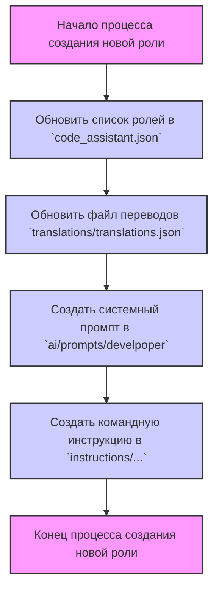

## АНАЛИЗ КОДА

### 1. <алгоритм>

**Блок-схема процесса создания новой роли:**

1. **`A[Файл code_assistant.json]`**:
   - **Описание**: Начальный шаг. Предполагается, что в файле `code_assistant.json` хранится информация о доступных ролях.
   - **Пример**: `code_assistant.json` может содержать JSON-объект с массивом ролей, где каждая роль имеет уникальное имя и описание.
   - **Поток данных**: Входная точка, откуда начинается процесс добавления новой роли.

2. **`B[Добавить роль в список ролей]`**:
   - **Описание**: На этом этапе новая роль добавляется в список ролей, хранящийся, вероятно, в `code_assistant.json`.
   - **Пример**: В `code_assistant.json` появляется новый элемент в массиве `roles` (например, `{ "name": "new_role", "description": "Описание новой роли" }`).
   - **Поток данных**: Данные о новой роли (имя, описание) передаются в файл `code_assistant.json`.

3. **`C[Добавить роль в файл переводов translations/translations.json]`**:
   - **Описание**: На этом шаге добавляются переводы для имени новой роли, вероятно, для поддержки нескольких языков.
   - **Пример**: В `translations/translations.json` добавляется ключ с именем новой роли, которому соответствуют переводы на разных языках. Например, `{ "new_role": { "en": "New Role", "ru": "Новая Роль" } }`.
   - **Поток данных**: Данные об имени новой роли и ее переводах передаются в файл `translations/translations.json`.

4. **`D[Создать системный промпт в ai/prompts/develpoper]`**:
   - **Описание**: Создаётся файл с системным промптом для новой роли.
   - **Пример**: Создается файл `ai/prompts/develpoper/new_role.txt`, который содержит текст, описывающий поведение ИИ для этой роли.
   - **Поток данных**: Текст системного промпта передается в файл `ai/prompts/develpoper/new_role.txt`.

5. **`E[Создать командную инструкцию в instructions/...]`**:
   - **Описание**: Создаётся файл с инструкциями для использования новой роли.
   - **Пример**: Создается файл `instructions/new_role.md`, который содержит описание команды для вызова этой роли и ее параметров.
   - **Поток данных**: Инструкция для команды передается в файл `instructions/new_role.md`.

### 2. <mermaid>

**Объяснение:**

*   `start_process`: Обозначает начало процесса.
*   `update_roles_list`: Шаг, в котором обновляется файл `code_assistant.json` добавлением информации о новой роли.
*   `update_translations`: Шаг добавления переводов для новой роли в `translations/translations.json`.
*   `create_system_prompt`: Шаг создания системного промпта для новой роли в `ai/prompts/develpoper`.
*  `create_command_instruction`: Шаг создания командной инструкции в `instructions/...`.
*   `end_process`: Обозначает конец процесса.

### 3. <объяснение>

**Общая картина:**
Представленный код описывает процесс создания новой роли для системы, использующей искусственный интеллект (ИИ). Процесс включает несколько ключевых этапов, связанных с конфигурацией и интеграцией новой роли в различные части проекта.

**Детальное объяснение:**

1.  **Файл `code_assistant.json`:**
    *   **Назначение**: Этот файл, вероятно, является центральным хранилищем данных, описывающих доступные роли в системе. Скорее всего, он содержит массив объектов, где каждый объект представляет отдельную роль.
    *   **Взаимосвязь**:  Файл `code_assistant.json` играет роль отправной точки, и информация из него используется для дальнейших шагов в создании новой роли.

2.  **Файл `translations/translations.json`:**
    *   **Назначение**: Этот файл обеспечивает многоязыковую поддержку. Он содержит переводы для различных терминов и фраз, используемых в системе.
    *   **Взаимосвязь**: В этот файл добавляются переводы для имени новой роли, чтобы обеспечить поддержку разных языков интерфейса.

3. **Директория `ai/prompts/develpoper`:**
    *   **Назначение**: Эта директория хранит файлы с системными промптами. Системный промпт определяет поведение ИИ при использовании определенной роли.
    *   **Взаимосвязь**: Для каждой новой роли создается отдельный файл в этой директории, который определяет, как ИИ должен вести себя при активации этой роли.

4. **Директория `instructions/...`:**
   *   **Назначение**: Эта директория хранит файлы с инструкциями по использованию ролей.
   *   **Взаимосвязь**: Для каждой новой роли создается инструкция, объясняющая, как вызвать эту роль, какие у нее параметры, и так далее.

**Потенциальные ошибки и области для улучшения:**

*   **Обработка ошибок**: Не описана обработка ошибок, которая должна быть предусмотрена при обновлении файлов. Например, проверка существования файла перед записью, обработка ошибок записи.
*   **Автоматизация**: Процесс кажется ручным. Можно автоматизировать создание и обновление файлов, используя скрипт.
*   **Версионирование**: Отсутствует механизм версионирования файлов, что может привести к проблемам при внесении изменений.
*   **Валидация данных**: Нет валидации данных при добавлении в файлы. Например, проверка уникальности имени роли.

**Взаимосвязи с другими частями проекта:**

*   Этот процесс является частью более широкой системы, управляющей ролями ИИ. Он непосредственно связан с тем, как пользователь взаимодействует с системой (через командные инструкции) и с тем, как ИИ реагирует на запросы (через системные промпты).
*   Этот процесс, вероятно, является частью системы, где пользователи могут настраивать и расширять функциональность, добавляя новые роли.
*   Файлы, созданные в ходе этого процесса, используются ИИ для понимания контекста и реагирования на запросы пользователей.

В целом, представленный код описывает процесс создания новой роли в системе. Он включает в себя изменение нескольких конфигурационных файлов и требует внимательной ручной работы. Для повышения надежности и удобства использования необходимо автоматизировать процесс, добавить обработку ошибок, версионирование и валидацию данных.