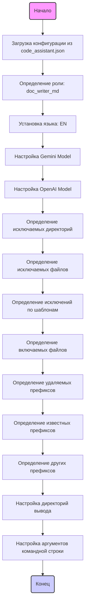

## АНАЛИЗ JSON КОНФИГУРАЦИИ

### 1. <алгоритм>

1.  **Начало**: JSON-объект загружается из файла `code_assistant.json`.
2.  **Определение роли**: JSON-объект определяет роль как `doc_writer_md`, указывает язык документации `EN` и используемые модели для обработки текста: `gemini`.
3.  **Конфигурация Gemini**: Настраиваются параметры для модели gemini, такие как формат ответа `text/plain` и имя модели `gemini-2.0-flash-exp`.
4.  **Конфигурация OpenAI**: Настраиваются параметры для модели OpenAI: `gpt-4o-mini` и `assistant_id`.
5.  **Исключение директорий**: Определяется список директорий, которые будут исключены из обработки.
    *   Пример: `.ipynb_checkpoints`, `resources`, `profiles` и другие.
6.  **Исключение файлов**: Определяется список файлов, которые будут исключены из обработки.
    *   Пример: `version.py`, `__init__.py`, `*.png` и другие.
7.  **Исключение по шаблонам**: Определяется список шаблонов, по которым файлы будут исключены.
    *   Пример: `.*\\\\(.*\\\\).*`, `___{3,}.*` и другие.
8.  **Включение файлов**: Определяется список расширений файлов, которые будут включены в обработку.
    *   Пример: `*.py`, `*.js`, `*.md` и другие.
9.  **Удаление префиксов**: Определяется список префиксов, которые будут удалены из текста.
    *   Пример: ```md, ```markdown, ```.
10. **Известные префиксы**: Определяется список известных префиксов, которые могут присутствовать в тексте.
     * Пример:  ` --------------------------- DEPRECTAED KEY --------------`, ```md, ```markdown, ```.
11. **Другие префиксы**: Определяется список других префиксов, которые могут присутствовать в тексте.
     * Пример: ```rst, ```plaintext, ```html
12. **Определение директорий вывода**: Настраиваются директории для вывода сгенерированной документации.
    *   Пример: `code_checker_md`, `code_explainer_md` и другие.
13. **Аргументы командной строки**: Настраиваются аргументы, которые будут использоваться в командной строке.
    *   Указываются роли, языки, модели и директории.
    *   Пример: ролями: `code_checker_md`, `code_explainer_md`, `doc_writer_md` и другие.

### 2. <mermaid>


### Объяснение зависимостей `mermaid` диаграммы:

*   `Start`: Начальная точка процесса загрузки и обработки конфигурации.
*   `LoadConfig`: Загружает JSON-файл `code_assistant.json` для получения конфигурации.
*   `DefineRole`: Определяет роль, для которой будет выполняться процесс, в данном случае `doc_writer_md`.
*   `SetLanguage`: Устанавливает язык, для которого будет генерироваться документация, в данном случае `EN`.
*   `ConfigGemini`: Настраивает параметры для модели Gemini, такие как тип ответа и имя модели.
*   `ConfigOpenAI`: Настраивает параметры для модели OpenAI, такие как модель и ID ассистента.
*   `ExcludeDirs`: Определяет список директорий, которые будут исключены из обработки.
*   `ExcludeFiles`: Определяет список файлов, которые будут исключены из обработки.
*   `ExcludeFilePatterns`: Определяет список шаблонов, по которым файлы будут исключены из обработки.
*   `IncludeFiles`: Определяет список расширений файлов, которые будут включены в обработку.
*   `RemovePrefixes`: Определяет список префиксов, которые будут удалены из обрабатываемых текстов.
*   `KnownPrefixes`: Определяет список известных префиксов, которые могут быть в текстах.
*   `OtherPrefixes`: Определяет список других префиксов, которые могут присутствовать в тексте.
*   `OutputDirs`: Настраивает директории, куда будут сохраняться результаты обработки.
*   `ArgParse`: Настраивает аргументы командной строки для управления процессом.
*   `End`: Конечная точка процесса обработки конфигурации.

### 3. <объяснение>

**Импорты**:
*   В данном коде нет явных импортов, так как это JSON-файл конфигурации, а не исполняемый код. Все параметры и настройки задаются напрямую в JSON-структуре.

**Классы**:
*   В JSON-файле нет классов, поскольку он предназначен для хранения данных конфигурации, а не для определения классов или объектов.

**Функции**:
*   Функций в этом JSON-файле нет. Этот файл используется для передачи параметров и настроек в программу.

**Переменные**:
*   `role`: Определяет роль выполняемой операции (в данном случае `doc_writer_md`).
    *   Тип: Строка (`string`).
    *   Использование: Определяет назначение скрипта.
*   `lang`: Устанавливает язык документации (в данном случае `EN`).
    *   Тип: Строка (`string`).
    *   Использование: Определяет язык сгенерированной документации.
*   `model`: Определяет используемую модель (в данном случае `gemini`).
    *   Тип: Список строк (`array of strings`).
    *   Использование: Определяет модель для обработки текста.
*    `start_dirs`: Список начальных директорий для анализа.
     *  Тип: Список строк (`array of strings`).
     *  Использование: Список начальных директорий для анализа кода.
*   `gemini_generation_config`: Настройки для модели Gemini.
    *   Тип: Объект (`object`).
    *   Использование: Задает параметры генерации для Gemini, такие как `response_mime_type`.
*   `gemini_model_name`: Имя модели Gemini.
    *   Тип: Строка (`string`).
    *   Использование: Указывает конкретную версию модели Gemini.
*   `openai_model_name`: Имя модели OpenAI.
    *   Тип: Строка (`string`).
    *   Использование: Указывает конкретную версию модели OpenAI.
*   `openai_assistant_id`: Идентификатор ассистента OpenAI.
    *   Тип: Строка (`string`).
    *   Использование: Указывает идентификатор конкретного ассистента OpenAI.
*   `exclude_dirs`: Список директорий для исключения.
    *   Тип: Список строк (`array of strings`).
    *   Использование: Исключает определенные директории из обработки.
*   `exclude_files`: Список файлов для исключения.
    *   Тип: Список строк (`array of strings`).
    *   Использование: Исключает определенные файлы из обработки.
*   `exclude_file_patterns`: Список шаблонов для исключения файлов.
    *   Тип: Список строк (`array of strings`).
    *   Использование: Исключает файлы, соответствующие определенным шаблонам.
*   `include_files`: Список шаблонов для включения файлов.
    *   Тип: Список строк (`array of strings`).
    *   Использование: Включает файлы, соответствующие определенным шаблонам.
*   `remove_prefixes`: Список префиксов для удаления.
    *   Тип: Список строк (`array of strings`).
    *   Использование: Удаляет определенные префиксы из обрабатываемого текста.
*   `known_prefixes`: Список известных префиксов.
    *   Тип: Список строк (`array of strings`).
    *   Использование: Определяет известные префиксы, которые могут присутствовать в тексте.
*   `other_prefixes`: Список других префиксов.
    *   Тип: Список строк (`array of strings`).
    *   Использование: Определяет другие префиксы, которые могут присутствовать в тексте.
*   `output_directory`: Настройки директорий вывода.
    *   Тип: Объект (`object`).
    *   Использование: Определяет, куда сохранять сгенерированную документацию.
*   `argparse`: Настройки аргументов командной строки.
    *   Тип: Объект (`object`).
    *   Использование: Задает аргументы командной строки для управления скриптом.
    *   `roles`: Список ролей, доступных в аргументах командной строки
    *   `exclude-roles`: Список исключенных ролей, которые не доступны в аргументах
    *   `languages`: Список доступных языков для аргументов командной строки
    *    `model`:  Список доступных моделей для аргументов командной строки
    *    `start_dirs`: Начальные директории для аргументов командной строки

**Цепочка взаимосвязей**:
1.  JSON-файл `code_assistant.json` является конфигурационным файлом для скриптов, которые обрабатывают исходный код.
2.  Директивы `exclude_dirs`, `exclude_files`, `exclude_file_patterns` и `include_files` используются для фильтрации файлов и директорий, которые будут обрабатываться.
3.  Директивы `remove_prefixes`, `known_prefixes`, и `other_prefixes` управляют форматированием текста, удаляя ненужные префиксы.
4.  Директива `output_directory` определяет, куда будет сохраняться сгенерированная документация в зависимости от роли.
5.  Директива `argparse` определяет доступные параметры для командной строки.

**Потенциальные ошибки и области для улучшения**:

1.  **Дублирование префиксов**: В `remove_prefixes`, `known_prefixes`, `other_prefixes` есть дублирующиеся записи, такие как  ``````md` и ``markdown`. Следует их унифицировать, возможно, добавить комментарии, чтобы было понятно что это за префиксы и для чего они нужны.
2.  **Неунифицированные форматы файлов**: В  `include_files` есть `*.htm*`, что может привести к неоднозначной интерпретации файлов с расширением html и htm. Следует унифицировать расширения.
3.  **Сложные шаблоны исключения файлов**: Шаблоны `exclude_file_patterns` слишком сложные и могут быть упрощены для лучшей читаемости.
4. **Разные подходы к именованию**: Есть `exclude-roles` и `exclude_dirs`, следует привести к единому формату `exclude_roles` и `exclude_directories`.
5.  **Отсутствие комментариев**:  В файле нет комментариев, что усложняет понимание назначения каждого параметра. Рекомендуется добавить комментарии к каждому ключевому параметру, чтобы было понятно, что он делает и для чего предназначен.
6.  **Жестко заданные значения**: Жестко заданные пути в `output_directory`  и в `argparse.start_dirs` делают файл менее гибким. Можно сделать их параметризованными через переменные окружения или внешние аргументы.
7.  **Избыточность**:  Многие исключенные директории могут быть обобщены с помощью шаблонов. Например, `quickstart` и `quick_start` могут быть объединены в шаблон `quick*start`.
8.  **Отсутствие проверок**: Отсутствуют проверки на корректность данных в файле. Например, можно проверять, что все пути существуют или что все расширения файлов допустимы.

Эти улучшения сделают файл более гибким, читаемым и простым в использовании.