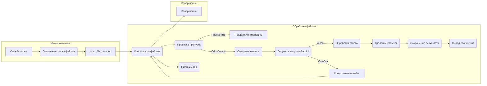

```MD
# <input code>

```python
## \file hypotez/src/endpoints/hypo69/code_assistant/assistant.py
# -*- coding: utf-8 -*-\
#! venv/Scripts/python.exe
#! venv/bin/python/python3.12
"""
Модуль для работы ассистента программиста
=========================================================================================

:class:`CodeAssistant`, читает файлы кода, отдает код в модели, модель обрабатывет код и возвращает его в класс, класс сохраняет результат
в директории `docs/gemini` В зависимости от роли файлы сохраняются в 
...
"""

import asyncio
import argparse
import sys
from pathlib import Path
from typing import Iterator, List, Optional
from types import SimpleNamespace
import signal
import time
import re
import fnmatch

import header
from src import gs
from src.utils.jjson import j_loads, j_loads_ns
from src.ai.gemini import GoogleGenerativeAI
from src.ai.openai import OpenAIModel
from src.utils.printer import pprint
from src.utils.path import get_relative_path
from src.logger import logger
from src.endpoints.hypo69.code_assistant.make_summary import make_summary 
# from toolbox import 

MODE = "dev"

class CodeAssistant:
    """ 
    .. :class:`CodeAssistant`
        :synopsis: Класс для работы ассистента программиста с моделями ИИ
    """
    # ... (rest of the class definition)
```

# <algorithm>

**Алгоритм работы CodeAssistant.process_files:**

1. **Инициализация:**
   - Получение списка файлов для обработки (`_yield_files_content`).
   - Определение `start_file_number`.
2. **Итерация по файлам:**
   - Для каждого файла (file_path, content) из списка:
     - Проверка условий пропуска файла (номер файла, наличие контента, исключенные файлы/директории).
     - Если файл не нужно пропускать:
       - Создание запроса к модели (`_create_request`).
       - Отправка запроса к модели Gemini (`gemini_model.ask`).
       - Обработка ответа модели:
         - Если ответ успешный:
           - Удаление внешних кавычек (`_remove_outer_quotes`).
           - Сохранение ответа в файл (`_save_response`).
           - Вывод сообщения об успешной обработке.
         - Если ответ неуспешный:
           - Логирование ошибки.
           - Продолжение цикла.
     - Пауза на 20 секунд (DEBUG).
3. **Завершение:**
   - Выход из цикла (возможно, при обработке всех файлов).

**Пример данных:**

* `file_path`: `/path/to/file.py`
* `content`: `print("Hello, world!")`
* `content_request`: JSON-запрос к Gemini, содержащий роль, язык, путь к файлу, инструкцию и код.
* `response`: Ответ Gemini, содержащий обработанный код.

**Взаимодействие между функциями:**

- `_yield_files_content` ищет файлы, возвращая их пути и содержимое.
- `_create_request` преобразует эти данные в формат запроса для модели.
- `gemini_model.ask` обращается к модели для обработки запроса.
- `_save_response` сохраняет результат обработки.


# <mermaid>



**Объяснение зависимостей:**

- `gs`: пакет, предоставляющий доступ к глобальным настройкам (например, путям и ключам API).
- `src`: корневой пакет проекта, содержащий другие модули и пакеты.
- `src.utils.jjson`: пакет для работы с JSON-данными.
- `src.ai.gemini`: пакет для работы с моделью Gemini.
- `src.ai.openai`: пакет для работы с моделью OpenAI.
- `src.utils.printer`: пакет для вывода сообщений в консоль.
- `src.utils.path`: пакет для работы с путями.
- `src.logger`: пакет для логирования.
- `src.endpoints.hypo69.code_assistant.make_summary`: функция для создания сводки.


# <explanation>

**Импорты:**

- `asyncio`, `argparse`, `sys`, `pathlib`, `typing`, `types`, `signal`, `time`, `re`, `fnmatch`: Стандартные библиотеки Python.
- `header`: Возможно, файл заголовков проекта, но точная функция неясна без контекста.
- `gs`: Глобальные настройки, вероятно, предоставляют доступ к системным параметрам, таким как пути к файлам и API-ключам.
- `src.utils.jjson`: Функции для загрузки JSON-конфигураций.
- `src.ai.gemini`, `src.ai.openai`: Модели ИИ (Gemini и OpenAI).
- `src.utils.printer`: Утилита для красивой печати данных в консоль.
- `src.utils.path`: Утилита для работы с путями.
- `src.logger`: Модуль для логирования.
- `src.endpoints.hypo69.code_assistant.make_summary`: Функция для создания сводки.


**Классы:**

- `CodeAssistant`: Класс для работы с ассистентом программиста.
  - `role`, `lang`, `model`, `start_dirs`, `base_path`, `config`, `gemini_model`, `openai_model`, `start_file_number`: Атрибуты, хранящие параметры ассистента, путь к конфигурации, модели ИИ и стартовый номер файла.
  - `__init__`, `_initialize_models`: Методы инициализации ассистента и моделей.
  - `parse_args`: Метод для парсинга аргументов командной строки.
  - `system_instruction`, `code_instruction`, `translations`: Методы для загрузки инструкций и переводов.
  - `process_files`: Метод для обработки файлов, отправки запросов к модели и сохранения результатов.
  - `_create_request`, `_yield_files_content`, `_save_response`, `_remove_outer_quotes`: Вспомогательные методы для работы с запросами, файлами и ответами.
  - `run`, `_signal_handler`: Методы для запуска процесса обработки и обработки сигналов прерывания.


**Функции:**

- `send_file`: Отправляет файл в модель, вызывая `gemini_model.upload_file`.
- `_create_request`: Создает JSON-запрос для модели ИИ, используя данные из файла и конфигурации.
- `_yield_files_content`: Возвращает итератор кортежей `(file_path, content)` для файлов в заданных директориях, учитывая включение/исключение файлов и директорий.
- `_save_response`: Сохраняет ответ модели в файл, учитывая имя модели, роль и язык.
- `_remove_outer_quotes`: Удаляет внешние кавычки из ответа модели.

**Переменные:**

- `MODE`:  Строковая переменная, вероятно, для обозначения режима работы (например, `dev` или `prod`).
- `config`: Объект `SimpleNamespace`, содержащий загруженную конфигурацию из файла.

**Возможные ошибки и улучшения:**

- **Обработка исключений:** Код содержит блоки `try...except`, но некоторые обработчики исключений недостаточно полные. Необходимо добавить более подробную обработку ошибок, особенно при чтении файлов, отправке запросов и сохранении результатов.
- **Время ожидания:** Задержка в 20 секунд (DEBUG) может быть слишком большой для реального приложения. Необходимо пересмотреть подход к управлению временем выполнения и использовать более гибкие механизмы.
- **Модели:** Приведенный код поддерживает только Gemini. Добавление поддержки других моделей (например, OpenAI) может быть полезным.
- **Проверка входных данных:** Необходимо добавить проверку корректности входных данных, например, проверку на наличие необходимых ключей в запросах к модели.
- **Управление памятью:** Если обрабатываются очень большие файлы, то необходимо добавить механизмы управления памятью.
- **Консистентность:**  Некоторые логические блоки могут быть вынесены в отдельные функции для повышения читаемости.

**Взаимосвязи с другими частями проекта:**

- `gs` (global settings) содержит параметры, используемые многими модулями.
- `src` - корневой модуль проекта, к которому относится `gs`.
- `src.ai`, `src.utils` содержат вспомогательные классы и функции, используемые `CodeAssistant`.
- `endpoints/hypo69/code_assistant/make_summary` - функция, скорее всего, для создания сводок, которая может быть использована после обработки файлов.