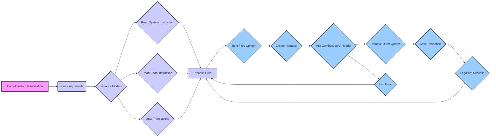

## <алгоритм>

1.  **Инициализация:**
    *   Создается экземпляр класса `CodeAssistant` с заданными ролями, языком, списком моделей и начальными директориями.
    *   Загружаются конфигурации из `code_assistant.json`.
    *   Инициализируются модели `Gemini` и `OpenAI` на основе конфигурации.

2.  **Разбор аргументов командной строки:**
    *   Используется `argparse` для разбора аргументов командной строки, таких как роль, язык, модель и директории.

3.  **Чтение инструкций:**
    *   Метод `system_instruction` читает инструкцию из файла с именем, основанным на роли и языке.
    *   Метод `code_instruction` читает инструкции для кода из файла, имя которого также зависит от роли и языка.

4.  **Загрузка переводов:**
    *   Метод `translations` загружает переводы из `translations.json`.

5.  **Обработка файлов (`process_files`):**
    *   Итерирует по файлам, полученным через `_yield_files_content`.
    *   Пропускает файлы, если они не содержат контент или путь, а также, если индекс файла меньше заданного `start_file_number`.
    *   Для каждого файла:
        *   Отправляет файл в модель с помощью функции `send_file`.
        *   Создает запрос к модели с помощью `_create_request`.
        *   Отправляет запрос в модель `Gemini` или `OpenAI`.
        *   Если получен ответ:
            *   Удаляет внешние кавычки из ответа.
            *   Сохраняет ответ в файл с помощью `_save_response`.
            *   Выводит сообщение об обработанном файле.
        *   Если ответ не получен, регистрирует ошибку.
        *   Делает паузу (20 секунд).

6.  **Создание запроса (`_create_request`):**
    *   Создает запрос для модели, включая роль, язык, путь к файлу и инструкции.
    *   Использует переводы из `translations.json`.

7.  **Генерация файлов (`_yield_files_content`):**
    *   Обходит директории, начиная с `start_dirs`.
    *   Фильтрует файлы на основе `include_files`, `exclude_dirs`, `exclude_file_patterns` и `exclude_files`.
    *   Читает содержимое файлов и возвращает их в виде итератора `(file_path, content)`.

8.  **Сохранение ответа (`_save_response`):**
    *   Определяет директорию вывода на основе роли, модели и языка.
    *   Создает путь для сохранения файла с суффиксом, зависящим от роли.
    *   Создает родительские директории, если они не существуют.
    *   Записывает ответ модели в файл.

9.  **Удаление внешних кавычек (`_remove_outer_quotes`):**
    *   Удаляет кавычки из ответа, если они есть.
    *   Обрабатывает маркеры кода (например, ````python`, ````mermaid`) для сохранения формата.

10. **Запуск (`run`):**
    *   Устанавливает обработчик сигналов прерывания (Ctrl+C).
    *   Запускает метод `process_files`.

11. **Обработка прерывания (`_signal_handler`):**
    *   Выводит сообщение о прерывании и завершает программу.

12. **Главная функция (`main`):**
    *   Разбирает аргументы командной строки.
    *   Создает экземпляр `CodeAssistant` и запускает процесс обработки.

13. **Основной цикл:**
    *   Загружает конфигурацию из `code_assistant.json`.
    *   Обрабатывает файлы для каждой комбинации ролей и языков.
    *   Создает экземпляры `CodeAssistant` для каждой комбинации.
    *   Запускает асинхронную обработку файлов.
    *   Обновляет конфигурацию перед каждой итерацией.

## <mermaid>



**Описание диаграммы:**

*   **A [CodeAssistant Initialization]**: Начальная точка, где создается экземпляр класса `CodeAssistant`.
*   **B (Parse Arguments)**: Разбор аргументов командной строки, которые влияют на работу ассистента.
*   **C {Initialize Models}**: Инициализация моделей ИИ (Gemini, OpenAI), используемых для обработки кода.
*   **D {Read System Instruction}**: Чтение системных инструкций из файла, специфичных для выбранной роли и языка.
*   **E {Read Code Instruction}**: Чтение инструкций для обработки кода из файла, специфичных для выбранной роли и языка.
*   **F {Load Translations}**: Загрузка переводов из файла, необходимых для корректного формирования запросов.
*   **G [Process Files]**: Основной процесс обработки файлов, включая итерацию по файлам, создание запросов и сохранение результатов.
*   **H {Yield Files Content}**: Генерация путей файлов и их содержимого, которые будут обрабатываться.
*   **I {Create Request}**: Создание запроса для модели ИИ на основе содержимого файла и инструкций.
*   **J {Ask Gemini/OpenAI Model}**: Отправка запроса в модель Gemini или OpenAI для получения ответа.
*   **K {Remove Outer Quotes}**: Удаление внешних кавычек из ответа, чтобы избежать ошибок форматирования.
*   **L {Save Response}**: Сохранение ответа модели в файл с суффиксом, основанным на роли.
*   **M {Log/Print Success}**: Вывод сообщения об успешной обработке файла и сохранении ответа.
*   **N {Log Error}**: Логирование ошибки, если ответ от модели не был получен или произошла другая ошибка.
   
   
**Зависимости, использованные в диаграмме:**
* **A**, **B**, **C**, **D**, **E**, **F**, **G**, **H**, **I**, **J**, **K**, **L**, **M**, **N**: Это основные логические блоки и этапы обработки, которые выполняются последовательно, образуя общий процесс.

## <объяснение>

### Импорты

*   `asyncio`: Для асинхронного программирования.
*   `argparse`: Для разбора аргументов командной строки.
*   `sys`: Для работы с системными параметрами, например, выхода из программы.
*   `pathlib.Path`: Для работы с путями к файлам и директориям.
*   `typing.Iterator, List, Optional`: Для аннотации типов.
*   `types.SimpleNamespace`: Для создания простых объектов с атрибутами.
*   `signal`: Для обработки системных сигналов.
*   `time`: Для работы со временем.
*   `re`: Для работы с регулярными выражениями.
*   `fnmatch`: Для сопоставления имен файлов с шаблонами.
*   `header`: (из `src.`) Похоже на модуль для общих настроек или заголовка.
*   `src.gs`: (из `src.`) Глобальные настройки проекта.
*   `src.utils.jjson`: (из `src.`) Модуль для работы с JSON.
*   `src.ai.gemini`: (из `src.`) Модуль для работы с моделью Gemini.
*   `src.ai.openai`: (из `src.`) Модуль для работы с моделью OpenAI.
*   `src.utils.printer`: (из `src.`) Модуль для вывода форматированного текста.
*   `src.utils.path`: (из `src.`) Модуль для работы с путями.
*   `src.logger.logger`: (из `src.`) Модуль для логирования.
*   `src.endpoints.hypo69.code_assistant.make_summary`: (из `src.`) Модуль для создания сводки.

### Классы

*   **`CodeAssistant`**:
    *   **Роль**: Главный класс, управляющий процессом обработки кода с использованием моделей ИИ.
    *   **Атрибуты**:
        *   `role`: Роль ассистента (например, `code_checker`, `doc_writer_md`).
        *   `lang`: Язык для обработки.
        *   `start_dirs`: Список начальных директорий для поиска файлов.
        *   `base_path`: Базовый путь к каталогу `code_assistant`.
        *   `config`: Конфигурация, загруженная из JSON.
        *   `gemini_model`: Экземпляр класса `GoogleGenerativeAI`.
        *   `openai_model`: Экземпляр класса `OpenAIModel`.
        *   `start_file_number`: Номер файла, с которого начинать обработку.
    *   **Методы**:
        *   `__init__`: Инициализация класса с заданными параметрами.
        *   `_initialize_models`: Инициализация моделей ИИ.
        *   `parse_args`: Разбор аргументов командной строки.
        *   `system_instruction`: Чтение системных инструкций из файла.
        *   `code_instruction`: Чтение инструкций для кода.
        *   `translations`: Загрузка переводов.
        *   `process_files`: Основной метод для обработки файлов.
        *   `_create_request`: Создание запроса для модели ИИ.
        *   `_yield_files_content`: Генерация путей файлов и их содержимого.
        *   `_save_response`: Сохранение ответа модели в файл.
        *   `_remove_outer_quotes`: Удаление внешних кавычек из ответа.
        *   `run`: Запуск процесса обработки.
        *   `_signal_handler`: Обработчик прерывания выполнения.

### Функции

*   **`send_file(file_path)`**:
    *   **Аргументы**:
        *   `file_path` (`Path`): Путь к файлу.
    *   **Возвращает**: `bool` или `str`
        *   `True` если url есть в ответе модели
        *   `False` если url нет в ответе модели или произошла ошибка
    *   **Назначение**: Отправка файла в модель для дальнейшей обработки.
        
*   **`main()`**:
    *   **Аргументы**: Нет.
    *   **Возвращает**: Нет.
    *   **Назначение**: Основная функция запуска программы.

### Переменные

*   `MODE`: Режим работы (`"dev"`).
*   `config_path`: Путь к конфигурационному файлу.
*   `args`: Аргументы командной строки (результат `argparse`).
*   `config`: Конфигурация, загруженная из JSON.
*   `assistant`: Экземпляр класса `CodeAssistant`.

### Ошибки и улучшения

*   **Обработка ошибок**: Присутствует обработка ошибок в большинстве функций, но можно добавить более подробное логирование и уведомления.
*   **Таймауты**: Присутствует пауза `asyncio.sleep(20)` после обработки каждого файла, что может замедлить процесс. Это значение можно сделать настраиваемым и уменьшить для ускорения обработки.
*   **Конфигурация**: Загрузка конфигурации происходит в цикле `while True` внутри `if __name__ == "__main__":`, что может привести к неожиданному поведению, если конфигурационный файл изменяется во время работы скрипта.
*   **Многопоточность**: Обработка файлов может быть ускорена за счет использования многопоточности или асинхронного выполнения.
*   **Отсутствие документации**: Код хорошо комментирован, но добавление docstring к функциям и методам улучшит читаемость и понимание.
*   **Дублирование кода**: Метод `_remove_outer_quotes` частично повторяется в логике обработки кавычек. Этот код можно вынести в отдельную функцию.

### Взаимосвязи с другими частями проекта

*   **`src.gs`**: Глобальные настройки проекта используются для доступа к путям, учетным данным и конфигурациям.
*   **`src.ai.gemini` и `src.ai.openai`**: Используются для взаимодействия с моделями ИИ.
*   **`src.utils.jjson`**: Используется для загрузки конфигураций и переводов из JSON.
*   **`src.utils.printer`**: Используется для форматированного вывода информации.
*   **`src.utils.path`**: Используется для получения относительных путей к файлам.
*   **`src.logger.logger`**: Используется для логирования ошибок и других событий.
*  **`src.endpoints.hypo69.code_assistant.make_summary`**: Используется для создания summary файлов.

Этот код является частью более крупного проекта, который использует различные модули для выполнения специфических задач. Основная цель данного модуля — автоматизировать процесс создания документации, примеров кода и тестов, используя модели ИИ, на основе предоставленной кодовой базы.