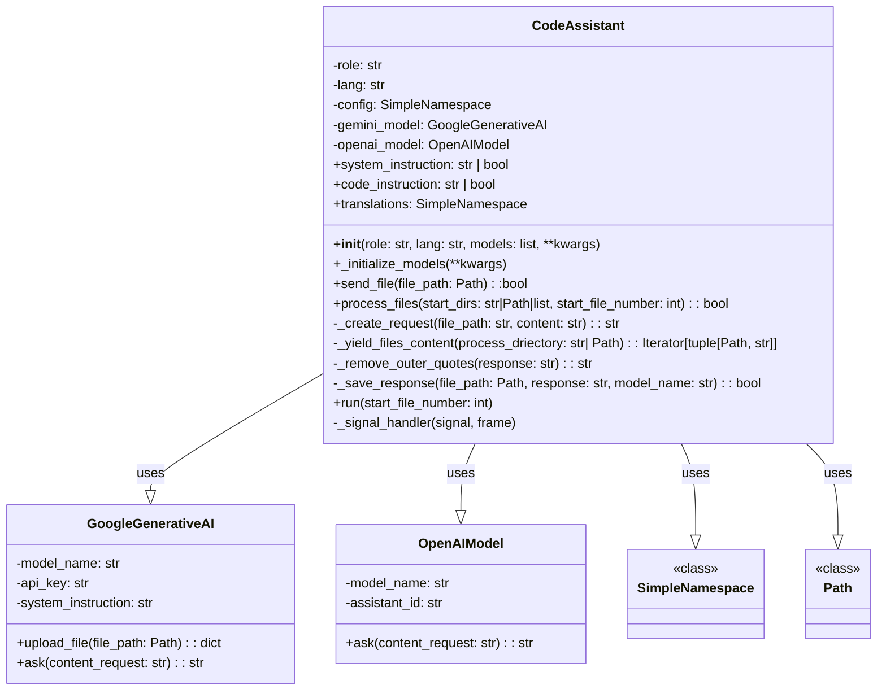
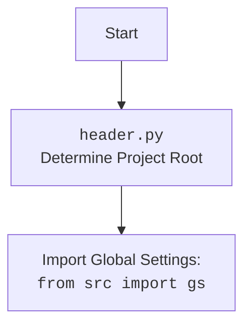

## Анализ кода `src/endpoints/hypo69/code_assistant/code_assistant.py`

### 1. <алгоритм>

**Блок-схема работы `CodeAssistant`:**

```mermaid
graph LR
    A[Начало] --> B{Инициализация `CodeAssistant`}
    B --> C{Загрузка конфигурации}
    C --> D{Инициализация моделей (Gemini/OpenAI)}
    D --> E{Выбор стартовой директории}
    E --> F{Цикл по файлам в стартовой директории}
    F -- файл соответствует условиям --> G{Чтение содержимого файла}
    F -- файл не соответствует условиям --> F
    G --> H{Формирование запроса к модели}
    H --> I{Отправка запроса к модели}
    I --> J{Получение ответа модели}
    J --> K{Удаление внешних кавычек из ответа}
    K --> L{Сохранение ответа в файл}
    L -- Файл сохранен --> M{Логирование успешной обработки файла}
     M --> F
    L -- Ошибка сохранения --> N{Логирование ошибки сохранения файла}
    N --> F
    J -- Нет ответа --> O{Логирование ошибки ответа модели}
    O --> F
    F -- Все файлы обработаны --> P{Завершение}
    
    style A fill:#f9f,stroke:#333,stroke-width:2px
    style P fill:#f9f,stroke:#333,stroke-width:2px
```

**Примеры для логических блоков:**

*   **B (Инициализация `CodeAssistant`):**
    *   Создание экземпляра `assistant = CodeAssistant(role='code_checker', lang='ru', models=['gemini'])`.
    *   Загрузка конфигурации из `code_assistant.json` в `self.config`.
    *   Установка `self.role = 'code_checker'` и `self.lang = 'ru'`.
    *   Инициализация моделей (в данном случае только Gemini).
*   **C (Загрузка конфигурации):**
    *   Чтение JSON файла `code_assistant.json` и сохранение его содержимого в `SimpleNamespace`.
    *   Пример содержимого файла:
        ```json
          {
              "start_dirs": ["src/endpoints/hypo69/code_assistant"],
              "exclude_file_patterns": ["__init__.py", "test_*.py"],
              "include_files": ["*.py"],
              "exclude_dirs": ["venv", "__pycache__"],
              "exclude_files": [],
              "output_directory": {
                  "code_checker": "code_checker/<model>/<lang>",
                  "doc_writer_md": "doc_writer_md/<model>/<lang>",
                  "doc_writer_rst": "doc_writer_rst/<model>/<lang>",
                  "doc_writer_html": "doc_writer_html/<model>/<lang>",
                  "code_explainer_md": "code_explainer_md/<model>/<lang>",
                  "code_explainer_html": "code_explainer_html/<model>/<lang>",
                   "pytest": "pytest/<model>/<lang>"
              },
              "remove_prefixes": [
                  "```md",
                  "```html",
                  "```python",
                  "```text",
                    "```json"
              ],
               "gemini_model_name": "gemini-1.5-pro-latest",
                "roles":["code_checker","doc_writer_md","doc_writer_rst", "doc_writer_html","code_explainer_md", "code_explainer_html","pytest"],
              "languages": ["ru","en"]
          }
        ```
*   **E (Выбор стартовой директории):**
    *   Использование `self.config.start_dirs` по умолчанию, если не передано в аргументах.
    *   Пример: `start_dirs = ['src/endpoints/hypo69/code_assistant']`
*    **F (Цикл по файлам в стартовой директории):**
   *    Итерация по всем файлам в указанных стартовых директориях, пропуская файлы, не соответствующие шаблонам включения или соответствующие шаблонам исключения.
   *    Пример: если `start_dirs` = `['src/endpoints/hypo69/code_assistant']`, цикл перебирает все файлы `.py` в этой директории, например: `src/endpoints/hypo69/code_assistant/assistant.py`, `src/endpoints/hypo69/code_assistant/make_summary.py`
*   **G (Чтение содержимого файла):**
    *   Чтение содержимого файла, например, `src/endpoints/hypo69/code_assistant/assistant.py`.
    *   Содержимое файла сохраняется в переменную `content`.
*   **H (Формирование запроса к модели):**
    *   Создание запроса в виде словаря, содержащего роль, язык, путь к файлу, инструкции и содержимое файла.
    *   Пример:
        ```python
        {
            "role": "Специализация - проверка кода",
            "output_language": "ru",
            "Path to file:": "src/endpoints/hypo69/code_assistant/assistant.py",
            "instruction": "Текст инструкции из файла...",
            "input_code": "```python\nimport ...\nclass ...\n```"
        }
        ```
*   **I (Отправка запроса к модели):**
    *   Вызов метода `ask()` у экземпляра `gemini_model` или `openai_model`.
    *   Отправка сформированного запроса в модель.
*   **J (Получение ответа модели):**
    *   Получение ответа от модели в виде строки.
    *   Пример: `'```md\n#  Объяснение кода\n##  Класс `CodeAssistant`\n...\n```'`
*   **K (Удаление внешних кавычек):**
    *   Удаление внешних кавычек, если ответ обернут в  `'```md ... ```'` или другие префиксы.
    *   Пример:  `'# Объяснение кода\n##  Класс `CodeAssistant`\n...\n'`
*   **L (Сохранение ответа в файл):**
    *   Сохранение ответа модели в новый файл в директории `docs` с учетом роли и языка.
    *   Пример: если роль `code_checker`, язык `ru`, имя файла `src/endpoints/hypo69/code_assistant/assistant.py`, то новый файл будет сохранен по пути `docs/code_checker/gemini/ru/endpoints/hypo69/code_assistant/assistant.py.md`.

### 2. <mermaid>

**Диаграмма классов:**



**Объяснение зависимостей:**

*   `CodeAssistant`:
    *   Имеет атрибуты `role`, `lang`, `config`, `gemini_model` и `openai_model`.
    *   Методы: `__init__`, `_initialize_models`, `system_instruction`, `code_instruction`, `translations`, `send_file`, `process_files`, `_create_request`, `_yield_files_content`, `_remove_outer_quotes`, `_save_response`, `run`, `_signal_handler`.
    *   Зависит от классов `GoogleGenerativeAI` и `OpenAIModel` для работы с моделями ИИ, и `SimpleNamespace` для хранения настроек, и `Path` для работы с файловой системой.
*   `GoogleGenerativeAI`:
    *   Представляет модель Gemini, имеет атрибуты `model_name`, `api_key` и `system_instruction`.
    *   Методы `upload_file` и `ask` для взаимодействия с моделью.
*   `OpenAIModel`:
    *   Представляет модель OpenAI, имеет атрибуты `model_name` и `assistant_id`.
    *   Метод `ask` для взаимодействия с моделью.
* `SimpleNamespace`:
   *   Класс для удобного хранения настроек и данных конфигурации.
*  `Path`:
    *  Класс для работы с путями файловой системы.

**Диаграмма импорта `header.py`**


### 3. <объяснение>

**Импорты:**

*   `asyncio`: Асинхронное программирование для неблокирующих операций.
*   `argparse`: Разбор аргументов командной строки.
*   `sys`: Работа с системными параметрами и функциями.
*   `pathlib.Path`: Удобная работа с путями в файловой системе.
*   `typing.Iterator`, `typing.List`, `typing.Optional`: Типизация данных.
*   `types.SimpleNamespace`: Создание простых объектов для хранения атрибутов.
*   `signal`: Обработка системных сигналов (например, `Ctrl+C`).
*   `time`: Для работы со временем.
*   `re`: Работа с регулярными выражениями.
*   `fnmatch`: Сравнение имен файлов с шаблонами.
*   `header`: Определяет корневую директорию проекта и загружает глобальные настройки.
*   `src.gs`: Глобальные настройки проекта.
*   `src.utils.jjson`: Загрузка и сохранение JSON файлов.
*   `src.ai.gemini`: Класс для работы с моделью Google Gemini.
*   `src.ai.openai`: Класс для работы с моделью OpenAI.
*   `src.utils.path`: Функции для работы с путями.
*    `src.logger.logger`: Логирование событий.
*    `src.endpoints.hypo69.code_assistant.make_summary`: Создание файла summary.md (используется в DEBUG).

**Класс `CodeAssistant`:**

*   **Роль:**  Центральный класс для управления процессом обработки файлов с помощью моделей ИИ.
*   **Атрибуты:**
    *   `role`: Роль ассистента (например, `code_checker`, `doc_writer_md`).
    *   `lang`: Язык обработки (например, `ru`, `en`).
    *   `config`: Настройки из файла `code_assistant.json`.
    *   `gemini_model`: Экземпляр `GoogleGenerativeAI` для работы с моделью Gemini.
    *   `openai_model`: Экземпляр `OpenAIModel` для работы с моделью OpenAI.
*   **Методы:**
    *   `__init__(self, role, lang, models, **kwargs)`: Инициализация класса, загрузка конфигурации и моделей.
    *   `_initialize_models(self, **kwargs)`: Создает экземпляры моделей Gemini и/или OpenAI.
    *   `system_instruction(self)`: Загрузка инструкции для модели из файла.
    *   `code_instruction(self)`: Загрузка инструкции для кода из файла с учетом роли и языка.
    *   `translations(self)`: Загружает переводы для ролей и языков из JSON файла.
    *   `send_file(self, file_path)`: Отправляет файл в модель (используется только для Gemini)
    *   `process_files(self, start_dirs, start_file_number)`: Основной метод для обработки файлов: перебирает файлы в указанных директориях, формирует запросы к моделям, получает ответы и сохраняет их в файлы.
    *   `_create_request(self, file_path, content)`: Создает запрос для модели с учетом роли, языка, пути к файлу и содержимого файла.
    *   `_yield_files_content(self, process_driectory)`: Итератор, перебирающий файлы в директории и возвращающий их пути и содержимое.
    *   `_remove_outer_quotes(self, response)`: Удаляет внешние кавычки в ответе модели.
    *   `_save_response(self, file_path, response, model_name)`: Сохраняет ответ модели в файл с нужным суффиксом в директории `docs`.
    *    `run(self, start_file_number)`: Запускает процесс обработки файлов, устанавливает обработчик прерывания.
    *    `_signal_handler(self, signal, frame)`: Обработчик прерывания для корректного завершения программы.

**Функции:**

*   `main()`: Главная функция запуска скрипта. Парсит аргументы командной строки и запускает `CodeAssistant`.
*   `parse_args()`: Разбирает аргументы командной строки, такие как `role`, `lang`, `model`, `start_dirs` и `start_file_number`.

**Переменные:**

*   `config`: `SimpleNamespace`, содержащий конфигурации из JSON-файла.
*   `start_dirs`: Список стартовых директорий для обработки.
*   `role`: Роль ассистента.
*    `lang`: Язык обработки.
*    `models_list`: Список моделей, которые нужно использовать.

**Потенциальные ошибки и области для улучшения:**

1.  **Обработка ошибок**: В некоторых местах используется `...` для пропуска обработки ошибок, что может привести к непредсказуемому поведению. Следует добавить более явную обработку исключений.
2.  **Асинхронность**: Используется `asyncio.sleep(20)` между обработкой файлов, что может замедлить процесс. Следует рассмотреть возможность оптимизации этого момента (например, использовать пулы потоков или асинхронные очереди).
3.  **Имя файла:**
    *   При формировании пути выходного файла не используется имя входного файла. Это приводит к тому, что все файлы получают одинаковое имя.
    *   Предлагается добавить в `_save_response` формирование имени выходного файла с учетом имени входного файла.
4.  **Удаление кавычек**: Метод `_remove_outer_quotes` дублируется в классе `CodeAssistant` и в методе `_save_response`. Следует вынести его в отдельную функцию, чтобы избежать дублирования кода.
5.  **Динамическое обновление конфигурации:** Конфигурация загружается в каждом цикле, что может привести к замедлению процесса, если изменения происходят нечасто. Можно реализовать механизм для отслеживания изменений конфигурационного файла и перезагрузки только при необходимости.

**Взаимосвязь с другими частями проекта:**

*   Использует глобальные настройки из `src.gs`.
*   Обращается к моделям `GoogleGenerativeAI` и `OpenAIModel` из пакета `src.ai`.
*   Использует утилиты из пакета `src.utils` (jjson, path).
*   Использует `src.logger.logger` для логирования.
*   Использует `header.py` для определения корня проекта.

Этот анализ предоставляет подробное описание функциональности кода, его структуры и связей с другими частями проекта.