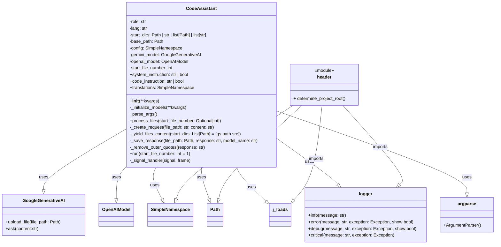

## АНАЛИЗ КОДА: `hypotez/src/endpoints/hypo69/code_assistant/assistant.py`

### 1. <алгоритм>

**Блок-схема работы `CodeAssistant`:**

```mermaid
flowchart TD
    A[Start] --> B{Parse Arguments};
    B --> C{Initialize CodeAssistant};
    C --> D{Initialize Models};
    D --> E{Start File Processing};
    E --> F{For each file};
    F --> G{Skip special files or if file number is less than start};
    G -- Skip --> F;
    G -- Process --> H{Create Request};
    H --> I{Send Request to Model (Gemini)};
    I --> J{Process Response};
    J -- Success --> K{Save Response};
    K --> L{Log success}
    J -- Fail --> M{Log error};
    I -- Fail --> N{Log model error};
    L --> O{Sleep};
    M --> O;
    N --> O;
    O --> F
    F -- No more files --> P[End];
    
    subgraph Initialize CodeAssistant
      direction TB
        C --> C1[Set Role, Lang, Model List, Start Dirs]
        C1 --> C2[Set Base Path]
        C2 --> C3[Load Config]
        C3 --> D
    end
   
     subgraph Process Response
      direction TB
        J --> J1[Remove Outer Quotes]
     end
    
    subgraph Create Request
      direction TB
        H --> H1[Get Translations]
        H1 --> H2[Create Request Dict]
        H2 --> H3[Convert Dict to String]
    end

    subgraph For each file
      direction TB
        F --> F1{Read File}
        F1 --> G
    end
    
    subgraph Save Response
      direction TB
        K --> K1{Get Output Directory}
        K1 --> K2{Format Target Directory}
        K2 --> K3{Define Suffix}
        K3 --> K4{Create Export Path}
        K4 --> K5{Create Parent Dirs if not exist}
        K5 --> K6{Save File}
    end
```

**Примеры для блоков:**

*   **B - Parse Arguments**: При запуске скрипта с `python assistant.py --role code_checker --lang ru --start-file-number 2`, аргументы будут распарсены и переданы в класс `CodeAssistant`.
*   **C - Initialize CodeAssistant**: При инициализации `CodeAssistant(role='doc_writer_md', lang='en')`, устанавливаются значения атрибутов, такие как `role` = `'doc_writer_md'`, `lang` = `'en'`, `base_path` = `.../hypo69/code_assistant`, и загружается конфигурация из JSON.
*   **G - Skip special files or if file number is less than start**: Если `start_file_number` равен 2, файл `1.py` будет пропущен, а обработка начнётся с файла `2.py`. Файлы `__init__.py` и `header.py` будут пропущены всегда.
*   **H - Create Request**:  Для файла `file.py` с содержимым `print("Hello")` будет создан запрос `{'role': 'Your specialization is documentation creation in the `MD` format', 'output_language': 'ru', 'Path to file: ': 'file.py', 'instruction': 'some instructions', 'input_code': '```print("Hello")```'}`.
*   **I - Send Request to Model (Gemini)**: Содержимое файла и инструкция отправляются в Gemini API, например: `response = self.gemini_model.ask(content_request)`
*   **J - Process Response**: Если модель возвращает `'```md some content ```'`,  будет вызван метод `_remove_outer_quotes()`, и результат станет `' some content '`.
*    **K - Save Response**:  Для файла `/src/module/file.py`, если `role` = `doc_writer_md` и `model_name` = `gemini`, файл будет сохранён как `/docs/gemini/en/module/file.py.md`
*   **O - Sleep**: Пауза в 20 секунд.

### 2. <mermaid>

**Диаграмма классов и зависимостей:**



**Анализ зависимостей `mermaid`:**

*   **`CodeAssistant`**: Основной класс, который управляет процессом обработки файлов.
    *   Зависит от `GoogleGenerativeAI` и `OpenAIModel` для работы с AI моделями.
    *   Использует `SimpleNamespace` для хранения настроек.
    *   Работает с `Path` для манипуляции путями к файлам.
    *   Использует `j_loads` для загрузки данных из JSON-файлов.
    *   Использует `logger` для логирования событий.
    *   Использует `argparse` для разбора аргументов командной строки.

*   **`GoogleGenerativeAI`**: Класс для работы с Gemini API.
    *   Используется в методе `_initialize_models()` для инициализации и в `process_files` для взаимодействия с моделью.
*   **`OpenAIModel`**: Класс для работы с OpenAI API.
    *   Используется в методе `_initialize_models()` для инициализации.
*    **`SimpleNamespace`**: Используется для хранения конфигурации и переводов.
*   **`Path`**: Используется для управления путями к файлам и директориям.
*   **`j_loads`**:  Функция из `src.utils.jjson`, которая загружает данные из JSON файлов.
*   **`logger`**:  Модуль из `src.logger.logger`, который используется для логирования событий и ошибок.
*  **`argparse`**: Используется для парсинга аргументов командной строки
*    **`header`**: Модуль `header.py` (см. ниже).

**Блок `mermaid` для `header.py`:**


### 3. <объяснение>

#### Импорты:
*   `asyncio`:  Используется для асинхронного выполнения, чтобы не блокировать поток при отправке запросов к моделям.
*   `argparse`:  Используется для разбора аргументов командной строки, таких как роль, язык и модели.
*   `sys`: Предоставляет доступ к системным переменным и функциям, включая выход из программы.
*   `pathlib.Path`: Используется для работы с файловыми путями.
*   `typing.Iterator, List, Optional`: Используется для аннотации типов, что делает код более читаемым и понятным.
*   `types.SimpleNamespace`:  Используется для создания объектов с атрибутами, доступными через точечную нотацию, что удобно для хранения настроек и конфигурации.
*   `signal`: Используется для обработки системных сигналов, например, для прерывания выполнения программы по Ctrl+C.
*    `time`: Используется для управления временем, например, для задержек.
*   `re`: Модуль для работы с регулярными выражениями, используется для фильтрации файлов.
*   `fnmatch`: Используется для сравнения имен файлов с паттернами.
*   `header`: Локальный модуль для определения корневой директории проекта и загрузки глобальных настроек.
*   `src.gs`:  Глобальные настройки проекта, включая пути, API ключи и прочее.
*   `src.utils.jjson.j_loads, j_loads_ns`:  Функции для загрузки данных из JSON-файлов.
*    `src.ai.gemini.GoogleGenerativeAI`:  Класс для работы с Google Gemini API.
*   `src.ai.openai.OpenAIModel`: Класс для работы с OpenAI API.
*   `src.utils.printer.pprint`:  Функция для вывода форматированного текста в консоль.
*   `src.utils.path.get_relative_path`: Функция для получения относительного пути файла.
*   `src.logger.logger`:  Модуль для логирования событий.
*   `src.endpoints.hypo69.code_assistant.make_summary`:  Модуль для создания `summary.md` (используется в DEBUG режиме).

#### Классы:
*   **`CodeAssistant`**:
    *   **Роль**: Основной класс, управляющий взаимодействием с моделями ИИ.
    *   **Атрибуты**:
        *   `role` (str): Роль ассистента (например, `code_checker`, `doc_writer_md`).
        *   `lang` (str): Язык для обработки (например, `ru`, `en`).
        *   `start_dirs` (Path | str | list\[Path] | list\[str]): Начальные директории для поиска файлов.
        *   `base_path` (Path): Базовый путь к директории `code_assistant`.
        *   `config` (SimpleNamespace): Конфигурация, загруженная из `code_assistant.json`.
        *   `gemini_model` (GoogleGenerativeAI): Экземпляр класса для работы с Gemini API.
        *   `openai_model` (OpenAIModel): Экземпляр класса для работы с OpenAI API.
        *    `start_file_number` (int) - номер начального файла для обработки.
    *   **Методы**:
        *   `__init__(**kwargs)`: Инициализирует ассистента с параметрами, устанавливает `role`, `lang`, список моделей, начальные директории, базовый путь и загружает конфигурацию.
        *   `_initialize_models(**kwargs)`: Инициализирует модели `GoogleGenerativeAI` и `OpenAIModel` на основе списка моделей.
        *   `parse_args()`: Разбирает аргументы командной строки.
        *   `system_instruction`: Загружает инструкции из файла на основе роли и языка.
        *   `code_instruction`: Загружает инструкции для кода из файла на основе роли и языка.
        *   `translations`: Загружает переводы для ролей и языков из JSON.
        *   `process_files(start_file_number: Optional[int] = 1)`: Основной метод, который обрабатывает файлы: читает файлы, отправляет их в модель и сохраняет результаты.
        *   `_create_request(file_path: str, content: str)`: Создаёт запрос для модели, включая роль, язык, путь к файлу и инструкции.
        *   `_yield_files_content(start_dirs: List[Path] = [gs.path.src])`:  Генерирует пары (путь к файлу, содержимое) для обработки.
        *   `_save_response(file_path: Path, response: str, model_name: str)`: Сохраняет ответ модели в файл, добавляя суффикс в зависимости от роли.
        *   `_remove_outer_quotes(response: str)`: Удаляет внешние кавычки из ответа модели.
        *   `run(start_file_number: int = 1)`: Запускает процесс обработки файлов и обрабатывает прерывание (Ctrl+C).
        *   `_signal_handler(signal, frame)`: Обработчик сигнала прерывания (Ctrl+C).
*   **`GoogleGenerativeAI`**:
    *    **Роль**: Класс для отправки запросов к Google Gemini API.
    *    **Методы**:
        *   `upload_file(file_path: Path)`: Метод загрузки файла в модель, возвращает URL файла.
        *    `ask(content:str)`: Метод отправки запроса в модель, возвращает ответ модели.
*   **`OpenAIModel`**:
    *    **Роль**: Класс для отправки запросов к OpenAI API.

#### Функции:

*   `main()`: Основная функция для запуска обработки файлов. Создает экземпляр класса `CodeAssistant` и запускает обработку.
*  `run_main_loop()`: Основная функция, которая запускает бесконечный цикл обработки файлов в соответствии с конфигурацией.

#### Переменные:

*   `MODE` (str): Определяет режим работы (по умолчанию "dev").
*   `config_path` (Path): Путь к файлу конфигурации.
*    `config` (SimpleNamespace): Объект с настройками, загруженный из JSON файла.
*   `args` (dict):  Аргументы, переданные через командную строку или из `config`.

####  Цепочка взаимосвязей:

1.  **Запуск**: `main()` или `run_main_loop()` (в бесконечном цикле) запускаются при старте скрипта.
2.  **Парсинг аргументов**: `CodeAssistant.parse_args()` разбирает аргументы командной строки или использует данные из конфигурационного файла (`code_assistant.json`).
3.  **Инициализация**: `CodeAssistant.__init__()` создаёт экземпляр класса, устанавливает начальные параметры, загружает конфигурацию и инициализирует модели.
4.  **Подготовка запроса**: Метод `_create_request()` формирует запрос для модели на основе файла и его содержимого, инструкции, роли и языка.
5.  **Отправка в модель**: `gemini_model.ask()` отправляет запрос в Gemini API.
6.  **Обработка ответа**: Метод `_remove_outer_quotes()` обрабатывает ответ модели, удаляя внешние кавычки и маркеры.
7.  **Сохранение ответа**: `_save_response()` сохраняет обработанный ответ в файл с соответствующим суффиксом, в директории `docs`.
8.  **Цикл обработки**:  Процесс повторяется для каждого файла в указанных директориях. Бесконечный цикл в `run_main_loop()` обеспечивает постоянную работу в соответствии с изменяемой конфигурацией.

#### Потенциальные ошибки и области для улучшения:
*  **Обработка ошибок**:  Не все потенциальные ошибки корректно обрабатываются. Логирование ошибок ведётся, но в некоторых случаях просто происходит пропуск и продолжение работы. Следует предусмотреть более детальную обработку исключений.
*  **Зависимости**:  Класс `CodeAssistant` имеет сильную зависимость от `GoogleGenerativeAI` и `OpenAIModel`, что затрудняет расширение функциональности. Было бы полезно создать интерфейсы для моделей, чтобы упростить добавление новых моделей в будущем.
*  **Конфигурация**:  Конфигурация загружается в начале и может быть обновлена в цикле, но её изменение не всегда может корректно влиять на текущую операцию, так как переменные уже инициализированы.
*  **Таймаут**:  Задержка в 20 секунд между обработкой файлов, необходимая для обхода ограничений API, должна быть настраиваемой.
*  **Бесконечный цикл**:  Бесконечный цикл в функции `run_main_loop()` может привести к неожиданному поведению программы и усложняет отладку.
*  **Исключения в yield**: Функция `_yield_files_content()` использует `yield None, None` в случае ошибки чтения файла, что может усложнить отладку. Лучше возвращать конкретное исключение или использовать более явные значения.
*  **Исключение в remove_outer_quotes**: Метод `_remove_outer_quotes()`  возвращает пустую строку `''` при ошибке, что может привести к некорректному сохранению файлов.

Этот анализ обеспечивает полное понимание структуры, функциональности и взаимосвязей в коде `assistant.py`.