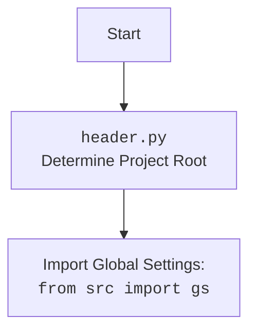

## ИНСТРУКЦИЯ:

Анализируй предоставленный код подробно и объясни его функциональность. Ответ должен включать три раздела:

1.  **<алгоритм>**: Опиши рабочий процесс в виде пошаговой блок-схемы, включая примеры для каждого логического блока, и проиллюстрируй поток данных между функциями, классами или методами.
2.  **<mermaid>**: Напиши код для диаграммы в формате `mermaid`, проанализируй и объясни все зависимости,
    которые импортируются при создании диаграммы.
    **ВАЖНО!** Убедитесь, что все имена переменных, используемые в диаграмме `mermaid`,
    имеют осмысленные и описательные имена. Имена переменных вроде `A`, `B`, `C`, и т.д., не допускаются!

    **Дополнительно**: Если в коде есть импорт `import header`, добавьте блок `mermaid` flowchart, объясняющий `header.py`:
    ```mermaid
    flowchart TD
        Start --> Header[<code>header.py</code><br> Determine Project Root]

        Header --> import[Import Global Settings: <br><code>from src import gs</code>]
    ```

3.  **<объяснение>**: Предоставьте подробные объяснения:
    *   **Импорты**: Их назначение и взаимосвязь с другими пакетами `src.`.
    *   **Классы**: Их роль, атрибуты, методы и взаимодействие с другими компонентами проекта.
    *   **Функции**: Их аргументы, возвращаемые значения, назначение и примеры.
    *   **Переменные**: Их типы и использование.
    *   Выделите потенциальные ошибки или области для улучшения.

Дополнительно, постройте цепочку взаимосвязей с другими частями проекта (если применимо).

Это обеспечивает всесторонний и структурированный анализ кода.
## Формат ответа: `.md` (markdown)
**КОНЕЦ ИНСТРУКЦИИ**
## MD

### <алгоритм>

1.  **Чтение параметров запуска**:
    *   Пример: `python assistant.py --role doc_writer --lang ru --models gemini openai --start_dirs /path/to/dir1 /path/to/dir2`
    *   Описание: Программа получает параметры через командную строку, такие как роль, язык, список моделей и стартовые директории. Альтернативно, параметры могут быть загружены из JSON-файла.

2.  **Инициализация**:
    *   Пример: Создание экземпляров моделей Gemini и OpenAI.
    *   Описание: Инициализируются модели ИИ (Gemini, OpenAI) на основе заданных параметров. Также, настраивается логгер.

3.  **Поиск файлов**:
    *   Пример: Поиск всех файлов с расширениями `.py` и `README.MD` в указанных директориях, исключая файлы и папки, соответствующие настройкам исключений.
    *   Описание: Рекурсивно сканируются указанные стартовые директории и извлекаются пути к файлам.

4.  **Загрузка промптов**:
    *   Пример: Чтение промпта `doc_writer_ru.md` из `src/ai/prompts/developer/`.
    *   Описание: Загружаются промпты (инструкции для моделей) из файлов на основе заданной роли и языка.

5.  **Обработка файлов**:
    *   Пример: Для каждого найденного файла, формируется запрос на основе промпта и содержимого файла, отправляется в выбранные модели.
    *   Описание: Код файла и соответствующий промпт отправляются на обработку в каждую выбранную модель.

6.  **Сохранение ответов**:
    *   Пример: Сохранение ответов от Gemini и OpenAI в директорию, соответствующую модели и языку, например, `docs/raw_rst_from_gemini/ru/`.
    *   Описание: Результаты обработки от каждой модели сохраняются в отдельную директорию.

### <mermaid>

```mermaid
flowchart TD
    Start[Начало] --> ReadSettings[Чтение настроек из CLI или JSON]
    ReadSettings --> InitLogger[Инициализация логгера]
    ReadSettings --> InitModels[Инициализация моделей (Gemini, OpenAI)]
    InitModels --> FindFiles[Поиск файлов .py и README.MD]
    FindFiles --> LoadPrompts[Загрузка промптов]
    LoadPrompts --> ProcessFiles[Обработка файлов]
     ProcessFiles -->  PrepareRequest[Подготовка запроса для модели]
    PrepareRequest --> SendToModels[Отправка запроса в модели]
     SendToModels -- Получен ответ --> SaveResponses[Сохранение ответов]
    SaveResponses --> End[Конец]
    
     
    classDef green fill:#90EE90
    class Start,End green
```



**Анализ зависимостей `mermaid`:**

*   `Start`, `ReadSettings`, `InitLogger`, `InitModels`, `FindFiles`, `LoadPrompts`, `ProcessFiles`,  `PrepareRequest`, `SendToModels`,`SaveResponses`, `End`:  Это узлы, представляющие этапы выполнения кода в основном алгоритме `code_assistant`.
*   Стрелки указывают на последовательность выполнения операций.

### <объяснение>

**Общее описание:**

Этот код является частью инструмента `Code Assistant`, предназначенного для автоматизации задач, связанных с обработкой кода, таких как создание документации, анализ кода и генерация тестов. Он использует модели искусственного интеллекта (Gemini и OpenAI) для выполнения этих задач на основе предоставленных промптов.

**Импорты:**

*   `os`, `sys`, `json`, `re`, `logging`, `argparse`, `copy`: Стандартные модули Python для работы с файловой системой, JSON, регулярными выражениями, логированием, аргументами командной строки и копированием объектов.
*   `src.ai.gemini_model`, `src.ai.openai_model`, `src.utils.file_utils`, `src.utils.logger`, `src.utils.header`, `src.utils.settings`, `src.ai.prompts`: Импорты из других частей проекта. Они обеспечивают взаимодействие с моделями ИИ, утилиты для работы с файлами, настройки логгера, определение корня проекта и настройку.
  * `src.ai.gemini_model`: отвечает за взаимодействие с моделью Gemini.
  * `src.ai.openai_model`: отвечает за взаимодействие с моделью OpenAI.
  * `src.utils.file_utils`:  предоставляет утилиты для работы с файловой системой (чтение, запись, поиск файлов).
  * `src.utils.logger`:  предоставляет утилиты для логирования событий.
  * `src.utils.header`: отвечает за определение корня проекта.
  * `src.utils.settings`: предоставляет утилиты для управления настройками проекта.
  * `src.ai.prompts`: отвечает за загрузку промптов.

**Классы:**

В данном коде нет явных классов, но взаимодействие с моделями `gemini_model` и `openai_model` подразумевает использование их классов.

**Функции:**

*   `main()`:
    *   **Назначение**: Главная функция, управляющая работой `Code Assistant`.
    *   **Аргументы**: Нет явных аргументов, но использует `argparse` для обработки параметров командной строки.
    *   **Возвращаемое значение**: Нет явного возвращаемого значения.
    *   **Логика**:
        1.  **Чтение параметров**: Читает параметры из командной строки или JSON-файла.
        2.  **Инициализация**: Инициализирует модели, логгер.
        3.  **Поиск файлов**: Находит все файлы, соответствующие заданным критериям.
        4.  **Загрузка промптов**: Загружает промпты для заданной роли.
        5.  **Обработка файлов**: Отправляет каждый файл на обработку в модели, сохраняет результаты.
*   `get_all_files(start_dirs, exclude_file_patterns, exclude_dirs, exclude_files)`:
    *   **Назначение**: Рекурсивный поиск файлов в указанных директориях.
    *   **Аргументы**:
        *   `start_dirs`: Список начальных директорий для поиска.
        *   `exclude_file_patterns`: Список регулярных выражений для исключения файлов.
        *   `exclude_dirs`: Список исключаемых директорий.
        *   `exclude_files`: Список исключаемых файлов.
    *   **Возвращаемое значение**: Список путей к найденным файлам.
    *   **Логика**: Проходит по стартовым директориям, рекурсивно просматривает все папки и собирает пути к файлам `.py` и `README.MD`, исключая файлы и папки, заданные в параметрах.
*  `prepare_request(file_path, prompt_text)`:
    *   **Назначение**: Подготавливает запрос для модели, включая путь к файлу и текст промпта.
    *   **Аргументы**:
          *    `file_path`: Путь к файлу.
          *    `prompt_text`: Текст промпта.
    *   **Возвращаемое значение**: Строку запроса.
    *   **Логика**: формирует строку запроса, объединяя путь к файлу и текст промпта.

**Переменные:**

*   `settings`: Объект настроек, полученный из `settings.py` или `settings.json` файла.
*   `logger`: Объект логгера.
*   `models`: Список моделей для обработки (например, `gemini`, `openai`).
*  `start_dirs`:  Список начальных директорий для поиска файлов.
*  `role`: Роль модели для выполнения задачи (`doc_writer`, `code_checker`, и т.д.).
*   `lang`: Язык для выполнения задачи (`ru`, `en`, и т.д.).
*   `exclude_file_patterns`, `exclude_dirs`, `exclude_files`: Списки для исключения файлов и директорий.

**Потенциальные ошибки и области для улучшения:**

*   **Обработка ошибок**: В коде отсутствуют явные блоки `try-except` для обработки ошибок, таких как ошибки ввода-вывода, проблемы с API моделей, и т.д. Необходимо добавить обработку исключений для устойчивости работы программы.
*   **Асинхронная обработка**: Обработка файлов выполняется последовательно, что может быть медленным при большом количестве файлов. Использование асинхронных операций (например, `asyncio`) позволит ускорить работу.
*   **Гибкость настроек**:  Настройки exclude могут быть более гибкими, например, поддерживать glob patterns.

**Взаимосвязь с другими частями проекта:**

*   `src.ai.gemini_model`:  Обеспечивает взаимодействие с API Gemini.
*   `src.ai.openai_model`: Обеспечивает взаимодействие с API OpenAI.
*   `src.utils.file_utils`:  Предоставляет функции для чтения и записи файлов.
*   `src.utils.logger`:  Обеспечивает логирование событий.
*   `src.utils.header`:  Определяет корень проекта.
*   `src.utils.settings`:  Предоставляет настройки для работы программы.
*   `src.ai.prompts`: Загружает промпты для разных ролей и языков.

**Цепочка взаимосвязей:**

1.  `main()`: Точка входа, которая управляет всеми другими модулями.
2.  `settings.py` (`settings.json`): Предоставляет настройки для работы `main()`, такие как API ключи, пути к файлам и другие параметры.
3.  `header.py`: Используется для определения корня проекта, от которого зависят другие относительные пути.
4.  `logger.py`: Используется для вывода логов в консоль или файл.
5.  `file_utils.py`: Используется для чтения файлов кода и промптов.
6.  `gemini_model.py` и `openai_model.py`: Используются для отправки запросов в API моделей и получения ответов.
7.  `prompts`: Используется для хранения промптов (инструкций для моделей).

В целом, этот код является частью сложного инструмента, который интегрируется с другими частями проекта для автоматизации обработки кода с использованием моделей ИИ.