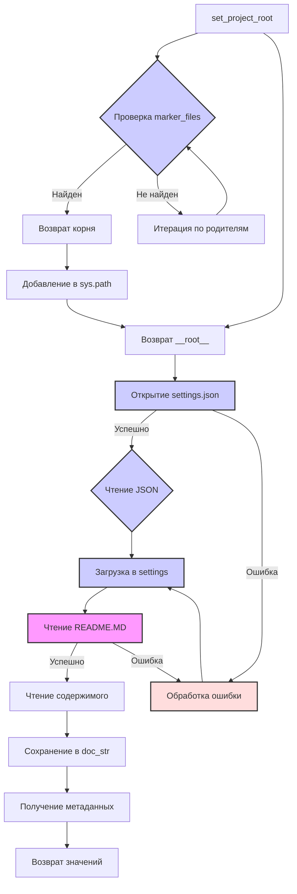

```MD
# <input code>

```python
## \file hypotez/src/logger/header.py
# -*- coding: utf-8 -*-\
#! venv/Scripts/python.exe
#! venv/bin/python/python3.12

"""
module: src.logger 
	:platform: Windows, Unix
	:synopsis: Модуль определяющий корневой путь к проекту. Все импорты строятся относительно этого пути.
    :TODO: В дальнейшем перенести в системную переменную"""
MODE = 'dev'

import sys
import json
from packaging.version import Version

from pathlib import Path
def set_project_root(marker_files=('pyproject.toml', 'requirements.txt', '.git')) -> Path:
    """
    Finds the root directory of the project starting from the current file's directory,
    searching upwards and stopping at the first directory containing any of the marker files.

    Args:
        marker_files (tuple): Filenames or directory names to identify the project root.
    
    Returns:
        Path: Path to the root directory if found, otherwise the directory where the script is located.
    """
    __root__:Path
    current_path:Path = Path(__file__).resolve().parent
    __root__ = current_path
    for parent in [current_path] + list(current_path.parents):
        if any((parent / marker).exists() for marker in marker_files):
            __root__ = parent
            break
    if __root__ not in sys.path:
        sys.path.insert(0, str(__root__))
    return __root__


# Get the root directory of the project
__root__ = set_project_root()
"""__root__ (Path): Path to the root directory of the project"""

from src import gs

settings:dict = None
try:
    with open(gs.path.root / 'src' /  'settings.json', 'r') as settings_file:
        settings = json.load(settings_file)
except (FileNotFoundError, json.JSONDecodeError):
    ...

doc_str:str = None
try:
    with open(gs.path.root / 'src' /  'README.MD', 'r') as settings_file:
        doc_str = settings_file.read()
except (FileNotFoundError, json.JSONDecodeError):
    ...


__project_name__ = settings.get("project_name", 'hypotez') if settings  else 'hypotez'
__version__: str = settings.get("version", '')  if settings  else ''
__doc__: str = doc_str if doc_str else ''
__details__: str = ''
__author__: str = settings.get("author", '')  if settings  else ''
__copyright__: str = settings.get("copyrihgnt", '')  if settings  else ''
__cofee__: str = settings.get("cofee", "Treat the developer to a cup of coffee for boosting enthusiasm in development: https://boosty.to/hypo69")  if settings else "Treat the developer to a cup of coffee for boosting enthusiasm in development: https://boosty.to/hypo69"
```

# <algorithm>

**Алгоритм работы:**

1. **`set_project_root(marker_files)`:**
   - Получает список `marker_files` (файлы, по которым определяется корень проекта).
   - Начинает поиск с текущего файла (`__file__`).
   - Итерируется по родительским каталогам текущего файла.
   - Для каждого родительского каталога проверяет существование файлов из списка `marker_files`.
   - Если один из файлов найден, то это корень проекта, и функция возвращает его путь.
   - Если корень не найден, то возвращает путь текущей директории.
   - Добавляет найденный корень в `sys.path`, что позволяет импортировать модули из корневой директории проекта.

2. **Получение данных из `settings.json` и `README.MD`:**
   -  Используя `__root__`, получает путь к файлу `settings.json` в директории `src`.
   - Попытка открыть и загрузить JSON данные из `settings.json` в `settings`. Использует обработку исключений `try-except` для обработки случаев, когда файл не найден или содержит некорректный JSON.
   - Аналогично, пытается загрузить содержимое `README.MD` в `doc_str`.

3. **Получение метаданных:**
   - Использует `settings.get()` для извлечения значений из словаря `settings`, с использованием значения по умолчанию, если ключ не найден.
   - Значения извлекаются для `__project_name__`, `__version__`, `__author__`, `__copyright__`, `__cofee__`, `__doc__`, `__details__`.

**Пример:**

Если файл `header.py` находится в `hypotez/src/logger`, и проект расположен в `hypotez`, то `set_project_root` найдет `hypotez` как корень проекта и добавит его в `sys.path`.

# <mermaid>



**Объяснение диаграммы:**

Диаграмма описывает цепочку вызовов и зависимостей.

- `set_project_root`: функция, определяющая корень проекта.
- `settings.json`: файл, содержащий настройки проекта.
- `README.MD`: файл, содержащий описание проекта.
- `sys.path`: системный список путей поиска модулей.
- Обработка ошибок (`try-except`) обеспечивает устойчивость кода.


# <explanation>

**Импорты:**

- `sys`: модуль, предоставляющий доступ к системным переменным, в том числе `sys.path`.
- `json`: модуль для работы с JSON-файлами.
- `packaging.version`: модуль для работы с версиями пакетов.
- `pathlib`: модуль для работы с путями к файлам и каталогам.
- `src.gs`: модуль, скорее всего, содержащий константы или функции для работы с путями внутри проекта.

**Классы:**

Нет классов в этом фрагменте кода.

**Функции:**

- `set_project_root(marker_files)`: находит корень проекта, используя заданный набор маркеров.
   - Аргументы: `marker_files` (кортеж имен файлов/каталогов, используемых для определения корня).
   - Возвращаемое значение: `Path` к корню проекта.

**Переменные:**

- `MODE`: строковая константа, вероятно, определяющая режим работы.
- `__root__`: `Path`-объект, хранящий путь к корню проекта.
- `settings`: словарь, хранящий данные из `settings.json`.
- `doc_str`: строка, хранящая содержимое `README.MD`.
- `__project_name__`, `__version__`, `__author__`, `__copyright__`, `__cofee__`, `__doc__`, `__details__`: переменные, хранящие метаданные проекта.

**Возможные ошибки и улучшения:**

- Логирование: стоит добавить логирование, например, используя `logging`, для отслеживания ошибок при поиске корня проекта или при чтении файлов.
- Обработка пустого файла `settings.json`: код должен обработать ситуацию, когда файл пуст или содержит некорректные данные.
- Улучшенное имя файла для `gs`: имя файла `gs.path.root` может быть более информативным, так как неясно, что он делает.
- Использование `Path` по умолчанию: Если у `gs` есть атрибут `root` типа `Path`, стоит использовать его напрямую вместо преобразования в строку.
- Проверка типов: можно добавить проверки типов для параметров и возвращаемых значений функций.

**Взаимосвязи с другими частями проекта:**

Модуль `gs` является зависимостью для текущего модуля. Он необходим для работы с путями к файлам внутри проекта. Вероятно, `gs` предоставляет общие функции работы с путями и конфигурацией проекта.  `settings.json` содержит ключевые данные о проекте, которые используются другими частями проекта для настройки поведения.  `README.MD` содержит описание, которое может использоваться для документации или других целей.