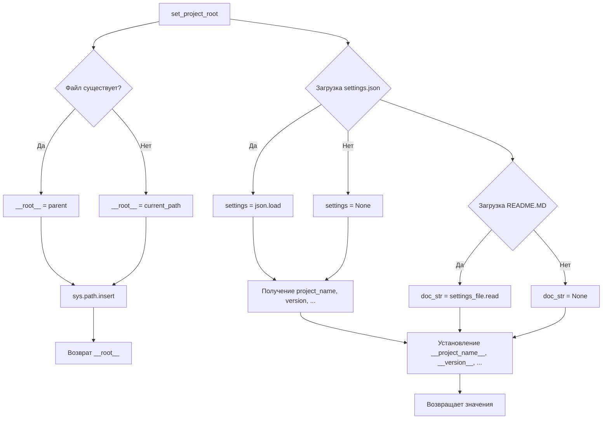

```MD
# <input code>

```python
## \file hypotez/src/logger/header.py
# -*- coding: utf-8 -*-
#! venv/Scripts/python.exe
#! venv/bin/python/python3.12

"""
module: src.logger 
	:platform: Windows, Unix
	:synopsis: Модуль определяющий корневой путь к проекту. Все импорты строятся относительно этого пути.
    :TODO: В дальнейшем перенести в системную переменную"""
MODE = 'dev'

import sys
import json
from packaging.version import Version

from pathlib import Path
def set_project_root(marker_files=('pyproject.toml', 'requirements.txt', '.git')) -> Path:
    """
    Finds the root directory of the project starting from the current file's directory,
    searching upwards and stopping at the first directory containing any of the marker files.

    Args:
        marker_files (tuple): Filenames or directory names to identify the project root.
    
    Returns:
        Path: Path to the root directory if found, otherwise the directory where the script is located.
    """
    __root__:Path
    current_path:Path = Path(__file__).resolve().parent
    __root__ = current_path
    for parent in [current_path] + list(current_path.parents):
        if any((parent / marker).exists() for marker in marker_files):
            __root__ = parent
            break
    if __root__ not in sys.path:
        sys.path.insert(0, str(__root__))
    return __root__


# Get the root directory of the project
__root__ = set_project_root()
"""__root__ (Path): Path to the root directory of the project"""

from src import gs

settings:dict = None
try:
    with open(gs.path.root / 'src' /  'settings.json', 'r') as settings_file:
        settings = json.load(settings_file)
except (FileNotFoundError, json.JSONDecodeError):
    ...

doc_str:str = None
try:
    with open(gs.path.root / 'src' /  'README.MD', 'r') as settings_file:
        doc_str = settings_file.read()
except (FileNotFoundError, json.JSONDecodeError):
    ...


__project_name__ = settings.get("project_name", 'hypotez') if settings  else 'hypotez'
__version__: str = settings.get("version", '')  if settings  else ''
__doc__: str = doc_str if doc_str else ''
__details__: str = ''
__author__: str = settings.get("author", '')  if settings  else ''
__copyright__: str = settings.get("copyrihgnt", '')  if settings  else ''
__cofee__: str = settings.get("cofee", "Treat the developer to a cup of coffee for boosting enthusiasm in development: https://boosty.to/hypo69")  if settings  else "Treat the developer to a cup of coffee for boosting enthusiasm in development: https://boosty.to/hypo69"
```

# <algorithm>

**Алгоритм**

1. **`set_project_root(marker_files)`:**
   - Принимает кортеж `marker_files` (файлы/директории для поиска корневого каталога).
   - Начинает поиск с текущей директории файла.
   - Итерируется по родительским каталогам.
   - Проверяет существование файлов/директорий из `marker_files` в текущей директории.
   - Если найден подходящий родительский каталог, записывает его в переменную `__root__` и завершает цикл.
   - Если корневой каталог не найден, `__root__` получает значение текущей директории.
   - Добавляет корневой каталог в `sys.path`, если он еще не добавлен.
   - Возвращает корневой каталог.

2. **Основная часть:**
   - Вызывает `set_project_root()` для получения корневого каталога.
   - Загружает `settings.json` из `gs.path.root / 'src' / 'settings.json'`, если файл существует.
   - Загружает `README.MD` из `gs.path.root / 'src' / 'README.MD'`, если файл существует.
   - Читает данные из `settings` и, если файл не существует или загрузка прошла неудачно, использует значения по умолчанию для переменных.

**Пример:**

Если `__file__` находится в `hypotez/src/logger/header.py`, `set_project_root` будет искать корневой каталог `hypotez` по родительским каталогам, используя файлы `pyproject.toml`, `requirements.txt` или `.git`. Если найден, он возвращает путь к `hypotez`.

**Передача данных:**

- Результат `set_project_root()` (корневой каталог) передается в глобальную переменную `__root__`, которая используется в последующих операциях.
- Значения из `settings.json` (если успешно загружены) используются для заполнения переменных `__project_name__`, `__version__`, `__author__`, `__copyright__` и `__cofee__`.
- Содержимое `README.MD` (если успешно загружено) передаётся в `__doc__`.


# <mermaid>



**Объяснение зависимости:**

- `gs.path.root`: Предполагается, что это объект из модуля `gs`, который предоставляет методы доступа к корневому каталогу проекта. Эта зависимость указывает на то, что модуль `gs` (вероятно, из пакета `src`) играет важную роль в определении пути к корневому каталогу проекта.
- `json`, `pathlib`: Стандартные библиотеки Python, необходимые для работы с JSON-файлами и путями.
- `packaging.version`: Библиотека для работы с версиями пакетов.


# <explanation>

**Импорты:**

- `sys`: Предоставляет доступ к системным параметрам, в частности, к пути поиска модулей (`sys.path`).
- `json`: Для работы с JSON-данными.
- `packaging.version`: Для работы с версиями пакетов.
- `pathlib`: Для работы с путями к файлам и директориям.

**Классы:**

- Нет явных классов, только функции.

**Функции:**

- `set_project_root(marker_files)`:  Находит корневой каталог проекта.  Аргумент `marker_files` позволяет задать список файлов, по наличию которых в родительских каталогах определяется корень.  Возвращает `Path` объекта, представляющего корневой каталог, или текущую директорию, если корневой каталог не найден.
- В остальном функции - это обычные операторы Python (открытие файлов, работа с JSON).

**Переменные:**

- `__root__`: Глобальная переменная типа `Path`, содержащая путь к корневому каталогу проекта.
- `settings`: Словарь, содержащий настройки проекта, загруженные из `settings.json`.
- `doc_str`: Строка, содержащая содержимое файла `README.MD`.
- `__project_name__`, `__version__`, `__author__`, `__copyright__`, `__cofee__`, `__doc__`: Переменные, содержащие информацию из `settings` или значения по умолчанию.

**Возможные ошибки и улучшения:**

- Обработка ошибок:  Используются `try...except` блоки для обработки `FileNotFoundError` и `json.JSONDecodeError`. Это хорошо, но может быть полезно добавить более конкретные проверки (например, проверить, что `settings` не пустой словарь или что в нем есть нужные ключи).
- Явное указание типов: В некоторых местах полезно явно указать типы переменных (например, `settings: dict`).
- Улучшенная логика поиска:  Если файлов из `marker_files` нет ни в одном из родительских каталогов, `__root__` останется равной текущему пути. В таком случае стоит добавить проверку.
- Модуль `gs`: Необходим вывод на консоль о том, что происходит при сбоях в открытии файла или при ошибке разбора JSON. Это может быть логирование или вывод в консоль.  Необходимо понять, как используется `gs.path.root`.
- Потенциально плохая идея создавать глобальные переменные `__root__`, `__project_name__`, ...  Вместо этого можно вернуть их из функций.

**Взаимосвязь с другими частями проекта:**

Модуль `src.logger` зависит от модуля `src.gs` для определения корневого пути, а также от `json`, `pathlib` и `packaging.version` (стандартные библиотеки Python).  Модуль `src.logger` отвечает за инициализацию некоторых переменных, используемых в других модулях.