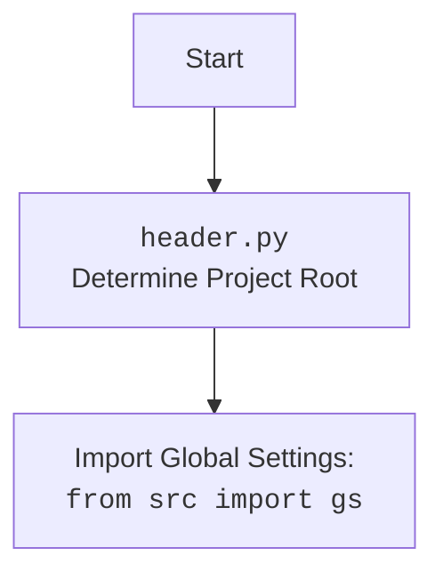

## <алгоритм>

1.  **`set_project_root(marker_files)`**:
    *   Начало: Функция принимает `marker_files` (кортеж имен файлов или директорий) в качестве аргумента. По умолчанию `marker_files` равен `('__root__',)`.
    *   Определение текущего пути: Определяется абсолютный путь к директории, где находится текущий файл (`__file__`).
    *   Инициализация корневого пути: Переменная `__root__` инициализируется текущим путем.
    *   Поиск корневого каталога:
        *   Обход родительских директорий: Функция последовательно перебирает текущую директорию и все ее родительские директории.
        *   Проверка маркеров: Для каждой директории проверяется, существует ли хотя бы один файл или директория с именем из `marker_files`.
        *   Обновление корневого пути: Если маркер найден, `__root__` обновляется до директории, где найден маркер, и поиск прекращается.
    *   Добавление в `sys.path`: Если найденный корневой путь не входит в `sys.path`, он добавляется в начало списка путей.
    *   Возврат: Функция возвращает путь к корневому каталогу.

    **Пример**:

    Допустим, структура проекта такая:
    ```
    project/
        __root__
        src/
            logger/
                header.py
            ...
    ```
    В этом случае `set_project_root()` начнет с папки `project/src/logger` и будет искать `__root__` выше.  
    Функция остановится на папке `project/` и вернет ее путь.

2.  **`__root__ = set_project_root()`**: Вызывается `set_project_root()`, и возвращенное значение присваивается глобальной переменной `__root__`.

3.  **Импорт `gs`**: Импортируется модуль `gs` из пакета `src`.

4.  **Загрузка настроек**:
    *   Чтение файла `settings.json`: Попытка открыть и прочитать файл `settings.json`, используя путь `gs.path.root / 'src' / 'settings.json'`.
    *   Обработка ошибок: Если файл не найден или возникает ошибка при разборе JSON, переменной `settings` присваивается `None`.

5.  **Загрузка документации**:
    *   Чтение файла `README.MD`: Попытка открыть и прочитать файл `README.MD`, используя путь `gs.path.root / 'src' / 'README.MD'`.
    *   Обработка ошибок: Если файл не найден или возникает ошибка при разборе, переменной `doc_str` присваивается `None`.

6.  **Инициализация глобальных переменных**: Глобальные переменные (`__project_name__`, `__version__`, `__doc__`, `__details__`, `__author__`, `__copyright__`, `__cofee__`) инициализируются значениями из словаря `settings` или значениями по умолчанию, если `settings` равно `None`.

## <mermaid>

```mermaid
flowchart TD
    Start[Start] --> FindRoot[set_project_root(marker_files)]
    FindRoot --> CheckMarker[Проверка наличия файлов маркеров в родительских директориях]
    CheckMarker -- Найдено --> SetRoot[Установка корневого каталога]
    CheckMarker -- Не найдено --> UseCurrent[Использовать текущую директорию]
    SetRoot --> InsertSysPath[Добавление в sys.path]
    UseCurrent --> InsertSysPath
    InsertSysPath --> ReturnRoot[Возврат корневого каталога]
    ReturnRoot --> AssignRoot[__root__ = set_project_root()]
    AssignRoot --> ImportGS[import gs из src]
    ImportGS --> LoadSettings[Загрузка settings.json]
    LoadSettings --> LoadDoc[Загрузка README.MD]
    LoadDoc --> InitGlobalVars[Инициализация глобальных переменных]
    InitGlobalVars --> End[Конец]

    style Start fill:#f9f,stroke:#333,stroke-width:2px
    style End fill:#f9f,stroke:#333,stroke-width:2px

```



**Объяснение зависимостей (импортов):**

*   `import sys`: Модуль `sys` используется для доступа к системным переменным и функциям, таким как `sys.path`, который хранит список путей, где Python ищет модули. В коде он используется для добавления корневого каталога проекта в `sys.path`, чтобы можно было импортировать модули из других частей проекта.

*   `import json`: Модуль `json` используется для работы с данными в формате JSON. В коде он используется для загрузки настроек проекта из файла `settings.json`.

*   `from packaging.version import Version`: Модуль `Version` используется для сравнения версий ПО. В данном коде не используется, вероятно, является заделом на будущее.

*   `from pathlib import Path`:  Класс `Path` из модуля `pathlib` предоставляет удобный объектно-ориентированный способ работы с путями к файлам и директориям. Он используется для определения абсолютных путей, поиска родительских директорий и проверки существования файлов.
*   `import header`: импортирует сам себя, используется для того что бы при импорте модуля `header` повторно не выполнял код

*   `from src import gs`: импортирует глобальные настройки проекта, которые доступны через объект `gs`

## <объяснение>

**Импорты:**

*   `sys`: Используется для изменения `sys.path`, что позволяет Python находить модули из корневой директории.
*   `json`: Используется для работы с JSON-файлами, в частности, для загрузки настроек проекта из `settings.json`.
*   `packaging.version.Version`: Не используется, но импортирован. Возможно, для будущей работы с версиями.
*   `pathlib.Path`: Используется для представления путей к файлам и директориям. Обеспечивает объектно-ориентированный интерфейс для работы с файловой системой.
*   `header`: импортирует сам себя, чтобы не повторять код импорта.
*   `src.gs`: Используется для доступа к глобальным настройкам проекта. Предполагается, что `src.gs` содержит информацию, необходимую для доступа к корневому каталогу проекта.

**Функции:**

*   `set_project_root(marker_files)`:
    *   **Аргументы:** `marker_files` (кортеж) - маркерные файлы или директории для поиска корневого каталога.
    *   **Возвращаемое значение:** `Path` - абсолютный путь к корневой директории проекта.
    *   **Назначение:** Определяет корневой каталог проекта путем поиска маркерных файлов в родительских директориях. Это позволяет определить, где находится корень проекта, независимо от того, где запущен скрипт.
    *   **Примеры**:
        ```python
        # Пример использования с маркером "__root__"
        root_path = set_project_root()
        print(root_path) # /path/to/project/root

        # Пример с другим маркером
        root_path = set_project_root(marker_files=('setup.py',))
        print(root_path) # /path/to/project/root
        ```

**Переменные:**

*   `__root__`: `Path` - абсолютный путь к корневому каталогу проекта. Инициализируется путем вызова функции `set_project_root()`.
*   `settings`: `dict` или `None` - словарь настроек, загруженных из файла `settings.json`. Если файл не найден или произошла ошибка при разборе, присваивается значение `None`.
*   `doc_str`: `str` или `None` - строка с текстом из файла `README.MD`. Если файл не найден или произошла ошибка при разборе, присваивается значение `None`.
*   `__project_name__`, `__version__`, `__doc__`, `__details__`, `__author__`, `__copyright__`, `__cofee__`: `str` - глобальные переменные, содержащие информацию о проекте, полученную из настроек `settings` или значения по умолчанию.

**Цепочка взаимосвязей:**

1.  Функция `set_project_root()` определяет корневой каталог проекта и присваивает его переменной `__root__`.
2.  Переменная `__root__` используется для определения полного пути к файлам `settings.json` и `README.MD`.
3.  Загруженные данные (из `settings.json` и `README.MD`) используются для инициализации глобальных переменных проекта.
4.  Импорт `from src import gs` предпологает наличие  модуля `gs` в пакете `src`, который предоставляет доступ к настройкам проекта. В данном случае, `gs.path.root` используется для доступа к переменной `__root__`.

**Потенциальные ошибки и области для улучшения:**

*   **Обработка ошибок**: Обработка `FileNotFoundError` и `json.JSONDecodeError` происходит через `...`, что означает, что ошибки просто игнорируются. Желательно добавить логирование ошибок или более явную обработку исключений.
*   **Зависимость от структуры проекта**:  Код предполагает, что файл `settings.json` и `README.MD` находятся по пути `src/settings.json` и `src/README.MD` относительно корня проекта. Если структура проекта изменится, код потребуется обновить.
*   **Использование `header`**: использование импорта самого себя `import header` выглядит странно, и не принесет никакого результата.
*   **Конфигурация через JSON**: Настройки проекта могут быть более гибкими, например, если использовать переменные окружения или конфигурационные файлы других форматов.
*   **Обработка ошибок загрузки настроек**:  Если не найден файл `settings.json` или произошла ошибка парсинга, переменные `__project_name__`, `__version__`, `__author__`, и `__copyright__` принимают значения по умолчанию. Это не всегда может быть желательно, лучше предусмотреть логирование ошибки и возможность  уведомление разработчика о проблеме.
*   **Неиспользуемый импорт**: `from packaging.version import Version` импортируется, но не используется. Этот импорт лучше удалить.

В целом, код выполняет важную функцию по определению корневого каталога проекта и загрузке основных настроек, но нуждается в доработке в части обработки ошибок и гибкости.