## Анализ кода `hypotez/src/endpoints/hypo69/code_assistant/header.py`

### 1. <алгоритм>

**Блок-схема:**

```mermaid
graph LR
    A[Начало] --> B{Определение `MODE`};
    B --> C[Импорт модулей];
    C --> D{Определение функции `set_project_root`};
    D --> E{Вызов `set_project_root` для определения `__root__`};
    E --> F{Импорт модуля `src.gs`};
    F --> G{Загрузка `settings.json` в `settings`};
    G --> H{Обработка ошибок загрузки `settings.json`};
    H --> I{Загрузка `README.MD` в `doc_str`};
    I --> J{Обработка ошибок загрузки `README.MD`};
    J --> K{Извлечение `project_name` из `settings`};
    K --> L{Извлечение `version` из `settings`};
    L --> M{Извлечение `doc_str`};
    M --> N{Извлечение `details` из `settings`};
     N --> O{Извлечение `author` из `settings`};
     O --> P{Извлечение `copyright` из `settings`};
     P --> Q{Извлечение `cofee` из `settings`};
     Q --> Z[Конец];
    
    
    style A fill:#f9f,stroke:#333,stroke-width:2px
    style Z fill:#f9f,stroke:#333,stroke-width:2px
    
    style B fill:#ccf,stroke:#333,stroke-width:2px
    style D fill:#ccf,stroke:#333,stroke-width:2px
    style E fill:#ccf,stroke:#333,stroke-width:2px
    
    style C fill:#afa,stroke:#333,stroke-width:2px
    style F fill:#afa,stroke:#333,stroke-width:2px
    
    style G fill:#ddf,stroke:#333,stroke-width:2px
    style H fill:#ffc,stroke:#333,stroke-width:2px
    style I fill:#ddf,stroke:#333,stroke-width:2px
    style J fill:#ffc,stroke:#333,stroke-width:2px
    
    style K fill:#bfb,stroke:#333,stroke-width:2px
    style L fill:#bfb,stroke:#333,stroke-width:2px
    style M fill:#bfb,stroke:#333,stroke-width:2px
    style N fill:#bfb,stroke:#333,stroke-width:2px
     style O fill:#bfb,stroke:#333,stroke-width:2px
    style P fill:#bfb,stroke:#333,stroke-width:2px
    style Q fill:#bfb,stroke:#333,stroke-width:2px
```



**Примеры для логических блоков:**
1.  **Определение `MODE`**: `MODE = 'dev'` - Устанавливается режим работы.
2.  **Импорт модулей**: `import sys`, `import json`, `from pathlib import Path`, `from packaging.version import Version` - Импортируются необходимые модули для работы с системой, JSON, путями и версиями.
3. **Определение функции `set_project_root`**: Функция `set_project_root` находит корневую директорию проекта, начиная с директории текущего файла.
    -  Входные данные: `marker_files = ('pyproject.toml', 'requirements.txt', '.git')`
    -  Выходные данные: `__root__` - объект `Path`, указывающий на корень проекта.
    -  Пример: Если файл находится в `/home/user/project/src/module.py`, а в `/home/user/project/` есть `pyproject.toml`, то `__root__` будет `/home/user/project/`.
4. **Вызов `set_project_root` для определения `__root__`**: `__root__ = set_project_root()` - Вызывается функция и результат сохраняется в `__root__`.
5. **Импорт модуля `src.gs`**: `from src import gs` - Импортируется модуль `gs` из пакета `src`.
6. **Загрузка `settings.json` в `settings`**: 
    -  Файл `settings.json` находится в `<root>/src/settings.json`.
    -  Если файл существует и является корректным JSON, он загружается в переменную `settings`.
    -  Если файл не найден или не является корректным JSON, переменная `settings` остается `None`.
7.  **Обработка ошибок загрузки `settings.json`**: `except (FileNotFoundError, json.JSONDecodeError): ...` - Обрабатываются ошибки, если файл `settings.json` не найден или имеет неверный формат.
8.  **Загрузка `README.MD` в `doc_str`**:
   -  Файл `README.MD` находится в `<root>/src/README.MD`.
    -  Если файл существует, его содержимое загружается в переменную `doc_str`.
    -  Если файл не найден, переменная `doc_str` остается `None`.
9.   **Обработка ошибок загрузки `README.MD`**: `except (FileNotFoundError, json.JSONDecodeError): ...` - Обрабатываются ошибки, если файл `README.MD` не найден.
10. **Извлечение данных из `settings`**:
    -   `__project_name__`:  Извлекается `project_name` из `settings`, если `settings` не None, иначе устанавливается значение `'hypotez'`.
    -   `__version__`: Извлекается `version` из `settings`, если `settings` не `None`, иначе устанавливается значение `''`.
    -   `__doc__`: Устанавливается содержимое переменной `doc_str`, если `doc_str` не None, иначе устанавливается значение `''`.
    -   `__details__`: Устанавливается пустая строка.
    -   `__author__`: Извлекается `author` из `settings`, если `settings` не `None`, иначе устанавливается значение `''`.
    -   `__copyright__`: Извлекается `copyrihgnt` из `settings`, если `settings` не `None`, иначе устанавливается значение `''`.
    -   `__cofee__`: Извлекается `cofee` из `settings`, если `settings` не `None`, иначе устанавливается значение по умолчанию.

### 2. <mermaid>

```mermaid
graph LR
    A[Начало] --> B(MODE: str);
    B --> C[Импорт: sys, json, Path, Version];
    C --> D{set_project_root(marker_files: tuple) : Path};
    D --> E(__root__: Path);
    E --> F[Импорт: src.gs];
    F --> G{settings: dict = Загрузка из settings.json};
    G --> H{doc_str: str = Загрузка из README.MD};
    H --> I(__project_name__: str);
    I --> J(__version__: str);
    J --> K(__doc__: str);
    K --> L(__details__: str);
    L --> M(__author__: str);
     M --> N(__copyright__: str);
     N --> O(__cofee__: str);
     O --> Z[Конец];
    
    
    style A fill:#f9f,stroke:#333,stroke-width:2px
    style Z fill:#f9f,stroke:#333,stroke-width:2px
     style B fill:#ccf,stroke:#333,stroke-width:2px
    style D fill:#ccf,stroke:#333,stroke-width:2px
    style E fill:#ccf,stroke:#333,stroke-width:2px
    style C fill:#afa,stroke:#333,stroke-width:2px
     style F fill:#afa,stroke:#333,stroke-width:2px
     style G fill:#ddf,stroke:#333,stroke-width:2px
     style H fill:#ddf,stroke:#333,stroke-width:2px
     style I fill:#bfb,stroke:#333,stroke-width:2px
    style J fill:#bfb,stroke:#333,stroke-width:2px
    style K fill:#bfb,stroke:#333,stroke-width:2px
    style L fill:#bfb,stroke:#333,stroke-width:2px
    style M fill:#bfb,stroke:#333,stroke-width:2px
    style N fill:#bfb,stroke:#333,stroke-width:2px
    style O fill:#bfb,stroke:#333,stroke-width:2px
```

**Объяснение зависимостей `mermaid`:**

*   **`MODE`**: Определяет режим работы (например, 'dev' для разработки).
*   **Импорты**: 
    *   `sys`:  Модуль для взаимодействия с интерпретатором Python, например, для изменения пути поиска модулей (`sys.path`).
    *   `json`: Модуль для работы с данными в формате JSON (загрузка настроек из `settings.json`).
    *   `Path` из `pathlib`:  Класс для работы с путями в файловой системе.
    *   `Version` из `packaging.version`: Класс для работы с версиями.
*   **`set_project_root`**: Функция, которая находит корневую директорию проекта, и возвращает объект `Path`
*    `__root__`: Объект `Path` - корень проекта, используется как база для формирования путей до других файлов.
*   **`src.gs`**: Модуль, который импортируется из пакета `src`.
*   **`settings: dict`**: Словарь, содержащий настройки проекта, загруженные из `settings.json`.
*   **`doc_str: str`**: Строка, содержащая содержимое `README.MD`.
*   `__project_name__`, `__version__`, `__doc__`, `__details__`, `__author__`, `__copyright__`, `__cofee__`: Глобальные переменные, содержащие информацию о проекте.

### 3. <объяснение>

**Импорты:**

*   `sys`: Используется для добавления корневой директории проекта в `sys.path`, чтобы можно было импортировать модули из `src`.
*   `json`: Используется для загрузки настроек проекта из файла `settings.json`.
*   `pathlib.Path`: Используется для работы с путями файловой системы. Позволяет создавать `Path` объекты,  используя их для навигации по файловой системе.
*    `packaging.version.Version`: Используется для работы с версиями.
 
**Классы:**

*   `pathlib.Path`: Класс для представления путей к файлам и каталогам.  Используется для работы с путями, нахождения корневого каталога, и формирования путей к `settings.json` и `README.MD`.

**Функции:**

*   `set_project_root(marker_files: tuple) -> Path`:
    *   **Аргументы**:
        *   `marker_files` (tuple): Кортеж, содержащий имена файлов или директорий, которые используются для определения корневой директории проекта.
    *   **Возвращаемое значение**:
        *   `Path`: Объект `Path`, представляющий корневую директорию проекта. Если не найдена, возвращает текущую директорию файла.
    *   **Назначение**: Функция находит корневую директорию проекта, поднимаясь по дереву каталогов, пока не найдет один из `marker_files` (например: pyproject.toml, requirements.txt, .git). После этого, добавляет корневой путь в `sys.path`
    *   **Пример**:
        ```python
        root_path = set_project_root(marker_files = ('pyproject.toml', '.git'))
        print(root_path) # Выведет путь до корневой директории
        ```

**Переменные:**

*   `MODE` (str): Определяет режим работы (например, 'dev' или 'prod'). Используется для определения поведения приложения в разных средах.
*   `__root__` (Path): Корневая директория проекта. Используется для построения путей к файлам.
*   `settings` (dict | None): Словарь настроек, загруженный из `settings.json`. Может быть `None`, если файл не найден или имеет неверный формат.
*   `doc_str` (str | None): Содержимое файла `README.MD`. Может быть `None`, если файл не найден.
*   `__project_name__` (str): Название проекта, взятое из `settings` или `'hypotez'` по умолчанию.
*   `__version__` (str): Версия проекта, взятая из `settings` или `''` по умолчанию.
*   `__doc__` (str): Строка документации проекта. Загружается из `README.MD` или `''` по умолчанию.
*    `__details__` (str): Строка с деталями проекта. Всегда пустая.
*   `__author__` (str): Автор проекта, взятый из `settings` или `''` по умолчанию.
*   `__copyright__` (str): Информация об авторских правах, взятая из `settings` или `''` по умолчанию.
*   `__cofee__` (str): Сообщение, предлагающее поддержать разработчика,  взято из `settings` или стандартное сообщение по умолчанию.

**Потенциальные ошибки и области для улучшения:**

*   **Обработка ошибок**: Обработка ошибок при загрузке `settings.json` и `README.MD` выполнена с помощью `try-except`, но обработка ошибок не выполняется, только игнорируется. Можно добавить логирование ошибок для облегчения отладки.
*   **`__details__`**:  Переменная всегда инициализируется пустой строкой. Можно добавить логику для ее получения из settings.
*   **Зависимость от файлов**: Код зависит от наличия `settings.json` и `README.MD`. Если их нет, то некоторые переменные будут иметь значения по умолчанию. Можно рассмотреть варианты  обеспечения значений по умолчанию для всех переменных в случае отсутствия файла настроек.
*   **Жестко закодированные значения по умолчанию:** Значения по умолчанию, такие как "hypotez" и "Treat the developer to a cup of coffee for boosting enthusiasm in development: https://boosty.to/hypo69", закодированы в коде. Возможно, их следует вынести в отдельный конфигурационный файл или в переменные окружения.

**Цепочка взаимосвязей с другими частями проекта:**

*   **`src.gs`**: Модуль `gs` из пакета `src` используется для доступа к путям файлов. Это показывает, что данный модуль полагается на модуль `gs` для доступа к глобальным настройкам пути.
*   **`settings.json`**: Файл используется для хранения настроек проекта, которые используются для формирования глобальных переменных, таких как имя проекта, версия, автор и т.д. Это показывает, что данный модуль напрямую зависит от настроек проекта.
*   **`README.MD`**: Файл используется для получения документации проекта.
*   **Другие модули**: Переменные, определенные в данном модуле (`__root__`, `__project_name__`, `__version__`, `__doc__`, `__details__`, `__author__`, `__copyright__`, `__cofee__`)  могут использоваться в других модулях проекта для получения информации о проекте,  путях и для взаимодействия с пользователем.

Этот анализ дает полное представление о работе кода, включая его структуру, зависимости и потенциальные улучшения.