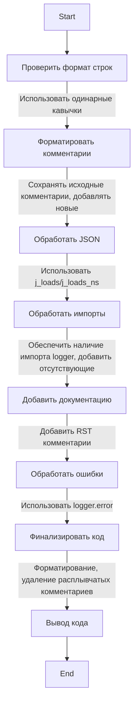

## Code Analysis of Module `instruction_code_checker_md_en`

### 1. <алгоритм>

1. **Инициализация**:
   -  Начало анализа кода с целью проверки и улучшения.
   -  Применяются строгие правила форматирования строк и комментариев.
   -  Пример: Исходный код, подлежащий анализу.
    
2.  **Проверка формата строк**:
    -  Обеспечение использования одинарных кавычек (`'`) для строк в коде Python.
    -  Пример: Замена `a = "строка"` на `a = 'строка'`.
    
3.  **Форматирование комментариев**:
    -   Сохранение всех исходных комментариев (`#`).
    -   Добавление новых комментариев построчно при модификации кода.
    -  Пример: Добавление комментариев ` # This is a new comment` после каждой измененной строки.
    
4.  **Обработка JSON**:
    - Использование `j_loads` или `j_loads_ns` из `src.utils.jjson` вместо `json.load`.
    - Пример: Замена `json.load(file)` на `j_loads(file)`.

5.  **Обработка импортов**:
    -   Обеспечение наличия импорта `logger` из `src.logger`.
    -  Добавление отсутствующих импортов.
     - Пример: Добавление `from src.logger import logger`, если его нет.

6. **Анализ и дополнение документации**:
   - Добавление комментариев в формате **RST** для всех функций, методов и классов.
   - Пример:  
   ```python
   """
       Функция для сохранения текста в файл.
   
       :param file_path: Путь к файлу.
       :type file_path: str
       :param data: Данные для записи.
       :type data: str
       :return: True если файл сохранен, иначе False.
       :rtype: bool
   """
   ```

7. **Обработка ошибок**:
   -  Использование `logger.error` для записи ошибок вместо `try-except`.
   -  Пример: Замена `try: ... except Exception as e: print(e)` на `try: ... except Exception as e: logger.error(e)`.

8. **Финализация кода**:
   -  Форматирование кода в соответствии с PEP8.
   -  Удаление расплывчатых комментариев.
   -  Пример: Замена комментариев "get data" на "retrieve data".

9. **Вывод**:
    -  Вывод полного отформатированного и прокомментированного кода.
    -  Пример: Вывод кода с указанием, какие строки были изменены и добавлением пояснений.
    

### 2. <mermaid>


**Объяснение:**

Диаграмма `mermaid` описывает последовательность действий при обработке кода.  
- `Start`: Начало процесса.
- `CheckFormat`: Проверка и корректировка формата строк, используется одинарная кавычка.
- `FormatComments`: Обработка комментариев, сохранение исходных и добавление новых при изменении.
- `ProcessJSON`: Изменение стандартной обработки `JSON` на кастомную `j_loads` или `j_loads_ns`.
- `HandleImports`: Проверка и добавление необходимых импортов, включая `logger`.
- `AddDocumentation`: Добавление документации в формате RST.
- `HandleErrors`: Изменение обработки ошибок с `try-except` на использование `logger.error`.
- `FinalizeCode`: Финализация кода, форматирование в соответствии со стандартами PEP8.
- `OutputCode`: Вывод обработанного кода.
- `End`: Конец процесса.

**Зависимости:**

В диаграмме нет явных импортов из других модулей. Однако, исходя из описания процесса,  есть зависимость от следующих компонентов:

1. **`src.utils.jjson`**: Используется для функций `j_loads` и `j_loads_ns`.
2. **`src.logger`**: Используется для импорта и применения `logger`.

### 3. <объяснение>

#### Импорты:

-   `src.utils.jjson`:
    -   **Назначение**: Модуль `jjson` предоставляет функции `j_loads` и `j_loads_ns` для парсинга JSON данных. 
    -   **Взаимосвязь**: Этот модуль является частью `src`, и его использование заменяет стандартный `json.load` для обеспечения консистентной обработки JSON в проекте.
-   `src.logger`:
    -   **Назначение**: Модуль `logger` используется для ведения журнала событий, включая ошибки, предупреждения и информационные сообщения.
    -   **Взаимосвязь**: Этот модуль является частью `src` и обеспечивает стандартизированный способ регистрации событий в проекте.

#### Классы:

- В представленном коде нет определения классов.

#### Функции:
- В представленном коде нет определения функций.

#### Переменные:

- В представленном коде нет определения переменных.

**Потенциальные ошибки и области для улучшения:**

1.  **Зависимости от `src`**:  Инструкция предполагает, что `src` является корректным пакетом в структуре проекта. Если структура проекта отличается, импорты могут быть некорректными.
2.  **Отсутствие конкретики**: Некоторые требования, такие как "выровнять имена функций" могут быть интерпретированы по-разному. Необходимо точное руководство по именованию.
3. **Избыточное избегание try-except**: Хотя использование `logger.error` рекомендуется для отслеживания ошибок, не все `try-except` блоки должны быть убраны. В некоторых случаях обработка конкретных исключений может быть необходимой.
4.  **Следование PEP8**: Требование следовать PEP8, хотя и хорошее, нуждается в более конкретных примерах для лучшего понимания.
5. **Отсутствие обработки контекста**: Инструкция не учитывает контекст кода, например, важность переменных, классов.
6.  **Ограниченность примеров**: Примеры использования RST документации хорошие, но их недостаточно для покрытия всех возможных вариантов.

**Цепочка взаимосвязей:**

-   Процесс начинается с анализа предоставленного кода.
-   Импортируется `j_loads` или `j_loads_ns` из `src.utils.jjson` для обработки JSON данных.
-   Используется `logger` из `src.logger` для ведения журнала ошибок и событий.
-  Результатом является отформатированный и задокументированный код, готовый к интеграции в проект.