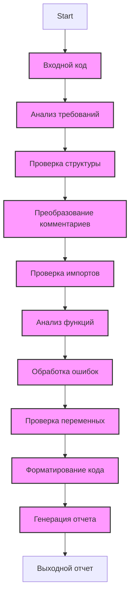

## Анализ кода модуля

**Код Качество**
9
- Сильные стороны
    - Четкая и подробная инструкция, определяющая требования к анализу кода и его форматированию.
    - Использование reStructuredText (RST) для комментариев и docstring повышает качество документации.
    - Использование `j_loads` и `j_loads_ns` обеспечивает консистентность при работе с JSON.
    - Внимание к сохранению существующих комментариев повышает надежность процесса модификации кода.
    - Наличие требований к структуре анализа (импорты, функции, классы и т.д.) обеспечивает полноту и систематичность анализа.
    - Отказ от `try-except` блоков в пользу `logger.error` упрощает код и стандартизирует обработку ошибок.
    - Предоставление примеров документации и улучшений в `TODO` формате помогает разработчикам.
    - Использование `mermaid` для визуализации процессов.

- Слабые стороны
    - Инструкция не содержит конкретный код для анализа, только общие требования.

**Рекомендации по улучшению**
1.  Добавить конкретный пример кода для анализа.
2.  Обеспечить более явную связь между описанием в инструкции и ожидаемым результатом в выходном коде.
3.  Добавить проверку на наличие всех необходимых модулей в коде.
4.  Определить четкие критерии оценки качества кода от 1 до 10.

**Алгоритм**

1.  **Начало**: Получение кода для анализа, а также инструкции.
    *   **Пример**: Переданный код в строке `input_code`.
2.  **Анализ требований**: Изучение инструкции для понимания ожидаемого результата и формата вывода.
    *   **Пример**: Анализ `INSTRUCTION` на предмет требований к языку (русский), формату вывода (Markdown) и другим условиям.
3.  **Проверка структуры**: Убедитесь, что код соответствует базовым требованиям.
    *   **Пример**: Проверка наличия необходимых импортов, соответствие имен переменных и функций ранее обработанным файлам.
4.  **Преобразование комментариев**: Переписать все комментарии и docstring в формате RST.
    *   **Пример**: Комментарии `# this is a comment` заменяются на RST-форматированные комментарии.
5.  **Импорты**: Добавить недостающие импорты и проверить корректность существующих.
    *   **Пример**: Если отсутствует импорт `from src.utils.jjson import j_loads`, то добавить его.
6.  **Функции и методы**: Проанализировать каждую функцию/метод, добавить RST-комментарии, и проверить корректность аргументов и возвращаемых значений.
    *   **Пример**: Функция `def my_function(a, b): ...` должна иметь RST-форматированные docstring и комментарии.
7.  **Обработка ошибок**: Заменить стандартные `try-except` блоки на использование `logger.error` для обработки ошибок.
    *   **Пример**: Заменить `try: ... except Exception as e: print(e)` на `try: ... except Exception as e: logger.error("Error occurred", e)`.
8.  **Переменные**: Проверить типы переменных и их использование.
    *   **Пример**: Если `variable = 10` то указать что это целое число.
9.  **Форматирование**: Убедиться, что код отформатирован в соответствии с инструкцией (одинарные кавычки, комментарии в формате RST).
10. **Создание отчета**: Сгенерировать Markdown документ с анализом, включая диаграммы `mermaid`.
     * **Пример**: Создание секций "Код Качество", "Рекомендации по улучшению", "Оптимизированный код" и т.д.
11. **Завершение**: Вывод отчета в формате Markdown.

**mermaid**

**Объяснение**

*   **Импорты**: В данном коде используются импорты из различных частей проекта `src`, в частности `src.utils.jjson`, `src.logger.logger`.
    *   `from src.utils.jjson import j_loads, j_loads_ns`: `j_loads` и `j_loads_ns` используются для корректной загрузки данных из JSON-файлов, с учетом особенностей проекта. Это заменяет стандартный `json.load` для обеспечения консистентности.
    *   `from src.logger.logger import logger`: `logger` используется для логирования ошибок и отладочной информации, что помогает отслеживать работу приложения.

*   **Классы**: В данном коде нет классов.

*   **Функции**: Данная инструкция описывает требования к функциям, но не предоставляет конкретных функций для анализа. В целом, функции должны быть задокументированы в RST-формате, с описанием аргументов и возвращаемых значений.

*   **Переменные**: Инструкция определяет требования к проверке типов переменных, но конкретные переменные отсутствуют в коде. Все переменные должны иметь четко определенные типы и назначения.

**Цепочка взаимосвязей:**
    - `src.utils.jjson` используется для корректной загрузки данных JSON, обеспечивая консистентность работы с файлами в проекте.
    - `src.logger.logger` используется для логирования событий и ошибок, обеспечивая централизованный механизм обработки исключений и отладки.

    Эта инструкция является частью процесса, который может быть использован в различных модулях проекта, связанных с обработкой и трансформацией кода. Например, она может быть использована для проверки кода модулей, связанных с обработкой пользовательского ввода, взаимодействием с AI-моделями, и т.д.