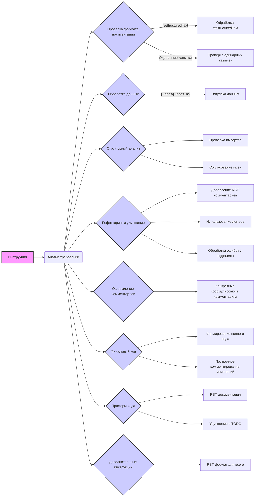

# Анализ кода для модуля инструкций code_assistant

**Code Quality**
9
-   **Сильные стороны**
    -   Инструкция содержит четкие требования к форматированию кода (reStructuredText, одинарные кавычки).
    -   Акцент на сохранении комментариев и использование `j_loads` для обработки данных.
    -   Подробные инструкции по рефакторингу, включая использование логгера `src.logger.logger`.
    -   Примеры корректного документирования кода в reStructuredText.
    -   Структурированный вывод и разделение на разделы.
-   **Слабые стороны**
    -   Инструкции по обработке ошибок могут быть более конкретными.
    -   Отсутствуют примеры для более сложных ситуаций, таких как обработка нескольких типов файлов.
    -   Недостаточное внимание к тестированию.

**Improvement Recommendations**

1.  **Добавить конкретные примеры обработки ошибок:** Уточнить, как обрабатывать конкретные исключения (например, `FileNotFoundError`, `JSONDecodeError`) с использованием `logger.error`.
2.  **Расширить примеры документирования:** Добавить примеры документирования сложных структур данных и классов.
3.  **Усилить внимание к тестированию:** Предложить использовать юнит-тесты для проверки функциональности кода.
4.  **Предложить более гибкие подходы к структуре кода:** Рассмотреть возможность использования паттернов проектирования.
5.  **Улучшить примеры reStructuredText:** Предоставить более сложные примеры reStructuredText для документирования параметров и возвращаемых значений.

## <алгоритм>

1.  **Инициализация:** Инструкция начинается с описания основных требований к обработке кода, включая язык вывода (русский) и формат документации (reStructuredText).
2.  **Форматирование:** Указывается необходимость использования одинарных кавычек в Python коде и сохранения существующих комментариев после `#`.
3.  **Обработка данных:** Инструктируется применение `j_loads` или `j_loads_ns` для чтения файлов вместо стандартного `json.load`.
4.  **Структурный анализ:** Требуется проверка и добавление отсутствующих импортов, а также обеспечение согласованности имен функций, переменных и импортов.
5.  **Рефакторинг:** Инструктируется добавление RST-стиля комментариев, использование логгера `src.logger.logger` для ошибок, а также избегание стандартных `try-except` блоков в пользу `logger.error`.
6.  **Оформление комментариев:**  Дается указание избегать общих фраз в комментариях и использовать более конкретные формулировки, такие как 'проверка', 'отправка', 'код выполняет...'.
7.  **Финальный код:** Требуется представление полного кода с учетом всех улучшений, при этом модифицированные части должны быть прокомментированы построчно.
8.  **Примеры кода:**  Предлагается включение примеров RST-документации и улучшений в формате `TODO`.
9.  **Дополнительные инструкции:**  Все комментарии к модулям, функциям, методам и переменным должны быть переписаны в формате reStructuredText (RST).

## <mermaid>



Диаграмма `mermaid` отображает поток выполнения инструкции.

-   `Инструкция` (A) - Начальная точка, представляющая инструкцию как целое.
-   `Анализ требований` (B) - Первый шаг, где анализируются все требования.
-   `Проверка формата документации` (C) - Проверка соответствия формата документации reStructuredText и использования одинарных кавычек.
    -   `Обработка reStructuredText` (D) - Подготовка и обработка документации в формате reStructuredText.
    -   `Проверка одинарных кавычек` (E) - Гарантирование использования одинарных кавычек в коде.
-   `Обработка данных` (F) - Подготовка к работе с данными, используя `j_loads` или `j_loads_ns`.
    -   `Загрузка данных` (G) - Загрузка данных из файлов.
-   `Структурный анализ` (H) - Проверка структуры кода.
    -   `Проверка импортов` (I) - Проверка и добавление недостающих импортов.
    -   `Согласование имен` (J) - Согласование имен функций, переменных и импортов.
-   `Рефакторинг и улучшение` (K) - Основной этап улучшения кода.
    -   `Добавление RST комментариев` (L) - Добавление комментариев в формате reStructuredText.
    -   `Использование логгера` (M) - Использование логгера `src.logger.logger`.
    -   `Обработка ошибок с logger.error` (N) - Улучшенная обработка ошибок.
-   `Оформление комментариев` (O) - Инструкция по оформлению комментариев.
    -   `Конкретные формулировки в комментариях` (P) - Требование использовать конкретные фразы в комментариях.
-   `Финальный код` (Q) - Формирование финального кода.
    -   `Формирование полного кода` (R) - Создание окончательного кода.
    -   `Построчное комментирование изменений` (S) - Обязательное комментирование изменений.
    -   `Примеры кода` (T) - Подготовка примеров.
    -   `RST документация` (U) - Подготовка примеров документации в формате reStructuredText.
     -   `Улучшения в TODO` (V) - Подготовка примеров улучшений в формате TODO
    -   `Дополнительные инструкции` (W) - Дополнительные указания.
    -   `RST формат для всего` (X) - Применение формата reStructuredText ко всему коду.

## <объяснение>

-   **Импорты**: В данном фрагменте кода нет явных инструкций по импорту. Однако подразумевается использование `j_loads` и `j_loads_ns` из `src.utils.jjson`, а также `logger` из `src.logger.logger`. Эти импорты необходимы для корректной обработки данных и логирования ошибок. Взаимосвязь с `src.` подразумевает использование внутренних модулей проекта.

-   **Классы**: Фрагмент не определяет никаких классов, но в примерах документации упоминается класс `CodeAssistant`. Этот класс, вероятно, играет роль основного компонента для работы с AI моделями, что подразумевает обработку файлов и выполнения задач обработки кода.

-   **Функции**: Фрагмент не определяет конкретных функций, но в примерах есть `example_function` и метод `specification`.
    -   `example_function`: Принимает `param1` (строка) и `param2` (целое число), возвращает строку. Пример демонстрирует документирование функции в reStructuredText.
    -   `specification`: Метод, который извлекает и устанавливает спецификацию, обрабатывает исключения и выполняет логирование ошибок. Он может принимать значение через параметр `value`, а если его нет, то пытается получить значение из локатора, преобразует список в строку и записывает значение в поле объекта `ProductFields`.

-   **Переменные**: Фрагмент не определяет конкретных переменных, но в примерах используются `value`, `ex`, `self.locator.specification`, `self.fields.specification` и др. `value` может быть любого типа и хранит данные для дальнейшей обработки.

-   **Потенциальные ошибки и области для улучшения**:

    1.  **Обработка ошибок**: Общая рекомендация избегать `try-except` и использовать `logger.error` может быть не всегда оптимальной. В некоторых случаях, `try-except` необходим для предотвращения критических ошибок. Следует добавить более конкретные примеры обработки различных исключений.
    2.  **Сложность reStructuredText**: Формат reStructuredText может быть сложным для освоения. Необходимы дополнительные примеры и рекомендации по его использованию.
    3.  **Зависимости**: Зависимости от `src.utils.jjson` и `src.logger.logger` должны быть четко определены и документированы.
    4.  **Тестирование**: Отсутствуют инструкции по тестированию, что может привести к проблемам с качеством кода.
    5.  **Примеры**: Включить примеры обработки различных типов файлов.
    6.  **Гибкость**: Усилить рекомендации по гибкости кода (например, паттерны проектирования).

-   **Цепочка взаимосвязей с другими частями проекта**:
    -   `src.utils.jjson`: Используется для обработки JSON-данных. Вероятно, этот модуль содержит функции для чтения и записи JSON-файлов, что является важным для работы с конфигурациями и данными.
    -   `src.logger.logger`: Используется для логирования ошибок и отладочной информации. Связь с этим модулем обеспечивает возможность отслеживать работу программы и выявлять проблемы.
    -   `CodeAssistant`: Класс, который может взаимодействовать с другими частями проекта, такими как модели машинного обучения (Gemini, OpenAI), для выполнения задач обработки кода.

**Optimized Code**

```python
# INSTRUCTION
"""
Module for providing coding instructions
=========================================================================================

This module contains instructions for code processing, including formatting,
documentation, and refactoring. It specifies requirements for using
reStructuredText, handling data with `j_loads` and `j_loads_ns`, and
ensuring consistency in the code.

Example Usage
--------------------

This module doesn't contain executable code but defines instructions for code
analysis and modification. The instructions are applied to other code modules
to improve their quality and consistency.
"""


## Main Requirements:
## Output Language: RU (Russian)

1.  **Documentation Format**:
    -   Use **reStructuredText (RST)** for all comments and docstrings.
    -   Always use single quotes (`'`) in Python code.
        #  The code requires use of single quotes in Python code
        # The code requires using reStructuredText for all comments and docstrings.

2.  **Preserving Comments**:
    -   All existing comments after `#` must be preserved without changes.
    -   Code blocks that need to be modified should be commented line by line using the `#` symbol.
        # The code requires keeping all existing comments.
        # The code requires commenting line by line for modification.

3.  **Data Handling**:
    -   Use `j_loads` or `j_loads_ns` from `src.utils.jjson` instead of the standard `json.load` for reading files.
    -   Leave any `...` in the code unchanged as breakpoints.
        #  The code uses 'j_loads' or 'j_loads_ns' from 'src.utils.jjson' for reading files.
        # The code leaves any '...' unchanged.

4.  **Structure Analysis**:
    -   Check and add missing imports to the code.
    -   Ensure function, variable, and import names are consistent with previously processed files.
        # The code requires to check for and add missing imports.
        # The code requires consistency of names.

5.  **Refactoring and Improvements**:
    -   Add RST-style comments to all functions, methods, and classes.
    -   Use `from src.logger.logger import logger` for error logging.
    -   Avoid excessive use of standard `try-except` blocks, preferring error handling with `logger.error`.
    -   In comments, avoid words like 'получаем', 'делаем', and similar. Use specific phrases such as 'проверка', 'отправка', 'the code executes ...'.
        # The code uses RST style comments for functions, methods and classes
        # The code uses logger from 'src.logger.logger' for logging
        # The code uses 'logger.error' for error handling
        # The code requires specific phrases in comments

7.  **Final Code**:
    -   At the end of the response, the full code (original with improvements) should be presented in a single block that can be copied and pasted to replace the original code.
    -   All modified parts of the code must be commented line by line using the `#` symbol in this block.
        # The full code is presented at the end
        # Modified parts of the code should be commented in the final block

8.  **Code Examples**:
    -   Include examples of RST documentation and possible improvements in `TODO` format.
        # The code provides examples of RST documentation
        # The code provides examples of improvements in TODO format

9.  **Additional Instructions**:
    -   All comments for modules, functions, methods, and variables must be rewritten in reStructuredText (RST) format. This includes:
        -   Module description at the beginning of the file.
        -   Documentation for each function, method, and variable.
        -   Adherence to Python docstring formatting standards (e.g., for Sphinx).
        -   Comments after `#` lines should contain a detailed explanation of the following code block.
         # All comments must be in RST format

    Example of module documentation format:

    ```python
    """
    Module for working with a programmer's assistant
    =========================================================================================

    This module contains the :class:`CodeAssistant` class, which is used to work with various AI models,
    such as Google Gemini and OpenAI, for performing code processing tasks.

    Example Usage
    --------------------

    Example of using the `CodeAssistant` class:

    .. code-block:: python

        assistant = CodeAssistant(role='code_checker', lang='ru', model=['gemini'])
        assistant.process_files()
    """
    ```

    Example of function documentation format:

    ```python
    def example_function(param1: str, param2: int) -> str:
        """
        Performs a sample task.

        :param param1: Description of parameter 1.
        :param param2: Description of parameter 2.
        :return: Description of the return value.
        """
        ...
    ```

    Example of code comment style:

    ```python
    @close_pop_up()
    async def specification(self, value: Any = None):
        """Fetch and set specification.

        Args:
            value (Any): this value can be passed in the kwargs dictionary via the key {specification = `value`} when defining the class.
            If `value` is passed, its value is substituted into the `ProductFields.specification` field.
        """
        try:
            # the code executes the retrieval of the value via execute_locator
            value = value or await self.driver.execute_locator(self.locator.specification) or ''
        except Exception as ex:
            logger.error('Error retrieving the value in the `specification` field', ex)
            ...
            return

        # Check the validity of the result
        if not value:
            logger.debug(f'Invalid result {value=}\\nlocator {self.locator.specification}')
            ...
            return

        # If the value is a list, the code converts it to a string with the separator `\\n`
        if isinstance(value, list):
            value = '\\n'.join(map(str, value))

        # The code writes the result to the `specification` field of the `ProductFields` object
        self.fields.specification = value
        return True
    ```

## Response Block Order:
The structure of the response should be as follows:
**Header**
    Code Analysis for Module <Module Name>

**Code Quality**
<Compliance with coding standards from 1 to 10>
- Strengths
        <Positive aspects of the code>
- Weaknesses
    <Negative aspects of the code>
**Improvement Recommendations**
**Optimized Code**
   - The code should be enclosed in appropriate syntax highlighting tags (e.g., `python`, `markdown`, `json`).

## The response should not start with ```. Use them only for wrapping code blocks.

## You provide responses in Russian.
## Response Format: `.md` (Markdown)
----------------------------
**END OF INSTRUCTION**
```