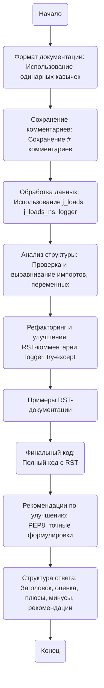

## Анализ кода модуля `Инструкция`

### 1. <алгоритм>
1. **Начало**: Инструкция определяет требования к обработке Python-кода и документации.
2. **Формат документации**:
   - Проверка использования одинарных кавычек (`'`) для строковых литералов и двойных кавычек (`"`) только для вывода (`print`, `input`, `logger.error`).
   - *Пример*:
     - **Правильно**: `a = 'A1'`, `b = ['a', 'b']`, `print("Hello")`
     - **Неправильно**: `a = "A1"`, `b = ["a", "b"]`, `print('Hello')`
3. **Сохранение комментариев**:
   - Сохранение всех комментариев, начинающихся с `#`.
   - Добавление новых комментариев после `#` при изменении кода.
4. **Обработка данных**:
   - Использование `j_loads` или `j_loads_ns` из `src.utils.jjson` вместо `json.load`.
   - Сохранение `...` без изменений.
   - Импорт `logger` только из `src.logger`.
   - *Пример*:
     - **Правильно**: `from src.utils.jjson import j_loads`, `from src.logger import logger`
     - **Неправильно**: `import json`, `import logging`
5. **Анализ структуры**:
   - Проверка наличия всех импортов.
   - Выравнивание имён функций, переменных и импортов.
6. **Рефакторинг и улучшения**:
   - Добавление комментариев в формате RST для функций, методов и классов.
   - Использование `from src.logger.logger import logger` для логирования ошибок.
   - Предпочтение `logger.error` перед `try-except`.
7. **Примеры RST-документации**:
    - Примеры RST-документации для модулей и функций.
8. **Финальный код**:
   - Полный код с изменениями и RST-комментариями.
9. **Рекомендации по улучшению**:
   - Следование PEP8.
   - Использование точных формулировок вместо неясных, например: "проверяем", "отправляем", "выполняем".
10. **Структура ответа**:
   - Заголовок, оценка качества кода, плюсы, минусы, рекомендации, оптимизированный код.
11. **Конец**: Вывод структурированного анализа кода.

### 2. <mermaid>

**Объяснение зависимостей `mermaid`:**
*   **`Start`**: Начало процесса анализа.
*   **`FormatDoc`**: Проверка и применение правил форматирования документации (кавычки).
*   **`SaveComments`**: Сохранение комментариев.
*   **`HandleData`**: Обработка данных с использованием `j_loads`, `j_loads_ns` и `logger`.
*   **`AnalyzeStructure`**: Анализ структуры кода (импорты, переменные).
*   **`RefactorImprove`**: Рефакторинг и улучшение кода (RST-комментарии, логгирование).
*   **`ExamplesRST`**: Примеры RST-документации для модулей и функций.
*   **`FinalCode`**: Формирование и вывод финального кода.
*   **`Recommendations`**: Рекомендации по улучшению стиля кода.
*   **`AnswerStructure`**: Формирование структуры ответа с оценкой и рекомендациями.
*   **`End`**: Конец процесса анализа кода.

### 3. <объяснение>

**Импорты:**

-  В данном коде импорты подразумеваются в инструкциях, но не представлены явно. 
    -   `from src.utils.jjson import j_loads, j_loads_ns`: Используются для загрузки JSON-данных, предлагая более надежную альтернативу стандартному `json.load`. Зависит от модуля `jjson` в пакете `src.utils`.
    -   `from src.logger import logger`: Используется для логирования ошибок и других сообщений. Зависит от модуля `logger` в пакете `src.logger`.

**Классы:**

-   В данном тексте нет явных классов, но подразумевается использование класса `CodeAssistant` в примере RST-документации.

**Функции:**

-   `save_text_file`: Асинхронная функция для сохранения данных в текстовый файл.
    -   **Аргументы**: `file_path` (путь к файлу), `data` (данные для записи), `mode` (режим записи).
    -   **Возвращаемое значение**: `bool` (успешно/не успешно).
    -   **Назначение**: Записывает данные в файл.
    -   **Пример**: `await save_text_file(Path('example.txt'), 'Пример текста')`

**Переменные:**

-   В данном коде рассматриваются строковые литералы, списки и словари, для которых требуется использовать одинарные кавычки (`'`). Также описываются `file_path`, `data`, `mode` в примере функции.

**Цепочка взаимосвязей с другими частями проекта:**

1. **`src.utils.jjson`**: Этот модуль используется для безопасной загрузки JSON-данных, что важно для надежной обработки данных. Зависит от набора инструментов `src.utils`.
2.  **`src.logger`**: Используется для логирования ошибок и предупреждений, обеспечивая возможность отслеживания и отладки работы кода.
3.  **`CodeAssistant`**: Класс, используемый для обработки кода, может зависеть от различных моделей AI (Google Gemini, OpenAI) и других частей проекта.

**Потенциальные ошибки или области для улучшения:**

-   Недостаточная детализация обработки ошибок в блоках `try-except`. Рекомендуется использовать `logger.error` для обработки исключений, вместо `try-except`, где это возможно.
-   Следование стандартам PEP8 может быть улучшено, чтобы обеспечить большую читаемость и единообразие кода.
-   Рекомендации по использованию точных формулировок (например, "проверяем", "отправляем", "выполняем" вместо "получаем" или "делаем") помогают сделать комментарии более понятными.
-   Оптимизация обработки JSON: Использование `j_loads` или `j_loads_ns` для более надежной обработки данных.

Этот анализ обеспечивает детальное понимание инструкций и их влияния на процесс обработки кода и документации.