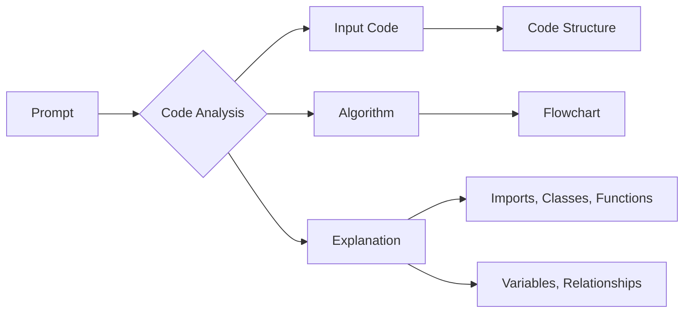

# Анализ кода

**<input code>**

```
**Summary for the prompt:**

### Key Requirements:
1. **Code Analysis**:
   - Provide the original code without any changes.
   - Describe the algorithm of the code as a step-by-step flowchart, showing how data moves between functions or classes.
   - Explain the code's operation, including imports, classes, functions, variables, and their relationships with other parts of the project.
   - Highlight potential errors or areas for improvement if any.

2. **Response Format**:
   - **<input code>**: The original code without any changes.
   - **<algorithm>**: A step-by-step description of the algorithm with examples.
   - **<explanation>**: A detailed explanation of the code, including:
     - Imports: their purpose and connections to other modules.
     - Classes: their purpose, attributes, methods, and relations to other components.
     - Functions: their purpose, arguments, and return values.
     - Variables: types and usage.
     - Relationships with other parts of the project and potential errors or improvements.

### Example Call:
A code snippet is provided to be analyzed and explained according to the instructions.
## Response format: .md (markdown)
---

This prompt is designed for a detailed analysis of the provided code, explaining all aspects, including logic, structure, and potential improvements.
```

**<algorithm>**

К сожалению, для построения блок-схемы и описания алгоритма необходимо предоставить сам код.  Данный фрагмент текста представляет собой описание требований к анализу кода, а не код для анализа.

**<mermaid>**



**<explanation>**

Предоставленный текст - это *описание задачи анализа кода*, а не сам код.  Он описывает требования к структуре отчета об анализе кода.

В отчете, соответствующем данному описанию, ожидается:

* **<input code>**:  Сам исходный код, который необходимо проанализировать.
* **<algorithm>**:  Блок-схема, описывающая алгоритм работы кода (включая данные, которые передаются между функциями, классами).  Это крайне важно для понимания логики программы.
* **<explanation>**: Подробное объяснение, которое включает:
    * **Импорты:** Описание импортированных библиотек и их использования в программе.  Важно понять, какие внешние зависимости используются.  Описание должно включать пути импорта, например, `from src.module import Class`.
    * **Классы:** Описание классов, их атрибутов, методов и взаимодействий с другими частями кода.
    * **Функции:** Описание функций, их входных параметров, возвращаемых значений, назначение и примеры их использования.
    * **Переменные:** Описание типов и использования переменных.
    * **Связь с другими частями проекта:** Описания зависимостей между анализируемым кодом и другими модулями проекта (`src.module1`, `src.module2` и т.д.).
    * **Возможные ошибки и улучшения:** Выявление потенциальных проблем в коде и предложение вариантов улучшения.

Без предоставления самого кода невозможно выполнить полную аналитику.