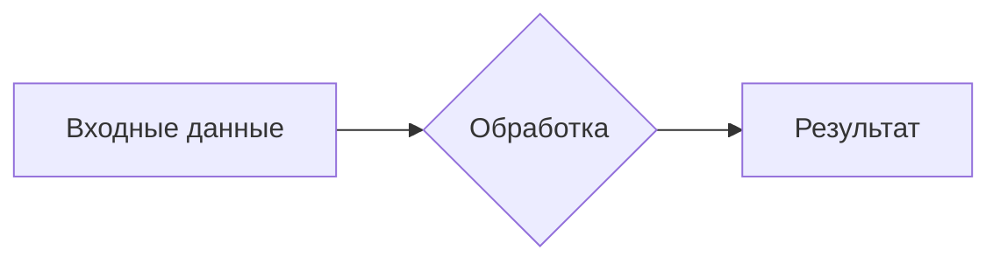

# Анализ кода

**<input code>**

```python
# Summary for the prompt:

# ... (rest of the prompt code, which is not code but instructions)
```

**<algorithm>**

Из-за отсутствия кода, алгоритм работы невозможно описать.  Необходимо предоставить код для анализа.  Блок-схема и примеры будут генерироваться на основе предоставленного кода.

**<mermaid>**



**<explanation>**

Из-за отсутствия кода невозможно предоставить объяснение импортов, классов, функций, переменных и их взаимосвязей.  Необходимо предоставить сам код для анализа.

**Заключение:**

Для корректного анализа кода, пожалуйста, предоставьте код для анализа.  Этот ответ представляет шаблон, который будет заполнен на основе предоставленного кода.