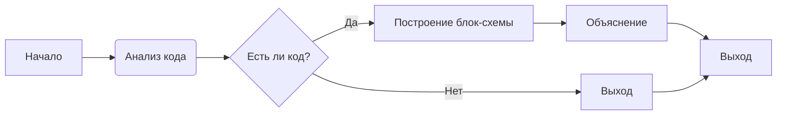

# Анализ кода

**<input code>**

```
```**Summary for the prompt:**

### Key Requirements:
1. **Code Analysis**:
   - Provide the original code without any changes.
   - Describe the algorithm of the code as a step-by-step flowchart, showing how data moves between functions or classes.
   - Explain the code's operation, including imports, classes, functions, variables, and their relationships with other parts of the project.
   - Highlight potential errors or areas for improvement if any.

2. **Response Format**:
   - **<input code>**: The original code without any changes.
   - **<algorithm>**: A step-by-step description of the algorithm with examples.
   - **<explanation>**: A detailed explanation of the code, including:
     - Imports: their purpose and connections to other modules.
     - Classes: their purpose, attributes, methods, and relations to other components.
     - Functions: their purpose, arguments, and return values.
     - Variables: types and usage.
     - Relationships with other parts of the project and potential errors or improvements.

### Example Call:
A code snippet is provided to be analyzed and explained according to the instructions.
## Response format: `.md` (markdown)
---

This prompt is designed for a detailed analysis of the provided code, explaining all aspects, including logic, structure, and potential improvements.
```

**<algorithm>**

Нет кода для анализа.  Блок-схема и примеры не могут быть сгенерированы без исходного кода.


**<mermaid>**



**<explanation>**

Невозможно предоставить объяснение, так как отсутствует исходный код.  Этот шаблон запрошен для анализа конкретного фрагмента кода.  Требуется вставить код в поле `input_code`.  Затем будет создан подробный анализ, включающий блок-схему алгоритма, объяснение импортов, классов, функций, переменных и взаимосвязей с другими частями проекта.

**Взаимосвязь с другими частями проекта:**

Без кода невозможно определить взаимосвязь с другими частями проекта.  Связь будет зависеть от конкретных импортов, используемых классов и функций, присутствующих в предоставляемом коде.