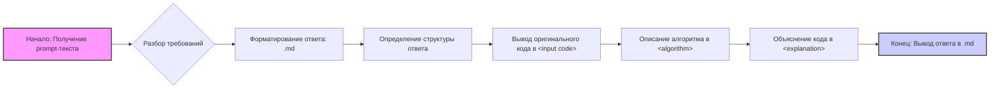

## Анализ и объяснение кода

### <input code>
```
**Summary for the prompt:**

### Key Requirements:
1. **Code Analysis**:
   - Provide the original code without any changes.
   - Describe the algorithm of the code as a step-by-step flowchart, showing how data moves between functions or classes.
   - Explain the code's operation, including imports, classes, functions, variables, and their relationships with other parts of the project.
   - Highlight potential errors or areas for improvement if any.

2. **Response Format**:
   - **<input code>**: The original code without any changes.
   - **<algorithm>**: A step-by-step description of the algorithm with examples.
   - **<explanation>**: A detailed explanation of the code, including:
     - Imports: their purpose and connections to other modules.
     - Classes: their purpose, attributes, methods, and relations to other components.
     - Functions: their purpose, arguments, and return values.
     - Variables: types and usage.
     - Relationships with other parts of the project and potential errors or improvements.

### Example Call:
A code snippet is provided to be analyzed and explained according to the instructions.
## Response format: `.md` (markdown)
---

This prompt is designed for a detailed analysis of the provided code, explaining all aspects, including logic, structure, and potential improvements.
```

### <algorithm>
1. **Начало**: Получение текста prompt-a, который необходимо проанализировать.
2. **Разбор требований**: Выделение ключевых требований, таких как необходимость предоставить оригинальный код, описание алгоритма, подробное объяснение.
3. **Форматирование ответа**: Определение формата ответа в виде Markdown (`.md`).
4. **Определение структуры ответа**: Структура ответа включает три раздела: `<input code>`, `<algorithm>`, `<explanation>`.
5.  **Вывод оригинального кода** -  Вывод исходного кода без изменений в раздел `<input code>`.
6.  **Алгоритм** -  Описание пошагового процесса, как код работает, в раздел `<algorithm>`.
7.  **Объяснение** - Подробное объяснение всех частей кода: импорты, классы, функции, переменные, связи с другими частями проекта, возможные ошибки и улучшения в раздел `<explanation>`.
8. **Конец**: Формирование и выдача ответа в формате `.md`.

**Пример:**
- **Входные данные**: Текст prompt-a.
- **Разбор требований**: Определяется, что нужно проанализировать код и подготовить объяснения в формате `.md`.
- **Форматирование ответа**: Указывается, что ответ будет в формате Markdown.
- **Структура ответа**: Определяется, что ответ будет включать разделы `<input code>`, `<algorithm>`, `<explanation>`.
- **Вывод кода**: Исходный код записывается в раздел `<input code>`.
- **Описание алгоритма**: Описывается пошагово, как происходит процесс анализа кода в раздел `<algorithm>`.
- **Объяснение**: Предоставляется детальный анализ, разделенный на импорты, классы, функции и т.д., в раздел `<explanation>`.
- **Вывод результата**: Ответ в формате `.md`.

### <mermaid>


**Анализ диаграммы `mermaid`:**

- **`A[Начало: Получение prompt-текста]`**: Это начальная точка процесса, где начинается получение входного текста, который надо проанализировать.
- **`B{Разбор требований}`**: Решение, где анализируются требования, включая извлечение ключевой информации о задачах, типе ответа и т.д.
- **`C[Форматирование ответа: .md]`**: Определение формата ответа как markdown.
- **`D[Определение структуры ответа]`**: Определение структуры ответа, включая разделы `<input code>`, `<algorithm>`, `<explanation>`.
- **`E[Вывод оригинального кода в &lt;input code&gt;]`**: Вывод исходного текста (который должен быть проанализирован) в соответствующий раздел.
- **`F[Описание алгоритма в &lt;algorithm&gt;]`**: Описание алгоритма работы кода в формате пошаговой инструкции.
- **`G[Объяснение кода в &lt;explanation&gt;]`**: Разбор и объяснение всех частей кода.
- **`H[Конец: Вывод ответа в .md]`**: Вывод сформированного ответа в формате `.md`.

**Импорты:**
Диаграмма не использует импорты, так как это описание логики, а не кода. Она лишь визуализирует шаги обработки текста.

### <объяснение>
#### Импорты:
В данном коде импорты не используются, так как это текстовое описание процесса, а не код на языке программирования.
#### Классы:
В данном коде нет классов.
#### Функции:
В данном коде нет функций, поскольку это описание логической последовательности действий.
#### Переменные:
В коде не используются переменные в том виде, как они обычно используются в программном коде. Зато используются текстовые описания переменных. Например, `prompt-текст`, `требования`, `формат ответа`, `структура ответа`, `исходный код`, `описание алгоритма`, `объяснение кода`, которые представляют собой концепции, а не конкретные переменные в памяти.
#### Связь с другими частями проекта:
Этот код-инструкция является частью системы, которая обрабатывает текстовые запросы и генерирует ответы. Он определяет формат и структуру анализа кода, обеспечивая единообразие и полноту.
#### Потенциальные ошибки и улучшения:
- **Недостаточная детализация**: Описание может быть не совсем точным или не учитывать некоторые граничные случаи.
- **Отсутствие динамического анализа**: Код не адаптируется к различным форматам или структурам входных данных.
- **Отсутствие обработки ошибок**: Нет механизма для выявления и обработки неверных форматов или некорректных входных данных.

**Улучшения**:
- **Более формализованный разбор требований**: Разбор требований можно сделать более строгим, используя регулярные выражения.
- **Адаптивная структура ответа**: Можно сделать структуру ответа более гибкой, чтобы она могла адаптироваться к разным видам кода.
- **Обработка ошибок**: Ввести проверки на наличие необходимых разделов.

**Цепочка взаимосвязей с другими частями проекта**:
- Данная инструкция является частью системы, которая занимается анализом кода и генерацией ответов.
- Результат работы данного кода (отчет в формате `.md`) может использоваться другими компонентами системы для дальнейшей обработки или отображения.
- Данная инструкция может быть частью workflow, который включает другие этапы, такие как сбор данных, обработка и т.д.