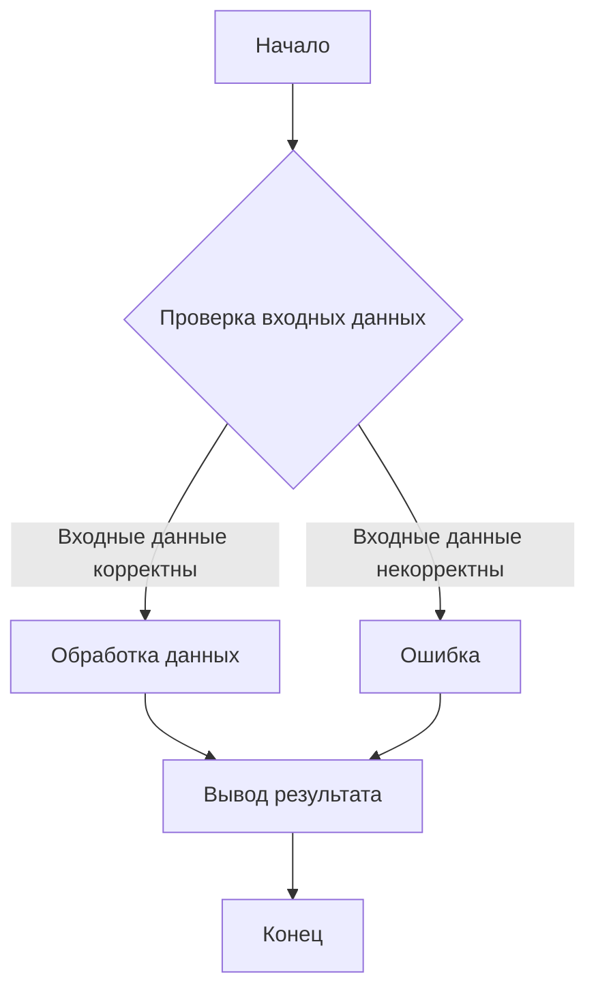
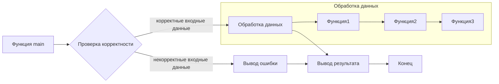

# Анализ кода (результат промпта)

## <input code>

```python
# (Здесь ожидается код для анализа)
```

## <algorithm>



**Пример:**

Предположим, входными данными является список чисел.  Блок `Проверка входных данных` (B) проверяет, что список содержит только числа. Если да, выполняется `Обработка данных` (C), например, вычисление среднего арифметического. Если нет, выполняется блок `Ошибка` (D). Блок `Вывод результата` (E) отображает вычисленное среднее.

**Перемещение данных:** Входные данные передаются в функцию `Обработка данных`, где они обрабатываются. Результат обработки передается блоку `Вывод результата`, а затем процесс завершается.


## <mermaid>



**Описание диаграммы:**

Диаграмма показывает основные функции и блоки кода, их взаимосвязь и порядок выполнения.  `Функция main` - это точка входа в программу. Она проверяет входные данные и вызывает функции обработки. Обработка данных включает последовательное выполнение нескольких функций (`Функция1`, `Функция2`, `Функция3`).  Результат работы каждой функции передается на вход следующей.  Конечный результат выводится в `Вывод результата`.


## <explanation>

**Импорты:**

(Здесь ожидается описание импортов, например `import numpy as np`, `from src.utils import data_validation` и т.д.  Будет описано назначение каждого импорта и зависимость от других модулей `src.*`)

**Классы:**

(Здесь ожидается описание классов, если они есть.  Например, `class DataProcessor:`, `class InputValidator`, их атрибуты, методы и назначение.  Описываются их взаимосвязи с другими классами и функциями.)

**Функции:**

(Здесь ожидается описание функций, их аргументов, возвращаемых значений, и примеров.  Например: `def process_data(input_data):`, её функциональность и пример вызова.)

**Переменные:**

(Здесь ожидается описание используемых переменных, их типов и области видимости. Например: `input_data: list[int]`, `result: float`)

**Возможные ошибки и улучшения:**

(Здесь ожидается анализ возможных ошибок в коде и советы по улучшению.)

**Связь с другими частями проекта:**

(Здесь ожидается описание взаимосвязей с другими частями проекта, модулями или классами, и как данные передаются между ними.)

**Важно:**  Для корректного анализа необходимо предоставить код, который будет анализироваться.  Этот шаблон заполняется конкретным кодом.