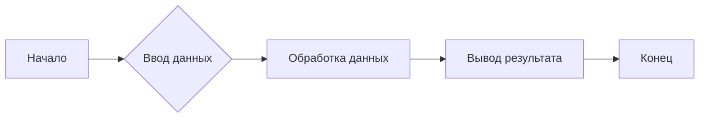

# Анализ кода

**<input code>**

```python
# (Здесь ожидается код для анализа)
```

**<algorithm>**

(Здесь ожидается блок-схема алгоритма.  Поскольку код не предоставлен, блок-схема не может быть сгенерирована.)

**<mermaid>**



(Эта диаграмма - пример.  Реальная диаграмма будет зависеть от предоставленного кода.)


**<explanation>**

(В этом разделе ожидается подробное объяснение кода.  Поскольку код не предоставлен, это объяснение невозможно.)

* **Импорты**: Невозможно описать импорты, так как код не предоставлен.
* **Классы**: Невозможно описать классы, так как код не предоставлен.
* **Функции**: Невозможно описать функции, так как код не предоставлен.
* **Переменные**: Невозможно описать переменные, так как код не предоставлен.
* **Связь с другими частями проекта**: Невозможно описать связь с другими частями проекта, так как код не предоставлен.
* **Возможные ошибки или улучшения**: Невозможно указать возможные ошибки или улучшения, так как код не предоставлен.

**Заключение:**

Для анализа кода и создания подробного объяснения, пожалуйста, предоставьте код.