## **Резюме для промпта:**

### Основные требования:
1. **Анализ кода**:
   - Предоставьте исходный код без изменений.
   - Опишите алгоритм работы кода в виде пошаговой блок-схемы, показывая перемещение данных между функциями или классами.
   - Объясните работу кода, включая импорты, классы, функции, переменные и их связи с другими частями проекта.
   - Укажите потенциальные ошибки или улучшения, если они есть.

2. **Формат ответа**:
   - **<input code>**: Исходный код без изменений.
   - **<algorithm>**: Пошаговое описание алгоритма работы кода с примерами.
   - **<explanation>**: Детальное объяснение кода, включая:
     - Импорты: их назначение и связи с другими модулями.
     - Классы: их назначение, атрибуты и методы, связи с другими компонентами.
     - Функции: описание назначения, аргументов и возвращаемых значений.
     - Переменные: описание типов и использования.
     - Связь с другими частями проекта и потенциальные ошибки или улучшения.

### Пример вызова:
Представлен код, который анализируется и объясняется в соответствии с инструкциями.

---

Этот промпт предназначен для детального анализа предоставленного кода с пояснением всех его аспектов, включая логику, структуру и потенциальные улучшения.
```

## <input code>
```
**Резюме для промпта:**

### Основные требования:
1. **Анализ кода**:
   - Предоставьте исходный код без изменений.
   - Опишите алгоритм работы кода в виде пошаговой блок-схемы, показывая перемещение данных между функциями или классами.
   - Объясните работу кода, включая импорты, классы, функции, переменные и их связи с другими частями проекта.
   - Укажите потенциальные ошибки или улучшения, если они есть.

2. **Формат ответа**:
   - **<input code>**: Исходный код без изменений.
   - **<algorithm>**: Пошаговое описание алгоритма работы кода с примерами.
   - **<explanation>**: Детальное объяснение кода, включая:
     - Импорты: их назначение и связи с другими модулями.
     - Классы: их назначение, атрибуты и методы, связи с другими компонентами.
     - Функции: описание назначения, аргументов и возвращаемых значений.
     - Переменные: описание типов и использования.
     - Связь с другими частями проекта и потенциальные ошибки или улучшения.

### Пример вызова:
Представлен код, который анализируется и объясняется в соответствии с инструкциями.

---

Этот промпт предназначен для детального анализа предоставленного кода с пояснением всех его аспектов, включая логику, структуру и потенциальные улучшения.
```

## <algorithm>
1.  **Начало**: Промпт получает запрос на анализ кода.
2.  **Анализ требований**: Промпт анализирует требования к ответу, включая необходимость предоставить исходный код, алгоритм работы, подробное объяснение, а также указание на возможные ошибки или улучшения.
3.  **Форматирование ответа**: Промпт подготавливает структуру ответа, разделенную на `<input code>`, `<algorithm>`, и `<explanation>`.
4.  **Заполнение <input code>**: Промпт добавляет исходный код в секцию `<input code>`.
5.  **Формирование алгоритма**: Промпт описывает алгоритм работы кода в виде пошаговой блок-схемы. В данном случае, поскольку предоставленный код является просто описанием структуры промпта, алгоритм будет сводиться к последовательности действий обработки и форматирования:
    - **Шаг 1**: Получение запроса на анализ кода.
    - **Шаг 2**: Разбор и интерпретация инструкций, включая требования к анализу и формату ответа.
    - **Шаг 3**: Формирование структуры ответа: `<input code>`, `<algorithm>`, `<explanation>`.
    - **Шаг 4**: Заполнение секции `<input code>` исходным кодом.
    - **Шаг 5**: Создание описания алгоритма работы кода.
    - **Шаг 6**: Подготовка подробного объяснения кода, включая импорты, классы, функции и переменные (в данном случае, отсутствуют).
    - **Шаг 7**: Выделение потенциальных ошибок или улучшений (если имеются).
    - **Шаг 8**: Формирование полного ответа в формате `.md`.
6.  **Заполнение <explanation>**: Промпт предоставляет подробное объяснение кода, которое включает:
    - Описание назначения промпта (анализ и объяснение кода).
    - Описание требований к анализу и формату ответа.
    - Описание разделов ответа.
    - Пример вызова.
7.  **Конец**: Промпт завершает работу и предоставляет готовый ответ.

**Примеры для каждого логического блока:**
*   **Шаг 1**: Пользователь отправляет запрос на анализ кода.
*   **Шаг 2**: Промпт анализирует инструкции, определяя, что требуется предоставить исходный код, алгоритм, объяснение.
*   **Шаг 3**: Промпт формирует скелет ответа, используя разделители `<input code>`, `<algorithm>`, `<explanation>`.
*   **Шаг 4**: Промпт копирует предоставленный код в секцию `<input code>`.
*   **Шаг 5**: Промпт создаёт текстовое описание алгоритма.
*   **Шаг 6**: Промпт готовит подробное объяснение, включая назначение, требования, разделы и примеры.
*   **Шаг 7**: В данном примере потенциальных ошибок нет.
*   **Шаг 8**: Промпт формирует полный Markdown ответ.

```mermaid
graph LR
    A[Начало: Получение запроса] --> B(Анализ требований);
    B --> C{Форматирование ответа};
    C --> D[Заполнение <input code>];
    D --> E[Формирование алгоритма];
    E --> F[Заполнение <explanation>];
    F --> G[Конец: Выдача ответа];
    
    style A fill:#f9f,stroke:#333,stroke-width:2px
    style G fill:#ccf,stroke:#333,stroke-width:2px
```

## <mermaid>

**Объяснение диаграммы Mermaid:**

- `graph LR`:  Указывает на создание графа (диаграммы) слева направо (Left to Right).
- `A[Начало: Получение запроса]`:  Представляет начальный этап, где промпт получает запрос на анализ кода.
- `B(Анализ требований)`:  Означает этап анализа требований, извлеченных из промпта.
- `C{Форматирование ответа}`:  Показывает этап формирования структуры ответа с разделами `<input code>`, `<algorithm>` и `<explanation>`.
- `D[Заполнение <input code>]`:  Указывает на процесс добавления исходного кода в секцию `<input code>`.
- `E[Формирование алгоритма]`: Представляет этап создания пошагового описания алгоритма работы кода.
- `F[Заполнение <explanation>]`:  Обозначает процесс создания подробного объяснения кода.
- `G[Конец: Выдача ответа]`:  Показывает заключительный этап, где промпт предоставляет сформированный ответ.

- `style A fill:#f9f,stroke:#333,stroke-width:2px`  и `style G fill:#ccf,stroke:#333,stroke-width:2px`:  Стилизация узлов A и G. Начало подсвечено розовым цветом, а конец — синим.

Эта диаграмма наглядно показывает поток выполнения промпта от получения запроса до формирования конечного ответа. Она иллюстрирует последовательность шагов, которые промпт выполняет для анализа и объяснения кода.

## <explanation>
### **Импорты**:
В представленном коде нет явных импортов, так как это текстовое описание инструкций, а не исполняемый код.

### **Классы**:
В коде нет классов. Это инструкция, а не объектно-ориентированный код.

### **Функции**:
В представленном коде нет функций, так как это текстовое описание инструкций, а не программный код.

### **Переменные**:
В коде нет переменных в традиционном смысле, но можно выделить логические переменные, такие как:

*   `input code`: Содержит исходный код.
*   `algorithm`:  Представляет алгоритм работы кода в виде пошаговой блок-схемы.
*   `explanation`:  Содержит подробное объяснение кода, включая импорты, классы, функции, переменные.
*   `format`: Задает формат ответа - Markdown (`.md`).

### **Связь с другими частями проекта**:
Этот промпт представляет собой автономную инструкцию и не зависит от других частей проекта в смысле прямого взаимодействия с кодом. Он используется для того, чтобы дать указания LLM (большой языковой модели) относительно того, как анализировать и объяснять код.

### **Потенциальные ошибки и улучшения**:
*   **Ошибки**: В самом коде ошибок нет, так как это описание инструкций. Однако, ошибки могут возникать в процессе реализации алгоритма, например, неправильное объяснение кода.
*   **Улучшения**:
    1.  **Уточнения требований**: Можно добавить более конкретные требования к объяснению (например, объяснение сложности алгоритмов).
    2.  **Примеры**: Можно добавить примеры использования конкретных инструкций.
    3.  **Автоматизация**: Можно доработать для автоматической генерации `mermaid` диаграмм из текста.
    4.  **Контекст**: При интеграции в более широкий проект можно добавить контекст, чтобы промпт учитывал специфические детали проекта.

В целом, данный промпт представляет собой набор инструкций для анализа и объяснения кода. Он служит шаблоном для языковой модели, определяя формат и содержание ответа.