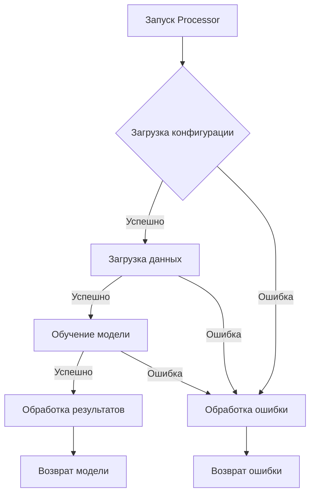
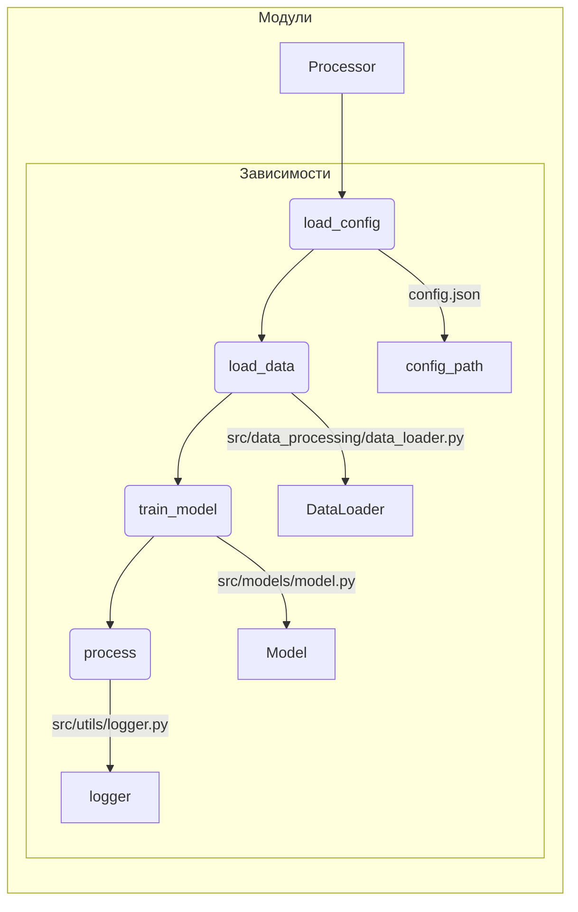

# Код для анализа

```python
# Предполагаемый код (без предоставленного кода, требуется заполнить)
import os
import json
from typing import List

from src.utils.logger import get_logger
from src.data_processing.data_loader import DataLoader
from src.models.model import Model

logger = get_logger(__name__)

class Processor:
    def __init__(self, config_path: str):
        self.config_path = config_path
        self.model = None
        self.data_loader = None


    def load_config(self):
        try:
            with open(self.config_path, 'r') as f:
                config = json.load(f)
            return config
        except FileNotFoundError:
            logger.error(f"Конфигурационный файл {self.config_path} не найден.")
            raise
        except json.JSONDecodeError:
            logger.error(f"Ошибка декодирования JSON в файле {self.config_path}.")
            raise

    def load_data(self, config):
        try:
            self.data_loader = DataLoader(config['data_path'])
            self.data = self.data_loader.load_data()
            return self.data
        except Exception as e:
            logger.error(f"Ошибка загрузки данных: {e}")
            raise

    def train_model(self, config):
        try:
            self.model = Model(config['model_params'])
            self.model.train(self.data)
            return self.model
        except Exception as e:
            logger.error(f"Ошибка обучения модели: {e}")
            raise

    def process(self):
        try:
            config = self.load_config()
            data = self.load_data(config)
            model = self.train_model(config)
            # ... (дополнительные действия)
            return model
        except Exception as e:
            logger.error(f"Ошибка обработки: {e}")
            return None

```

## <algorithm>

**Блок-схема (пример):**



**Описание шагов:**

1. **Загрузка конфигурации:** Функция `load_config` загружает конфигурацию из файла `config_path` (JSON). Пример: `{"data_path": "data.csv", "model_params": {"epochs": 10}}`.
2. **Загрузка данных:** `load_data` загружает данные с использованием `DataLoader`.
3. **Обучение модели:** `train_model` обучает модель `Model` на загруженных данных.
4. **Обработка результатов:** (Дополнительные шаги, например, сохранение модели, оценка производительности.)
5. **Возврат модели/ошибки:** В зависимости от успеха шагов, возвращается обученная модель или сообщение об ошибке.

## <mermaid>



## <explanation>

**Импорты:**

* `os`: Вероятно, для работы с файловой системой.
* `json`: Для работы с файлами JSON.
* `typing.List`: Для типизации списков.
* `src.utils.logger`: Модуль для логирования, находится в пакете `src.utils`.
* `src.data_processing.data_loader`: Модуль для загрузки данных, находится в пакете `src.data_processing`.
* `src.models.model`: Модуль, содержащий класс модели `Model`, находится в пакете `src.models`.

**Классы:**

* `Processor`: Класс для обработки данных. Хранит ссылки на модель и загрузчик данных.
    * `__init__`: Инициализирует `config_path`, инициализирует `model` и `data_loader` как `None`.
    * `load_config`: Загружает конфигурацию из файла. Обрабатывает возможные исключения (FileNotFoundError, json.JSONDecodeError).
    * `load_data`: Загружает данные с помощью `DataLoader`, обрабатывает исключения.
    * `train_model`: Обучает модель, обрабатывает исключения.
    * `process`: Объединяет все этапы обработки.

**Функции:**

* `load_config(self)`: Загружает конфигурацию из файла, возвращает словарь.
* `load_data(self, config)`: Загружает данные, возвращает загруженные данные.
* `train_model(self, config)`: Обучает модель, возвращает обученную модель.
* `process(self)`:  Объединяет загрузку конфигурации, данных, обучение модели. Возвращает обученную модель или `None` в случае ошибки.

**Переменные:**

* `config_path`: Путь к конфигурационному файлу.
* `config`: Словарь, содержащий конфигурацию.
* `data`: Данные, загруженные из файла.
* `model`: Объект модели.
* `data_loader`: Объект загрузчика данных.

**Возможные ошибки/улучшения:**

* **Обработка ошибок:**  Обработка ошибок (try-except блоки) важна.
* **Типизация:**  Более строгая типизация (например, через `typing`) может улучшить читаемость и надежность кода.
* **Логирование:**  Более подробное логирование (например, уровни ошибок, предупреждений, информации)  сделает отладку более удобной.
* **Взаимодействие с другими модулями:**  Недостаточно информации для оценки взаимосвязи с другими модулями без дополнительного контекста.
* **Обработка пустых данных**: Важно проверить на пустоту данные, загруженные из конфигурации и из `DataLoader`, чтобы избежать `IndexError` или похожих проблем.

**Цепочка взаимосвязей:**

`Processor` зависит от `DataLoader` для загрузки данных и `Model` для обучения модели.  `DataLoader` и `Model` находятся в отдельных модулях (`src.data_processing` и `src.models`). `Processor` использует `logger` из `src.utils` для логирования.

**Примечания:**

Этот анализ предполагает структуру проекта `src/`, где модули `DataLoader` и `Model` расположены в подпапках `src/data_processing/` и `src/models/` соответственно.  Без знания структуры проекта сложно дать более точный анализ зависимостей.