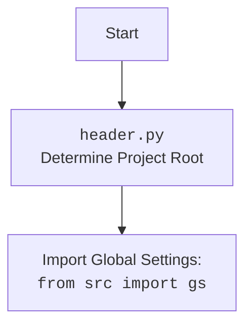

## Анализ кода

### 1. <алгоритм>

1.  **Начало**: Запускается скрипт.
2.  **Импорт `header`**: Импортируется модуль `header`, который, вероятно, отвечает за определение корневой директории проекта и импорт глобальных настроек.
    *   *Пример*:  Если текущий скрипт находится в `/hypotez/src/endpoints/hypo69/code_assistant`, то `header.py` может установить корневую директорию как `/hypotez`.
3.  **Импорт `os`**: Импортируется стандартный модуль `os` для работы с операционной системой, например, для работы с файловой системой.
    *   *Пример*:  Используется для проверки наличия директории или файла, или для получения текущей директории.
4.  **Импорт `json`**: Импортируется стандартный модуль `json` для работы с данными в формате JSON.
    *   *Пример*:  Используется для сериализации данных в JSON-строку или для десериализации JSON-строки в структуру Python.
5.  **Определение класса `CodeExplainer`**: Создается класс `CodeExplainer`, который будет отвечать за анализ и объяснение кода.
    *   *Пример*:  Экземпляр этого класса будет использоваться для обработки кода.
6.  **Инициализация класса `CodeExplainer`**: При создании экземпляра класса вызывается метод `__init__`, который принимает словарь настроек `instruction_data` и сохраняет его в атрибуте `instruction_data`.
    *   *Пример*: `instruction_data` может содержать, например, инструкции о том, какой язык использовать для ответа.
7.  **Метод `explain_code`**: Метод `explain_code` принимает входной код в виде строки (`input_code`) и возвращает строку с объяснениями.
    *   *Пример*: `input_code` содержит код, который нужно проанализировать.
8.  **Генерация ответа**: Метод `explain_code` генерирует markdown-строку, содержащую разделы `<алгоритм>`, `<mermaid>`, и `<объяснение>`.  Эта строка возвращается в качестве результата работы метода.  Сейчас пока разделы содержат просто заглушки.

### 2. <mermaid>

```mermaid
flowchart TD
    Start --> ImportHeader[Import Module: <br> <code>header.py</code>]
    ImportHeader --> ImportOS[Import Module: <br> <code>os</code>]
    ImportOS --> ImportJSON[Import Module: <br> <code>json</code>]
    ImportJSON --> ClassCodeExplainer[Define Class: <br> <code>CodeExplainer</code>]
    ClassCodeExplainer --> InitMethod[Method: <br> <code>__init__(instruction_data)</code>]
    InitMethod --> ExplainCodeMethod[Method: <br> <code>explain_code(input_code)</code>]
    ExplainCodeMethod --> GenerateResponse[Generate Response String in Markdown Format]
    GenerateResponse --> End
```



**Объяснение диаграммы `mermaid`**:

1. **`Start`**: Начальная точка выполнения скрипта.
2. **`ImportHeader`**: Импортируется модуль `header.py`, который отвечает за установку корневой директории проекта и импорт глобальных настроек.
3. **`ImportOS`**: Импортируется модуль `os` для взаимодействия с операционной системой.
4. **`ImportJSON`**: Импортируется модуль `json` для работы с данными в формате JSON.
5. **`ClassCodeExplainer`**: Объявляется класс `CodeExplainer`, который будет отвечать за анализ и объяснение кода.
6. **`InitMethod`**: Метод `__init__` инициализирует экземпляр класса `CodeExplainer`, сохраняя входные данные `instruction_data`.
7. **`ExplainCodeMethod`**: Метод `explain_code` принимает входной код и возвращает строку с объяснениями.
8. **`GenerateResponse`**: Метод `explain_code` генерирует строку с объяснениями в формате Markdown.
9.  **`End`**: Завершение работы.

Вторая `mermaid` диаграмма, описывает логику `header.py`:
1.  **`Start`**: Начало работы `header.py`.
2.  **`Header`**: Определение корневой директории проекта.
3.  **`import`**: Импорт глобальных настроек из модуля `src.gs`.

### 3. <объяснение>

**Импорты**:

*   `import header`: Этот импорт, вероятно, включает в себя логику для определения корневой директории проекта, а также может импортировать глобальные настройки проекта. Модуль может быть частью внутренней структуры проекта `hypotez`.
*   `import os`: Стандартный модуль Python для взаимодействия с операционной системой. Он может использоваться для работы с файловой системой, получения информации о процессах и т.д.
*   `import json`: Стандартный модуль Python для работы с данными в формате JSON. Позволяет преобразовывать объекты Python в JSON-строки и наоборот.

**Классы**:

*   `class CodeExplainer`:
    *   **Роль**: Класс предназначен для анализа и объяснения кода.
    *   **Атрибуты**:
        *   `instruction_data` (словарь): Содержит инструкции для анализа кода.
    *   **Методы**:
        *   `__init__(instruction_data)`: Конструктор класса, инициализирует экземпляр, сохраняя инструкции.
        *   `explain_code(input_code)`: Метод принимает код в виде строки, анализирует его и генерирует markdown-строку с объяснениями.
    *   **Взаимодействие**: Класс `CodeExplainer` не взаимодействует напрямую с другими классами в предоставленном коде, но его методы используются для обработки входных данных (`input_code`) и инструкций (`instruction_data`).

**Функции**:

*   `__init__(instruction_data)`:
    *   **Аргументы**: `instruction_data` (словарь).
    *   **Возвращаемое значение**: Нет.
    *   **Назначение**: Инициализация экземпляра класса `CodeExplainer`.
    *   *Пример*:  При создании экземпляра класса `CodeExplainer` `instruction_data` может быть словарем с инструкциями о том, какой формат ответа использовать (`.md`), какой язык использовать для ответа (`ru`), и т.д.
*   `explain_code(input_code)`:
    *   **Аргументы**: `input_code` (строка).
    *   **Возвращаемое значение**: Строка с объяснениями в формате Markdown.
    *   **Назначение**: Генерирует markdown-ответ с анализом и объяснениями предоставленного кода.
    *   *Пример*: Если `input_code` содержит код `print("Hello, world!")`, то этот метод должен создать markdown-строку, в которой будет объяснено, что делает этот код.

**Переменные**:

*   `instruction_data` (словарь): Атрибут класса `CodeExplainer`, хранит инструкции для анализа кода.
*   `input_code` (строка): Входящий аргумент метода `explain_code`, содержит код, который нужно проанализировать.

**Потенциальные ошибки и области для улучшения**:

*   В текущей реализации метод `explain_code` возвращает лишь заглушку. Он не производит никакого реального анализа кода. Это основная область для улучшения.
*   Нет обработки исключений.  Возможно, стоит добавить блоки `try-except` для корректной обработки возможных ошибок во время выполнения.

**Взаимосвязь с другими частями проекта**:

*   Модуль `header.py`, вероятно, является частью общей структуры проекта `hypotez`. Он используется для обеспечения согласованности в определении корневой директории проекта и импорта глобальных настроек.
*   Класс `CodeExplainer` используется в рамках более крупной системы (предположительно системы, связанной с анализом кода), где он обрабатывает инструкции и генерирует ответы.  Вероятно, что это часть функциональности, связанной с code assistant.

Этот анализ предоставляет подробное объяснение кода, его функциональности и взаимосвязей с другими частями проекта.