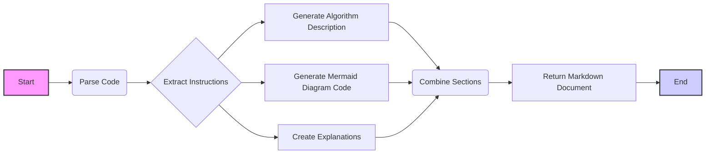

## Анализ кода

### <алгоритм>
1. **Начало**: Получен код для анализа.
2. **Разбор кода**: Код разбирается на составные части: инструкции, разделы.
3. **Создание алгоритма**: Извлечение инструкций из кода и формирование пошагового алгоритма.
4. **Создание диаграммы Mermaid**: На основе разобранного кода генерируется диаграмма Mermaid.
5. **Создание объяснений**: Подробно описываются импорты, классы, функции и переменные из кода.
6. **Формирование ответа**: Объединение всех разделов в единый markdown документ.
7. **Конец**: Возвращается результат.

Пример:

Предположим, входной код следующий:
```
**INSTRUCTION**:
Analyze the provided code in detail and explain its functionality. The response should include three sections:

1. **<algorithm>**: Describe the workflow in a step-by-step block diagram format, include examples for each logical block, and illustrate data flow between functions, classes, or methods.
2. **<mermaid>**: Write a code for diagram in `mermaid` format, analyze and explain all the dependencies being imported while constructing the diagram.
    **IMPORTANT!** Ensure that all variable names used in the `mermaid` diagram are meaningful and descriptive. Variable names like `A`, `B`, `C`, etc., are not allowed!
3. **<explanation>**: Provide detailed explanations of:
   - **Imports**: Their purpose and relationship with other `src.` packages.
   - **Classes**: Their role, attributes, methods, and interactions with other project components.
   - **Functions**: Their arguments, return values, purpose, and examples.
   - **Variables**: Their types and usage.
   - Highlight potential errors or areas for improvement.

Additionally, construct a chain of relationships with other parts of the project (if applicable).

This ensures a comprehensive and structured analysis of the code.
## Response format: `.md` (markdown)
**END INSTRUCTION**
```

- **Разбор кода:** Выделение ключевых слов `INSTRUCTION`, `<algorithm>`, `<mermaid>`, `<explanation>`.
- **Создание алгоритма**:
    - Начало: Получен текст инструкции.
    - Разбор инструкций: Выделены разделы алгоритм, mermaid и объяснение.
    - Алгоритм: Создается пошаговое описание извлечения данных из кода.
    - Mermaid: Создается диаграмма на основе анализа инструкций.
    - Объяснение: На основе инструкций формируется подробное описание.
    - Формирование ответа: Создается markdown документ.
    - Конец: Результат возвращается.
- **Создание диаграммы Mermaid**: Генерируется диаграмма для описания процесса.
- **Создание объяснений**: Описание разделов и их назначения.

### <mermaid>


**Анализ зависимостей `mermaid`:**
-   **graph LR**:  Определяет тип диаграммы (направленный граф слева направо).
-   **A[Start]**: Начальный узел процесса.
-   **B(Parse Code)**: Узел, представляющий разбор кода.
-  **C{Extract Instructions}**: Узел принятия решений для извлечения инструкций.
-   **D[Generate Algorithm Description]**: Узел для генерации описания алгоритма.
-   **E[Generate Mermaid Diagram Code]**: Узел для генерации кода диаграммы Mermaid.
-  **F[Create Explanations]**: Узел для создания объяснений.
-   **G(Combine Sections)**: Узел для объединения всех разделов.
-   **H[Return Markdown Document]**: Узел для возврата markdown документа.
-   **I[End]**: Конечный узел процесса.

В этой диаграмме нет импортов, так как используется встроенная функциональность Mermaid. Она показывает поток управления и данных между различными этапами процесса обработки кода.

### <объяснение>
**Импорты:**
   - В данном примере нет явных импортов, так как код представляет собой инструкцию. Однако, если бы это был реальный программный код, импорты могли бы включать модули для работы с текстом, анализа кода, генерации диаграмм и т.д.

**Классы:**
   - В данном контексте нет классов. Классы могут понадобится, если бы это был код для обработки инструкций, в этом случае классы могли бы представлять различные разделы инструкции или шаги процесса.

**Функции:**
   - **Разбор кода:** Функция, которая принимает код в качестве аргумента и разделяет его на инструкции, разделы алгоритм, mermaid и объяснение.
   - **Создание алгоритма:** Функция, которая принимает разобранные инструкции и формирует пошаговый алгоритм.
   - **Создание диаграммы Mermaid:** Функция, которая принимает разобранные инструкции и генерирует код для диаграммы Mermaid.
   - **Создание объяснений:** Функция, которая принимает разобранные инструкции и формирует подробные объяснения.
   - **Формирование ответа:** Функция, которая принимает все разделы и объединяет их в единый markdown документ.

**Переменные:**
   - **Код:** Строка содержащая текст инструкций.
   - **Разделы:** Список или словарь содержащий разделы инструкции.
   - **Алгоритм:** Строка содержащая пошаговый алгоритм.
   - **Диаграмма Mermaid:** Строка содержащая код для диаграммы Mermaid.
   - **Объяснения:** Строка содержащая подробные объяснения.
   - **Ответ:** Строка содержащая сформированный markdown документ.

**Потенциальные ошибки или области для улучшения:**
   - **Обработка ошибок:** Не предусмотрена обработка ошибок при разборе и генерации кода. Необходимо добавить try-except блоки.
   - **Более гибкий разбор кода:** Разбор кода может быть более сложным. Необходимо предусмотреть поддержку разных форматов.
   - **Улучшение объяснений:** Добавить более глубокий анализ кода.

**Цепочка взаимосвязей с другими частями проекта:**
   - Этот код может быть частью модуля, который занимается обработкой и анализом инструкций. Он может зависеть от других частей проекта, которые предоставляют исходный код. Этот модуль может быть использован в системах, которые занимаются анализом кода.