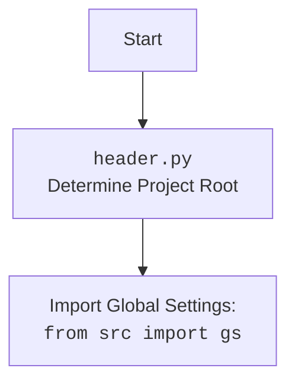

## Анализ инструкции

### 1. **<алгоритм>**

Инструкция предписывает создание структурированного анализа кода, состоящего из трёх ключевых разделов:

1.  **Алгоритм:** Необходимо описать рабочий процесс кода в виде пошаговой блок-схемы. Каждый логический блок должен быть проиллюстрирован примерами, а также необходимо показать поток данных между функциями, классами и методами.
    *   Пример:
        ```
        Start --> Input Data
        Input Data --> Process Data: (data processing logic, e.g., filtering, sorting)
        Process Data --> Output Data
        ```
2.  **Mermaid:** Необходимо создать диаграмму в формате `mermaid`, отражающую структуру и зависимости кода. Все переменные в диаграмме должны иметь осмысленные имена.
    *   Пример:
        ```mermaid
        flowchart TD
            InputData(Input Data) --> ProcessData(Process Data)
            ProcessData --> OutputData(Output Data)
        ```
    *   Если в коде есть `import header`, необходимо включить дополнительный блок `mermaid` с объяснением `header.py`.
        ```mermaid
        flowchart TD
            Start --> Header[<code>header.py</code><br> Determine Project Root]

            Header --> import[Import Global Settings: <br><code>from src import gs</code>]
        ```
3.  **Объяснение:** Этот раздел должен содержать подробный анализ:
    *   **Импорты:** Описание назначения каждого импорта и его связи с пакетом `src`.
    *   **Классы:** Объяснение роли, атрибутов, методов и взаимодействия с другими классами проекта.
    *   **Функции:** Описание аргументов, возвращаемых значений, назначения и примеров вызова.
    *   **Переменные:** Описание типов и использования переменных.
    *   Анализ возможных ошибок и предложений по улучшению кода.
    *   Анализ связей с другими частями проекта.

### 2. **<mermaid>**

Инструкция не содержит конкретного кода для анализа, поэтому невозможно построить диаграмму `mermaid` на основе конкретного кода. Но есть примеры, как нужно составлять диаграмму:

*   Общая блок-схема:
    ```mermaid
    flowchart TD
        InputData(Input Data) --> ProcessData(Process Data)
        ProcessData --> OutputData(Output Data)
    ```
    Эта диаграмма показывает простой поток данных от ввода до вывода, проходя через стадию обработки данных.

*   Диаграмма `header.py` (если есть `import header`):
    ```mermaid
    flowchart TD
        Start --> Header[<code>header.py</code><br> Determine Project Root]

        Header --> import[Import Global Settings: <br><code>from src import gs</code>]
    ```
    Эта диаграмма показывает, что `header.py` определяет корневой каталог проекта и импортирует глобальные настройки из `src.gs`.

### 3. **<объяснение>**

Инструкция не содержит конкретный код, поэтому нет конкретных импортов, классов, функций и переменных для объяснения. Однако, общие принципы:

*   **Импорты:** В контексте проекта `src`, импорты из этого пакета предполагают использование модулей и компонентов проекта. Например, `from src.utils import helper_functions` импортирует вспомогательные функции из модуля `utils`.
*   **Классы:** Классы будут описаны с указанием их назначения, атрибутов (полей класса) и методов (функций внутри класса). Примеры:
    *   Класс `DataProcessor` может иметь методы `process_data(data)` и `validate_data(data)`.
    *   Атрибуты класса могут быть, например, `input_path` и `output_path`.
*   **Функции:** Каждая функция должна быть проанализирована с точки зрения ее входных параметров, типа возвращаемого значения и ее назначения в общей логике программы. Примеры:
    *   Функция `load_data(file_path)` возвращает данные из файла.
    *   Функция `calculate_average(data)` возвращает среднее значение переданных данных.
*   **Переменные:** Объяснение типов данных и их использования. Примеры:
    *   `input_data` (список/словарь/DataFrame) - данные, которые обрабатываются.
    *   `result` (число/список) - результат обработки данных.

**Дополнительные комментарии:**

*   **Анализ ошибок**: В коде могут быть потенциальные ошибки, такие как:
    *   Неправильная обработка исключений при работе с файлами.
    *   Отсутствие валидации данных.
    *   Некорректная работа с внешними сервисами.
*   **Предложения по улучшению**:
    *   Добавить более детальную документацию.
    *   Рефакторить код для улучшения читаемости.
    *   Использовать асинхронность для ускорения выполнения операций.
*   **Взаимосвязи с другими частями проекта**:
    *   Необходимо определить, как анализируемый код взаимодействует с другими модулями или сервисами проекта. Например, данные могут приходить из базы данных (модуль `db`) или отправляться на API (модуль `api`).

**Общий формат ответа:**

```md
## Анализ кода

### 1. <алгоритм>
(Описание алгоритма в виде пошаговой блок-схемы с примерами)

### 2. <mermaid>
(Код диаграммы mermaid с объяснениями переменных)

(Если есть import header)


### 3. <объяснение>
- **Импорты:** (Список и объяснение импортов)
- **Классы:** (Список и объяснение классов)
- **Функции:** (Список и объяснение функций)
- **Переменные:** (Список и объяснение переменных)
- **Ошибки и улучшения:** (Описание ошибок и предложения по улучшению)
- **Связи с другими частями проекта:** (Описание связей с другими частями проекта)
```