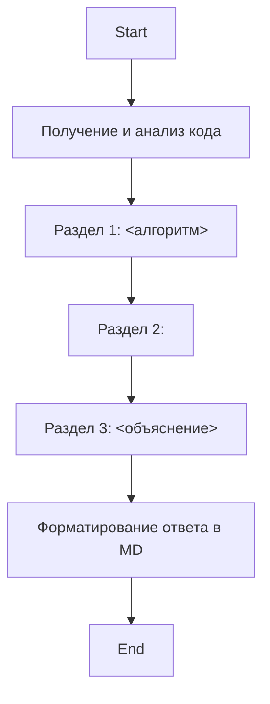

## Анализ Инструкции по Объяснению Кода

### 1. <алгоритм>

1. **Начало**: Получить на вход код, который нужно проанализировать.
2. **Анализ**:
   - Идентифицировать импорты, классы, функции и переменные в коде.
   - Проанализировать поток данных и взаимосвязи между этими элементами.
3. **Раздел 1: Алгоритм**:
   - Описать рабочий процесс кода в виде пошаговой блок-схемы.
   - Включить примеры для каждого логического блока.
   - Проиллюстрировать поток данных между функциями, классами или методами.
4. **Раздел 2: mermaid**:
   - Создать диаграмму в формате `mermaid` для визуализации структуры кода.
   - Использовать осмысленные имена переменных в диаграмме.
   - Проанализировать и объяснить все зависимости, которые импортируются при создании диаграммы.
   - Если есть импорт `import header`, добавить блок `mermaid` для `header.py`.
5. **Раздел 3: Объяснение**:
   - Предоставить подробные объяснения:
     - **Импорты**: Назначение и связь с пакетами `src`.
     - **Классы**: Роль, атрибуты, методы и взаимодействие с другими компонентами.
     - **Функции**: Аргументы, возвращаемые значения, назначение и примеры.
     - **Переменные**: Типы и использование.
     - Выделить потенциальные ошибки или области для улучшения.
     - Построить цепочку взаимосвязей с другими частями проекта.
6. **Форматирование**:
   - Вывести ответ в формате `.md` (markdown).
7. **Конец**: Завершить анализ.

### 2. <mermaid>

**Объяснение зависимостей:**

- Диаграмма представляет собой последовательность этапов обработки входного кода. 
- `Start`: Начало процесса анализа.
- `AnalyzeCode`: Этап, где полученный код анализируется для дальнейшей обработки.
- `AlgorithmSection`: Этап, где формируется текстовое описание алгоритма.
- `MermaidSection`: Этап, где генерируется код для диаграммы `mermaid`.
- `ExplanationSection`: Этап, где формируется подробное объяснение кода.
- `FormatOutput`: Этап, где форматируется вывод в формат `.md`.
- `End`: Конец процесса.

### 3. <объяснение>

- **Импорты**:
    - В данном случае импорты отсутствуют, так как это инструкция, а не код. Если бы код для анализа был предоставлен, то импорты были бы проанализированы на предмет их назначения и связи с пакетами `src`, если таковые имелись бы.
- **Классы**:
    - В данном случае нет классов, так как это инструкция, а не код. При анализе классов в коде, будет рассмотрена их роль, атрибуты, методы и взаимодействие с другими компонентами проекта.
- **Функции**:
    - В данном случае нет функций, так как это инструкция, а не код. При анализе функций в коде, будут рассмотрены их аргументы, возвращаемые значения, назначение и примеры использования.
- **Переменные**:
    - В данном случае нет переменных, так как это инструкция, а не код. При анализе переменных в коде, будут рассмотрены их типы и использование.
- **Дополнительно:**
  - Инструкция сама по себе является алгоритмом действий для анализа кода.
  - Она структурирована для обеспечения полного и последовательного понимания работы кода.
  - Недостатки: инструкция не учитывает языковые особенности (например Python, Java, JavaScript и т.д)
  - Улучшения: добавить в инструкцию возможность выбора языка программирования и генерации ответов с учетом особенностей синтаксиса и семантики этого языка.

**Цепочка взаимосвязей:**
   - Данная инструкция является частью системы генерации объяснений кода. Она принимает код как входные данные, а выдает структурированный анализ в формате `.md`, который может быть использован для документации или обучения.
   - Она работает в связке с другими частями проекта, которые предоставляют код для анализа и используют сгенерированный анализ.
   - Файлы `hypotez/src/endpoints/hypo69/code_assistant/instructions/instruction_code_explainer_md_ru.md` используются как входная точка для обработки кода и генерации структурированных ответов.