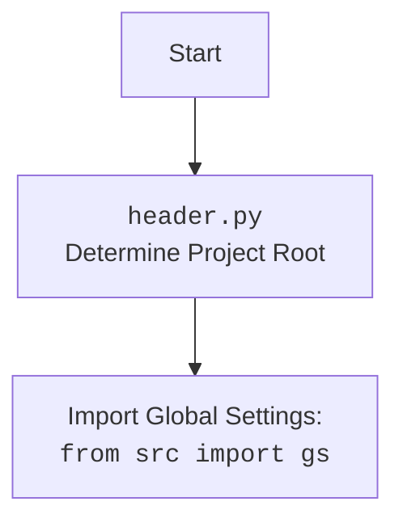

## Анализ Инструкции

### 1. **<алгоритм>**:

Инструкция определяет процесс анализа кода, который должен включать следующие шаги:

1.  **Разбор кода**:
    *   Внимательно прочитать и понять предоставленный код.
    *   Определить основные элементы: импорты, классы, функции, переменные.
    *   Пример: Если дан код `def add(a, b): return a + b`, нужно распознать функцию `add` с аргументами `a`, `b` и ее операцию.
2.  **Создание блок-схемы**:
    *   Представить рабочий процесс кода в виде пошаговой блок-схемы.
    *   Для каждого логического блока указывать примеры.
    *   Показать поток данных между функциями, классами, методами.
    *   Пример: Для вышеуказанной функции, блок-схема могла бы включать блоки "Вход: a, b", "Операция: a + b", "Выход: результат".
3.  **Создание диаграммы `mermaid`**:
    *   Написать код для диаграммы в формате `mermaid`, отражающей зависимости в коде.
    *   Использовать описательные имена переменных.
    *   Пример: Для функции `add`, диаграмма может показать, как входные данные `a` и `b` передаются в функцию и как результат возвращается.
4.  **Дополнительно (если есть `import header`):**
    *   Если в коде есть импорт `import header`, добавить `mermaid` flowchart, описывающий `header.py`.
    *   Пример: `Start --> Header[header.py Determine Project Root] --> import[Import Global Settings: from src import gs]`
5.  **Объяснение**:
    *   Предоставить подробное объяснение кода.
    *   **Импорты**: Описать их назначение и связи с пакетами `src`.
    *   **Классы**: Описать их роль, атрибуты, методы и взаимодействие.
    *   **Функции**: Описать аргументы, возвращаемые значения, назначение и примеры.
    *   **Переменные**: Указать их типы и использование.
    *   Выделить потенциальные ошибки и области для улучшения.
6. **Взаимосвязи**:
    *   Описать цепочки взаимосвязей с другими частями проекта (если есть).

### 2. **<mermaid>**:

Инструкция подразумевает, что в каждом ответе будет как минимум одна диаграмма `mermaid`.
* Диаграмма должна иметь осмысленные и описательные имена переменных.
* Диаграмма flowchart должна отражать логику анализируемого кода.
* Если присутствует `import header`, то должна быть создана дополнительная диаграмма.

Примеры:

```mermaid
flowchart TD
    Start --> InputA[Input: Value A]
    InputA --> InputB[Input: Value B]
    InputB --> AddFunction[Call Function: add(A, B)]
    AddFunction --> Output[Output: Result]
```

Для `header.py`:


### 3. **<объяснение>**:

Инструкция явно определяет, что объяснения должны быть подробными и включать:

*   **Импорты**: Пояснение для чего импортируются модули/пакеты.
    *   Пример: `from src.utils import logger` - импортируется модуль `logger` из пакета `src.utils` для логирования.
*   **Классы**: Роль класса, его атрибуты и методы.
    *   Пример: Если есть класс `class DataProcessor:`, нужно объяснить его назначение (обработка данных), атрибуты (например, `self.data`) и методы (например, `process_data`).
*   **Функции**: Их аргументы, возвращаемые значения, назначение и примеры.
    *   Пример: `def calculate_sum(a, b): return a + b` - принимает два аргумента `a` и `b` и возвращает их сумму.
*   **Переменные**: Их типы и использование.
    *   Пример: `count = 0` - переменная `count` целого типа, используется как счетчик.
*   **Ошибки и улучшения**: Выделение потенциальных проблем или возможностей для оптимизации кода.
    *   Пример:  "Функция не обрабатывает некорректный ввод, нужно добавить проверки типов" или "Можно использовать `list comprehension` вместо цикла `for` для оптимизации".
* **Взаимосвязи**: Как данный код взаимодействует с другими частями проекта.
    *   Пример: "Эта функция используется в модуле `src.main` для обработки результатов вычислений".

**Взаимосвязь с другими частями проекта**: Описание, если есть, как данный код взаимодействует с другими модулями/пакетами.

**Цель Инструкции**:

Целью инструкции является создание всестороннего, структурированного и понятного анализа кода.
Инструкция требует от пользователя не только понимания кода, но и его представления в виде блок-схем, диаграмм `mermaid` и подробных объяснений.
Это позволяет не только анализировать, но и хорошо документировать и визуализировать код.