# Анализ Инструкции

## 1. <алгоритм>

Инструкция описывает процесс анализа кода с целью его детального объяснения. Вот пошаговая блок-схема этого процесса:

1.  **Начало**: Получение исходного кода для анализа.

2.  **Анализ**: 
    *   Проверка на наличие импортов, классов, функций и переменных.
    *   Определение связей между этими элементами.

3.  **Генерация алгоритма**:
    *   Создание пошаговой блок-схемы, описывающей работу кода.
    *   Добавление примеров для каждого логического блока.
    *   Иллюстрация потока данных между функциями/классами/методами.

4.  **Генерация `mermaid` диаграммы**:
    *   Написание кода для диаграммы `mermaid`, отражающей структуру кода.
    *   Использование осмысленных и описательных имен переменных.
    *   Отражение зависимостей и связей между компонентами.

5.  **Генерация объяснения**:
    *   Подробное объяснение всех импортов (их назначение и связь с проектом `src`).
    *   Подробное объяснение классов (их роль, атрибуты, методы и взаимодействие).
    *   Подробное объяснение функций (их аргументы, возвращаемые значения, назначение, примеры).
    *   Описание переменных (их типы и использование).
    *   Выделение потенциальных ошибок и областей для улучшения.
    *   Анализ взаимосвязей с другими частями проекта.

6.  **Форматирование ответа**:
    *   Форматирование всего анализа в `.md` формате (markdown).

7.  **Конец**: Вывод структурированного анализа кода.

**Примеры**:

*   **Логический блок 1 (Анализ):**
    *   Вход: Python код: `import os; def foo(x): return x+1`.
    *   Выход: Информация о наличии импорта `os`, функции `foo`, аргумента `x`, возвращаемого значения `x+1`.
*   **Логический блок 3 (Генерация алгоритма):**
    *   Пример потока данных: Функция `foo` принимает `x`, вычисляет `x+1` и возвращает результат.
*   **Логический блок 4 (Генерация `mermaid`):**
    *   Пример mermaid кода: `graph LR; input_data(Ввод x) --> function_foo(foo(x)); function_foo --> output_data(Вывод x+1);`

```mermaid
graph LR
    subgraph Analysis
        A[Start: Получение исходного кода] --> B(Анализ кода);
        B --> C{Есть ли импорты?};
        C -- Yes --> D(Объяснение импортов);
        C -- No --> E{Есть ли классы?};
        D --> E;
        E -- Yes --> F(Объяснение классов);
        E -- No --> G{Есть ли функции?};
        F --> G;
        G -- Yes --> H(Объяснение функций);
        G -- No --> I{Есть ли переменные?};
        H --> I;
        I -- Yes --> J(Объяснение переменных);
        I -- No --> K;
        J --> K;
    end
    
    subgraph OutputGeneration
    K[Завершение анализа] --> L(Генерация алгоритма);
    L --> M(Генерация mermaid диаграммы);
    M --> N(Генерация объяснения);
    N --> O(Форматирование в Markdown);
    O --> P[End: Вывод анализа]
    end
```

## 2. <mermaid>

**Объяснение зависимостей:**

*   Диаграмма представляет собой блок-схему процесса анализа и объяснения кода, разбитую на два основных подграфа: `Analysis` и `OutputGeneration`.
*   **`Analysis`**:
    *   `A`: Начало процесса - получение исходного кода для анализа.
    *   `B`: Этап анализа кода для выявления его элементов (импорты, классы, функции, переменные).
    *   `C`, `E`, `G`, `I`: Условные блоки для проверки наличия импортов, классов, функций и переменных соответственно.
    *   `D`, `F`, `H`, `J`: Блоки для подробного объяснения найденных элементов.
    *   `K`: Завершение этапа анализа, переход к генерации ответа.
*   **`OutputGeneration`**:
    *   `L`: Генерация пошагового алгоритма.
    *   `M`: Генерация диаграммы в формате `mermaid`.
    *   `N`: Генерация подробных объяснений по каждому элементу кода.
    *   `O`: Форматирование результата в Markdown.
    *   `P`: Конечная точка процесса, вывод готового анализа.
*   Поток выполнения: Процесс идет последовательно, от анализа кода к генерации и форматированию результата. Зависимости между этапами четко обозначены стрелками.

## 3. <объяснение>

**Объяснение Инструкции:**

**Импорты**: Инструкция сама по себе не импортирует какие-либо модули. Однако, при выполнении кода, который эта инструкция должна анализировать, импорты будут анализироваться, и их назначение и связь с пакетом `src` должны быть объяснены. Например, `import os` указывает на использование модуля `os` для работы с операционной системой. Зависимости с другими пакетами `src` будут рассмотрены, если анализируемый код их использует (например, `from src.utils import logger`).

**Классы**: Инструкция не определяет классов, но она требует объяснения классов, которые могут быть в анализируемом коде. Для каждого класса необходимо объяснить его роль в проекте, атрибуты, методы и взаимодействие с другими компонентами. Например, если есть класс `DataProcessor`, необходимо объяснить, какие данные он обрабатывает, какие атрибуты имеет (например, `file_path`), какие методы он предоставляет (например, `load_data()`, `process_data()`) и как он взаимодействует с другими классами или функциями в проекте.

**Функции**: Аналогично классам, инструкция требует анализа функций, которые могут присутствовать в анализируемом коде. Для каждой функции нужно объяснить ее аргументы, возвращаемое значение, назначение и предоставить пример использования. Например, если есть функция `calculate_average(data)`, нужно объяснить, что она принимает список `data`, возвращает среднее значение, ее предназначение - вычисление среднего, и привести пример с данными: `calculate_average([1, 2, 3])`.

**Переменные**: Инструкция требует описания переменных, их типов и использования в анализируемом коде. Это включает определение типов (int, float, string, list, dict и т.д.) и контекста, где переменные используются. Например, переменная `count = 0` - это целое число, используемое для подсчета, или `file_name = "data.txt"` - это строка, представляющая имя файла.

**Потенциальные Ошибки и Области для Улучшения:**

1.  **Недостаток контекста**: Инструкция требует полного понимания контекста кода, включая его назначение, цели и место в проекте. Без контекста могут возникнуть неточности в объяснении, так как понимание работы кода в вакууме затруднено.
2.  **Сложность анализа**: Анализ сложных алгоритмов, особенно при наличии большого количества взаимосвязей и зависимостей, может быть сложным и требовать дополнительного времени и ресурсов.
3.  **Субъективность**:  Интерпретация и объяснение кода могут быть субъективными. Необходимы четкие критерии оценки правильности анализа.
4.  **Нехватка информации**: Если код не содержит комментариев,  сложно понять назначение отдельных блоков кода.
5.  **Ограничение Markdown**: Некоторые типы диаграмм могут быть сложными для создания в `mermaid` и, следовательно, для представления в markdown.

**Взаимосвязи с Другими Частями Проекта:**

Инструкция сама по себе не имеет прямых связей с другими частями проекта. Однако при применении этой инструкции к анализу кода, эти связи необходимо будет устанавливать и описывать. Например, если анализируемая функция вызывает другие функции из других модулей, то это должно быть указано. Если анализируемый класс является частью API,  его связи с другими классами или модулями в этой API должны быть выявлены.

В заключение, эта инструкция предназначена для обеспечения структурированного и детального анализа кода, что способствует его лучшему пониманию и документированию.