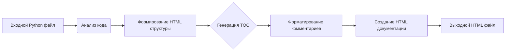

# Анализ кода инструкции для генерации документации в формате HTML

## 1. <input code>

```html
<!-- INSTRUCTION -->

<p>For each input Python file, create documentation in <code>HTML</code> format for subsequent use. The documentation must meet the following requirements:</p>

<ol>
  <li>
    <strong>Documentation Format</strong>:
    <ul>
      <li>Use the <code>HTML</code> standard.</li>
      <li>Each file should begin with a header and a brief description of its contents.</li>
      <li>For all classes and functions, use the following comment format:
        <pre><code>python
def function(param: str, param1: Optional[str | dict | str] = None) -> dict | None:
    """
    Args:
        param (str): Description of the `param` parameter.
        param1 (Optional[str | dict | str], optional): Description of the `param1` parameter. Defaults to `None`.

    Returns:
        dict | None: Description of the return value. Returns a dictionary or `None`.

    Raises:
        SomeError: Description of the situation in which the `SomeError` exception is raised.
    """
</code></pre>
      </li>
      <li>Use <code>ex</code> instead of <code>e</code> in exception handling blocks.</li>
    </ul>
  </li>

  <li>
    <strong>TOC (Table of Contents)</strong>:
    <ul>
      <li>Include a table of contents section at the beginning of each documentation file.</li>
      <li>The structure should include links to all major sections of the module documentation.</li>
    </ul>
  </li>

  <li>
    <strong>Documentation Formatting</strong>:
    <ul>
      <li>Use proper <code>HTML</code> syntax for all headers, lists, and links.</li>
      <li>For documenting classes, functions, and methods, include structured sections with descriptions, parameter details, return values, and raised exceptions. Example:
        <pre><code>html
<h2>Functions</h2>

<h3><code>function_name</code></h3>

<p><strong>Description</strong>: Brief description of the function.</p>

<p><strong>Parameters</strong>:</p>
<ul>
  <li><code>param</code> (str): Description of the `param` parameter.</li>
  <li><code>param1</code> (Optional[str | dict | str], optional): Description of the `param1` parameter. Defaults to `None`.</li>
</ul>

<p><strong>Returns</strong>:</p>
<ul>
  <li><code>dict | None</code>: Description of the return value.</li>
</ul>

<p><strong>Raises</strong>:</p>
<ul>
  <li><code>SomeError</code>: Description of the situation in which the `SomeError` exception is raised.</li>
</ul>
</code></pre>
      </li>
    </ul>
  </li>

  <!-- ... (rest of the instruction) ... -->
</ol>

<p>Generate the corresponding documentation for each input Python file in <code>HTML</code> format.</p>
<h1>## Response format: `.md` (markdown)</h1>
<!-- END OF INSTRUCTION -->
```
```

## 2. <algorithm>

Эта инструкция описывает алгоритм для генерации HTML-документации из Python-файлов.  Алгоритм включает в себя несколько этапов, каждый из которых необходимо выполнить для каждого входного Python-файла:

1. **Обработка каждого входного файла**: Входной Python-файл анализируется, и информация о классах, функциях и т.д. извлекается с помощью парсинга.
2. **Форматирование HTML**: Извлеченная информация форматируется в соответствии со стандартами HTML. Это включает создание заголовков, списков, ссылок и других элементов HTML для структурирования документации.
3. **Генерация TOC**: Формируется таблица содержания (TOC), которая содержит ссылки на все главные разделы документации, включая классы, функции, методы и т.д.
4. **Форматирование комментариев**: Комментарии Python-файла (например, `Args`, `Returns`, `Raises`) анализируются и преобразуются в структурированный формат HTML (списки, описания).
5. **Выходной HTML**: Результирующая HTML-документация генерируется и сохраняется в файл.


**Пример:**

Входной Python-файл с функцией `my_function`:
```python
def my_function(param: str, param1: int = 0) -> str:
    """
    Возвращает строку, содержащую параметр.

    Args:
        param (str):  Описание параметра.
        param1 (int, optional): Описание параметра. Defaults to 0.

    Returns:
        str: Возвращаемая строка.
    """
    return f"param: {param}, param1: {param1}"
```

Результат: HTML-документ будет содержать заголовок `<h3>my_function</h3>`, описание, параметры, возвращаемое значение, и т.д.  в формате, описанном в инструкции.


## 3. <mermaid>



**Объяснение диаграммы:**

* **Входной Python файл (A):** исходный файл, который необходимо обработать.
* **Анализ кода (B):** этап извлечения информации о классах, функциях, атрибутах и т.д. из кода.
* **Формирование HTML структуры (C):**  создание структуры HTML документации (разделы, заголовки).
* **Генерация TOC (D):** формирование таблицы содержания (TOC) со ссылками на разные части документации.
* **Форматирование комментариев (E):**  обработка и форматирование docstrings в соответствии с требуемым форматом.
* **Создание HTML документации (F):** объединение всех предыдущих этапов в окончательную HTML-документацию.
* **Выходной HTML файл (G):** готовая HTML-документация, которая сохраняется в файл.

## 4. <explanation>

**Импорты:**
Инструкция не содержит импортов.  Она представляет собой описание формата HTML-документации.  Она служит инструкциями для  других модулей в проекте,  определяя, как должна быть написана документация для файлов в Python.

**Классы, функции, переменные:**
Инструкция фокусируется на структуре и формате документации для классов и функций. Она описывает, как должны выглядеть комментарии (docstrings), какие разделы (Args, Returns, Raises) должны присутствовать, и как они должны быть структурированы. Она не определяет конкретные классы, функции или переменные.

**Возможные ошибки и улучшения:**

* Инструкция не определяет конкретный способ парсинга входного Python-файла для извлечения информации.  На практике, для этого потребуются соответствующие инструменты или библиотеки Python.
* Отсутствует механизм проверки валидности генерируемого HTML-кода.
* Не определен формат входных данных: это может быть любой текстовый формат.

**Цепочка взаимосвязей:**

Эта инструкция служит шаблоном и спецификацией для других частей проекта, которые будут генерировать HTML-документацию.  Другими словами, она определяет *как* следует генерировать документацию.  Программная реализация (код на Python) будет  принимать эту инструкцию как вход и выполнять генерацию, а не содержать ее в себе.