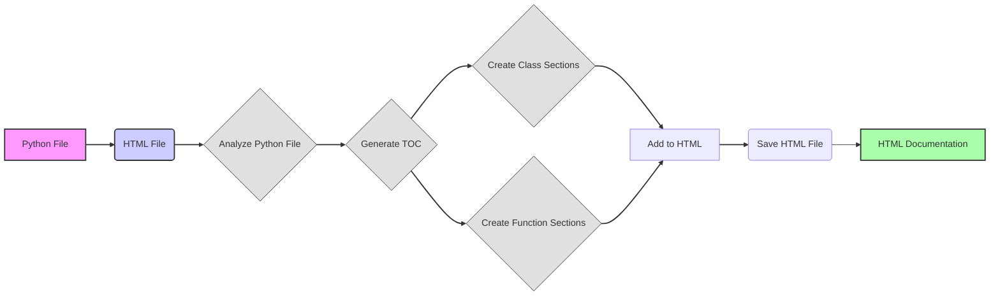

## Анализ HTML-кода инструкции для генерации документации

### 1. <алгоритм>

Представленный HTML-код описывает инструкцию по созданию HTML-документации для Python файлов. Вот пошаговая блок-схема алгоритма, который должен следовать разработчик, чтобы сгенерировать документацию:

1.  **Начало:** Получение на вход Python файла.
2.  **Инициализация:** Подготовка HTML-файла для документации:
    *   Добавить HTML-заголовок (например, `<h1>Module Name</h1>`).
    *   Добавить оглавление (`TOC`).
    *   Добавить общую информацию о файле.
3.  **Анализ файла:** Пройтись по Python файлу, определяя классы, функции, их атрибуты и методы.

    *   **Пример:**
        ```python
        def example_function(param: str, param1: Optional[str | dict | str] = None) -> dict | None:
        """
        Args:
            param (str): Description of the `param` parameter.
            param1 (Optional[str | dict | str], optional): Description of the `param1` parameter. Defaults to `None`.

        Returns:
            dict | None: Description of the return value. Returns a dictionary or `None`.

        Raises:
            SomeError: Description of the situation in which the `SomeError` exception is raised.
        """
        # some code here
        ```
4.  **Формирование HTML-секций:** Для каждого класса и функции создать HTML-секцию со структурированным описанием.
    *   **Класс:**
        *   Заголовок уровня 3 (`<h3>ClassName</h3>`).
        *   Описание класса.
        *   Раздел с методами (`<ul><li>method_name</li>...</ul>`).
    *   **Функция:**
        *   Заголовок уровня 3 (`<h3>function_name</h3>`).
        *   Описание функции.
        *   Раздел с параметрами (`<ul><li>param (type): description</li>...</ul>`).
        *   Раздел с возвращаемым значением (`<ul><li>type: description</li></ul>`).
        *   Раздел с исключениями (`<ul><li>ExceptionName: description</li></ul>`).
5.  **Генерация HTML:**
    *   Добавить все сформированные HTML секции в основной HTML-документ.
    *   Сформировать ссылки на разделы в оглавлении.
6.  **Завершение:** Записать полученный HTML документ в файл.
7.  **Конец:** Готовая HTML документация.

### 2. <mermaid>


**Объяснение диаграммы:**

*   **Python File:** `A` - это входной Python-файл, который нужно документировать.
*   **HTML File:** `B` - это HTML-файл, который будет содержать документацию.
*   **Analyze Python File:** `C` -  это процесс анализа Python-файла для определения классов и функций, их параметров, возвращаемых значений и исключений.
*   **Generate TOC:** `D` - генерация оглавления (TOC) для HTML-документа.
*   **Create Class Sections:** `E` - создание HTML-секций для классов, включающих описание класса и методов.
*   **Create Function Sections:** `F` - создание HTML-секций для функций, включающих описание функции, параметров, возвращаемых значений и исключений.
*   **Add to HTML:** `G` - добавление сгенерированных HTML-секций классов и функций в общий HTML-документ.
*  **Save HTML File:** `H` - сохранение сгенерированного HTML-документа в файл.
*   **HTML Documentation:** `I` - конечный HTML-файл с документацией.
*  Стили:
    * `style A fill:#f9f,stroke:#333,stroke-width:2px`: Стилизация для входного файла (розовый фон, черная рамка).
    * `style B fill:#ccf,stroke:#333,stroke-width:2px`: Стилизация для результирующего HTML-файла (синий фон, черная рамка).
    * `style I fill:#afa,stroke:#333,stroke-width:2px`: Стилизация для конечной HTML-документации (зеленый фон, черная рамка).
    * `classDef flow fill:#e0e0e0,stroke:#333`: Стилизация для блоков процесса (серый фон, черная рамка).
    * `class C,D,E,F flow`: Применение стилей процесса к соответствующим узлам.
    * `linkStyle 0,1,2,3,4,5,6,7 stroke:#333,stroke-width:2px`: Стилизация для линий связей.

**Зависимости:**

В этой диаграмме нет импортов, так как это концептуальная блок-схема процесса. Но если бы речь шла о коде на Python, то, возможно, потребовались бы библиотеки для:

*   Парсинга Python кода (`ast`).
*   Генерации HTML (`html`).

### 3. <объяснение>

**Импорты:**
*   В HTML-коде инструкции импортов нет. Это инструкция, а не исполняемый код.
*   Если бы нужно было реализовывать этот алгоритм на Python, потребовались бы импорты, например:
    *   `ast`: Для разбора Python-файла и извлечения информации о классах, функциях, их параметрах и т.д.
    *   `typing`: Для работы с аннотациями типов (например, `Optional`, `Union`).
    *   `html`: Для создания HTML-документа.

**Классы:**
*   В HTML-инструкции классов нет. Но при реализации алгоритма на Python, вероятно, понадобится класс для представления, например, документа (Document), в котором будут храниться все HTML-блоки, методы и атрибуты.

**Функции:**

*   В HTML-инструкции нет функций, но если бы этот алгоритм был реализован в Python, понадобились бы функции для:
    *   `parse_python_file(filepath: str) -> dict`: Разбор Python-файла и получение словаря с информацией о классах, функциях и их атрибутах.
    *   `generate_toc(data: dict) -> str`: Создание HTML-кода для оглавления.
    *   `generate_class_section(class_data: dict) -> str`: Создание HTML-кода для секции класса.
    *   `generate_function_section(function_data: dict) -> str`: Создание HTML-кода для секции функции.
    *   `generate_html_document(data: dict) -> str`: Сборка всех HTML-блоков в финальный HTML-документ.
    *   `save_html_document(html_string: str, filepath: str) -> None`: Запись HTML-кода в файл.

**Переменные:**

*   В HTML-инструкции нет переменных.
*   При реализации в Python, типы переменных будут зависеть от их назначения, например:
    *   `filepath` (str): Путь к Python-файлу.
    *   `data` (dict): Данные, полученные после разбора Python-файла.
    *   `html_string` (str):  Строка, содержащая HTML-код.
    *   `class_data` (dict): Данные о классе.
    *   `function_data` (dict): Данные о функции.

**Потенциальные ошибки и области для улучшения:**

*   **Обработка сложных Python конструкций:** Необходимо предусмотреть обработку сложных конструкций Python, таких как декораторы, метаклассы, вложенные функции.
*   **Обработка исключений:** При разборе кода нужно добавить обработку возможных ошибок при разборе Python-файла.
*   **Добавление поддержки стилей:** В HTML можно добавить поддержку CSS для стилизации документации.
*   **Автоматическое обновление:** Реализовать автоматическое обновление документации при изменении исходного кода.
*   **Локализация:** Предусмотреть поддержку нескольких языков для документации.
*   **Формат вывода:**  Сделать поддержку различных форматов вывода, таких как PDF или markdown.

**Взаимосвязь с другими частями проекта:**
*   Данная инструкция является частью более крупного процесса создания документации для Python-проекта. Этот модуль, как правило, будет связан с:
    *   Системой парсинга Python кода.
    *   Системой генерации HTML.
    *   Системой сборки документации.

В целом, предоставленный HTML-код описывает четкую инструкцию для создания HTML-документации Python-кода. При правильной реализации, она может стать основой для автоматизированного генератора документации.