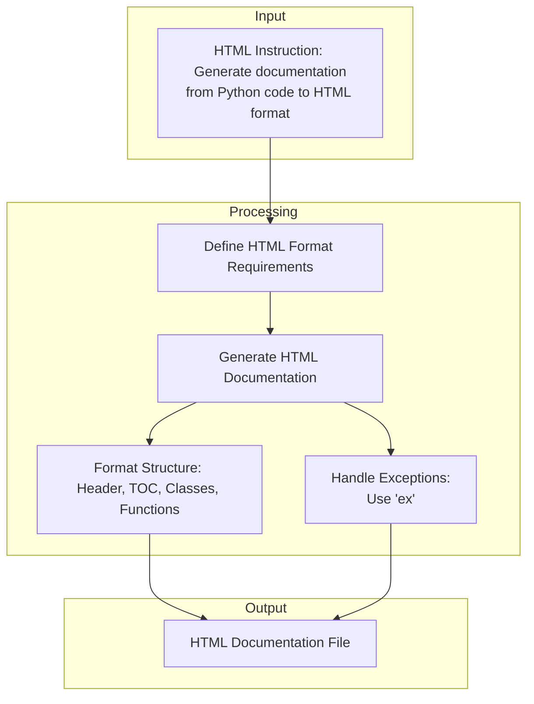

## <алгоритм>

1.  **Ввод:** Получаем на вход описание требований к генерации HTML-документации для Python-кода. 
2.  **Основные требования:**
    *   Документация должна быть в формате HTML.
    *   Каждый файл начинается с заголовка и краткого описания.
    *   Использовать заданный формат комментариев для классов и функций.
    *   Использовать `ex` вместо `e` при обработке исключений.
    *   Создать оглавление (TOC) в начале каждого документа.
    *   Правильное использование HTML-тегов для заголовков, списков и ссылок.
    *   Структурированные разделы для описания классов, функций и методов, включая параметры, возвращаемые значения и возможные исключения.
    *   Использование заголовков разных уровней `<h1>`, `<h2>`, `<h3>`, `<h4>`
3.  **Формат документации:**
    *   Содержит оглавление (TOC).
    *   Структурированные секции для классов и функций.
    *   Описание (Description), параметры (Parameters), возвращаемые значения (Returns), исключения (Raises) для каждого класса, функции и метода.
4.  **Пример структуры документации:**
    *   `<h1>Module Name</h1>`
    *   `<h2>Overview</h2>`
    *   `
Brief description of the module's purpose.
`
    *   `<h2>Classes</h2>`
    *   `<h3><code>ClassName</code></h3>`
    *   `
<strong>Description</strong>: Brief description of the class.
`
    *   `
<strong>Methods</strong>:
`
    *   `<ul><li><code>method_name</code>: Brief description of the method.</li></ul>`
    *   `<h2>Functions</h2>`
    *   `<h3><code>function_name</code></h3>`
    *   `
<strong>Description</strong>: Brief description of the function.
`
    *   `
<strong>Parameters</strong>:
`
    *   `<ul><li><code>param</code> (str): Description of the \`param\` parameter.</li><li><code>param1</code> (Optional[str | dict | str], optional): Description of the \`param1\` parameter. Defaults to \`None\`.</li></ul>`
    *   `
<strong>Returns</strong>:
`
    *   `<ul><li><code>dict | None</code>: Description of the return value.</li></ul>`
    *   `
<strong>Raises</strong>:
`
    *   `<ul><li><code>SomeError</code>: Description of the situation in which the \`SomeError\` exception is raised.</li></ul>`
5. **Генерация HTML:** Пошагово создаем HTML-структуру, наполняя её данными, извлекаемыми из Python кода (не показано в данном input).

## <mermaid>

**Объяснение `mermaid`:**

*   **Input (Ввод):**
    *   `A` (HTML Instruction): Представляет ввод - инструкцию в формате HTML, описывающую требования к генерации документации.
*   **Processing (Обработка):**
    *   `B` (Define HTML Format Requirements): Этот шаг определяет требования к структуре HTML, такие как использование заголовков, списков, и формат комментариев.
    *   `C` (Generate HTML Documentation): Основной процесс генерации HTML-документации, исходя из заданных требований.
    *   `D` (Format Structure): Формирование структуры HTML, включая заголовок, оглавление (TOC), разделы для классов и функций.
    *  `E` (Handle Exceptions): Обработка исключений, включая требование использования `ex` вместо `e` в блоках обработки исключений.
*  **Output (Вывод):**
    * `F` (HTML Documentation File): Результирующий файл HTML-документации.

**Зависимости:**

В данном контексте зависимости в коде не рассматриваются, поскольку это инструкция, а не код. Мы анализируем процесс преобразования инструкции в формат HTML, основываясь на требованиях.

## <объяснение>

### Импорты:
В данном коде отсутствуют импорты, так как это инструкция по форматированию HTML-документации, а не выполняемый код.

### Классы:
В данном коде нет классов, поскольку это не код, а инструкция по генерации документации.

### Функции:
В данном коде нет функций, так как это не код, а инструкция по генерации документации.

### Переменные:
В данном коде нет переменных, так как это не код, а инструкция по генерации документации.

### Объяснение:

Этот документ представляет собой подробную инструкцию по созданию HTML-документации на основе Python-кода. Основная цель - стандартизировать процесс генерации документации, чтобы она была единообразной, понятной и соответствовала принятым стандартам.

**Основные моменты инструкции:**

1.  **Формат:**
    *   Документация должна быть представлена в формате HTML.
    *   Для комментариев к функциям и классам используется стандартизованный формат, включающий описания параметров, возвращаемых значений и возможных исключений.
    *   В блоках `except` используется `ex` вместо `e`.
2.  **Оглавление (TOC):** В начале каждого файла должно быть оглавление, содержащее ссылки на основные разделы.
3.  **Форматирование:** Используется правильный HTML-синтаксис, структурированные разделы для классов, функций и методов, а также заголовки разных уровней.

**Примеры:**
Инструкция предоставляет пример формата для документации функций и классов, включая описание параметров, возвращаемых значений и обрабатываемых исключений.

**Потенциальные области для улучшения:**
 * Автоматизация генерации: Инструкция не включает в себя скрипт, который бы выполнял генерацию HTML. В будущей версии можно добавить автоматизацию этого процесса.
 *  Интеграция с Python: Инструкция не интегрируется напрямую с Python. Процесс извлечения информации из Python-кода для генерации документации должен быть дополнительно реализован.
 * Возможность настройки: Можно расширить инструкцию для возможности гибкой настройки шаблонов HTML-документации.

**Цепочка взаимосвязей с другими частями проекта:**

Эта инструкция, скорее всего, будет использована в рамках более крупного проекта, где требуется автоматическая генерация документации. Она является частью процесса разработки, которая обеспечивает возможность получить подробную документацию на основе имеющегося Python-кода.