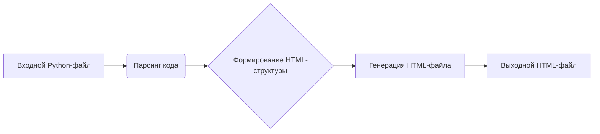

```MD
# Анализ кода для генерации документации в формате HTML

## 1. <input code>

```html
<!-- INSTRUCTION -->

<p>Для каждого входного Python-файла создайте документацию в формате <code>HTML</code> для последующего использования. Документация должна соответствовать следующим требованиям:</p>

<ol>
  <li>
    <strong>Формат документации</strong>:
    <ul>
      <li>Используйте стандарт <code>HTML</code>.</li>
      <li>Каждый файл должен начинаться с заголовка и краткого описания его содержимого.</li>
      <li>Для всех классов и функций используйте следующий формат комментариев:
        <pre><code>python
def function(param: str, param1: Optional[str | dict | str] = None) -> dict | None:
    """
    Args:
        param (str): Описание параметра `param`.
        param1 (Optional[str | dict | str], optional): Описание параметра `param1`. По умолчанию значение равно `None`.

    Returns:
        dict | None: Описание возвращаемого значения. Возвращает словарь или `None`.

    Raises:
        SomeError: Описание ситуации, в которой возникает исключение `SomeError`.
    """
</code></pre>
      </li>
      <li>Используйте <code>ex</code> вместо <code>e</code> в блоках обработки исключений.</li>
    </ul>
  </li>

  <li>
    <strong>Оглавление (TOC)</strong>:
    <ul>
      <li>Включите раздел оглавления в начале каждого документа.</li>
      <li>Структура должна включать ссылки на все основные разделы документации модуля.</li>
    </ul>
  </li>

  <li>
    <strong>Форматирование документации</strong>:
    <ul>
      <li>Используйте правильный синтаксис <code>HTML</code> для всех заголовков, списков и ссылок.</li>
      <li>Для документирования классов, функций и методов включайте структурированные разделы с описаниями, деталями параметров, значениями возвращаемых данных и поднятыми исключениями. Пример:
        <pre><code>html
<h2>Функции</h2>

<h3><code>function_name</code></h3>

<p><strong>Описание</strong>: Краткое описание функции.</p>

<p><strong>Параметры</strong>:</p>
<ul>
  <li><code>param</code> (str): Описание параметра <code>param</code>.</li>
  <li><code>param1</code> (Optional[str | dict | str], optional): Описание параметра <code>param1</code>. По умолчанию значение равно <code>None</code>.</li>
</ul>

<p><strong>Возвращаемое значение</strong>:</p>
<ul>
  <li><code>dict | None</code>: Описание возвращаемого значения.</li>
</ul>

<p><strong>Исключения</strong>:</p>
<ul>
  <li><code>SomeError</code>: Описание ситуации, в которой возникает исключение <code>SomeError</code>.</li>
</ul>
</code></pre>
      </li>
    </ul>
  </li>

  ... (остальная часть инструкции)
</ol>

<p>Создайте соответствующую документацию для каждого входного Python-файла в формате <code>HTML</code>.</p>

<!-- END OF INSTRUCTION -->
```

## 2. <algorithm>

Эта инструкция описывает алгоритм генерации HTML-документации для Python-файлов.  В алгоритме предполагается наличие входного файла (Python-код). Алгоритм включает в себя:

1. Чтение входного Python-файла.
2. Парсинг кода для выделения классов, функций и комментариев.
3. Формирование структуры HTML-документа.
4. Добавление заголовков (h1-h4), списков, описаний, параметров, возвращаемых значений и исключений.
5. Генерация HTML-файла с соответствующей структурой.

**Пример:**  Если входной Python-файл содержит определение класса `MyClass` и функции `my_function`, то алгоритм создаст HTML-документ, содержащий разделы "Классы", "MyClass" с описанием класса и "Функции", "my_function" с описанием функции, полученным из соответствующих docstrings.

## 3. <mermaid>



**Подключаемые зависимости:**

В данном коде нет явных подключаемых зависимостей.  Все операции (чтение, парсинг, генерация)  осуществляются на уровне языка Python и могут быть выполнены без внешних библиотек.  Однако, для более сложных задач (например, генерации TOC, более сложной структуры HTML) можно использовать соответствующие библиотеки (например, для обработки HTML).

## 4. <explanation>

* **Импорты**:  В данном примере нет импортируемых модулей Python.  Это просто HTML-документ, описывающий требования к генерации документации.  Он служит руководством для Python-скрипта, который будет реализовывать эти требования.
* **Классы**:  Нет реальных классов Python.  Пример кода иллюстрирует, как должны быть оформлены комментарии к функциям и классам в Python-файлах, которые затем будут использованы для генерации HTML.
* **Функции**:  Инструкция не описывает функции.  Она описывает *как* должны быть написаны функции (и классы), чтобы их можно было правильно документировать.
* **Переменные**:  Инструкция не использует переменные.  Она описывает формат документации.

**Возможные ошибки/улучшения**:

Инструкция не содержит кода Python,  а является спецификацией для генерации HTML-документации.  Потенциальные проблемы могут возникнуть при разработке Python-скрипта, который будет обрабатывать Python-код и генерировать HTML на основе docstrings.


**Цепочка взаимосвязей с другими частями проекта**:

Инструкция предполагает, что существует другой инструмент (Python-скрипт), который будет считывать Python-код и применять данную инструкцию для генерации HTML-документов.  В таком случае взаимосвязь будет между Python-кодом (модулями), который нужно документировать, инструкцией (спецификацией для генерации) и  скриптом-генератором HTML.

```
Python-код (модули) --> Инструкция (HTML-спецификация) --> Скрипт-генератор HTML --> HTML-документ