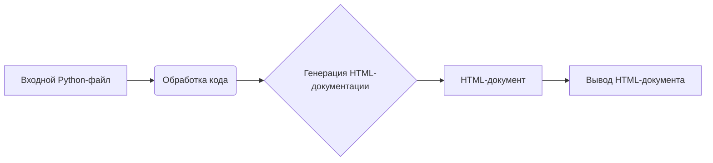

# Описание кода

```html
<!-- INSTRUCTION -->

<p>Для каждого входного Python-файла создайте документацию в формате <code>HTML</code> для последующего использования. Документация должна соответствовать следующим требованиям:</p>

<ol>
  <li>
    <strong>Формат документации</strong>:
    <ul>
      <li>Используйте стандарт <code>HTML</code>.</li>
      <li>Каждый файл должен начинаться с заголовка и краткого описания его содержимого.</li>
      <li>Для всех классов и функций используйте следующий формат комментариев:
        <pre><code>python
def function(param: str, param1: Optional[str | dict | str] = None) -> dict | None:
    """
    Args:
        param (str): Описание параметра `param`.
        param1 (Optional[str | dict | str], optional): Описание параметра `param1`. По умолчанию значение равно `None`.

    Returns:
        dict | None: Описание возвращаемого значения. Возвращает словарь или `None`.

    Raises:
        SomeError: Описание ситуации, в которой возникает исключение `SomeError`.
    """
</code></pre>
      </li>
      <li>Используйте <code>ex</code> вместо <code>e</code> в блоках обработки исключений.</li>
    </ul>
  </li>

  <li>
    <strong>Оглавление (TOC)</strong>:
    <ul>
      <li>Включите раздел оглавления в начале каждого документа.</li>
      <li>Структура должна включать ссылки на все основные разделы документации модуля.</li>
    </ul>
  </li>

  <li>
    <strong>Форматирование документации</strong>:
    <ul>
      <li>Используйте правильный синтаксис <code>HTML</code> для всех заголовков, списков и ссылок.</li>
      <li>Для документирования классов, функций и методов включайте структурированные разделы с описаниями, деталями параметров, значениями возвращаемых данных и поднятыми исключениями. Пример:
        <pre><code>html
<h2>Функции</h2>

<h3><code>function_name</code></h3>

<p><strong>Описание</strong>: Краткое описание функции.</p>

<p><strong>Параметры</strong>:</p>
<ul>
  <li><code>param</code> (str): Описание параметра <code>param</code>.</li>
  <li><code>param1</code> (Optional[str | dict | str], optional): Описание параметра <code>param1</code>. По умолчанию значение равно <code>None</code>.</li>
</ul>

<p><strong>Возвращаемое значение</strong>:</p>
<ul>
  <li><code>dict | None</code>: Описание возвращаемого значения.</li>
</ul>

<p><strong>Исключения</strong>:</p>
<ul>
  <li><code>SomeError</code>: Описание ситуации, в которой возникает исключение <code>SomeError</code>.</li>
</ul>
</code></pre>
      </li>
    </ul>
  </li>

  <li>
    <strong>Заголовки разделов</strong>:
    <ul>
      <li>Используйте заголовки первого уровня (<code>&lt;h1&gt;</code>), второго уровня (<code>&lt;h2&gt;</code>), третьего уровня (<code>&lt;h3&gt;</code>) и четвертого уровня (<code>&lt;h4&gt;</code>) последовательно по всему файлу.</li>
    </ul>
  </li>

  <li>
    <strong>Пример файла</strong>:
    <pre><code>html
<h1>Название модуля</h1>

<h2>Обзор</h2>
<p>Краткое описание назначения модуля.</p>

<h2>Классы</h2>

<h3><code>ClassName</code></h3>

<p><strong>Описание</strong>: Краткое описание класса.</p>

<p><strong>Методы</strong>:</p>
<ul>
  <li><code>method_name</code>: Краткое описание метода.</li>
</ul>

<h2>Функции</h2>

<h3><code>function_name</code></h3>

<p><strong>Описание</strong>: Краткое описание функции.</p>

<p><strong>Параметры</strong>:</p>
<ul>
  <li><code>param</code> (str): Описание параметра <code>param</code>.</li>
  <li><code>param1</code> (Optional[str | dict | str], optional): Описание параметра <code>param1</code>. По умолчанию значение равно <code>None</code>.</li>
</ul>

<p><strong>Возвращаемое значение</strong>:</p>
<ul>
  <li><code>dict | None</code>: Описание возвращаемого значения.</li>
</ul>

<p><strong>Исключения</strong>:</p>
<ul>
  <li><code>SomeError</code>: Описание ситуации, в которой возникает исключение <code>SomeError</code>.</li>
</ul>
</code></pre>
  </li>
</ol>

<p>Создайте соответствующую документацию для каждого входного Python-файла в формате <code>HTML</code>.</p>

<!-- END OF INSTRUCTION -->
```

## <algorithm>

**Описание алгоритма:**

Код описывает формат документации для файлов в формате HTML. Он не содержит алгоритма обработки данных, а описывает структуру и содержание документации.  Блок-схема описывает лишь структуру документации.

**Шаг 1:**  Создать заголовок `<h1>Название модуля</h1>`.

**Шаг 2:**  Создать обзор `<h2>Обзор</h2>` с кратким описанием модуля.

**Шаг 3:**  Для каждого класса создать заголовок `<h3>ClassName</h3>` и описать класс.

**Шаг 4:**  Для каждого метода класса создать элемент списка ` <li>method_name</li>`.

**Шаг 5:**  Для каждой функции создать заголовок `<h3>function_name</h3>` и описать функцию, включая параметры, возвращаемые значения и возможные исключения.


## <mermaid>



**Объяснение диаграммы:**

Диаграмма показывает последовательность действий. На вход подается Python-файл (A). Далее код обрабатывается (B) и генерируется HTML-документ (C). Результат (D) выводится на экран (E). Зависимости отсутствуют, так как код не взаимодействует с другими модулями.


## <explanation>

**Импорты:**
Код не содержит импортов, так как он представляет собой инструкцию, а не фрагмент исполняемого кода.

**Классы:**
Код описывает структуру HTML-документации, но не содержит определений классов.

**Функции:**
Код не содержит определений функций.  Он описывает *как* должна выглядеть документация функций и классов в HTML.

**Переменные:**
Код не содержит переменных.

**Возможные ошибки и улучшения:**

* Инструкция не указывает, как обрабатывать многофайловые проекты или проекты с многоуровневой структурой (вложенные папки с файлами).  
* Не указан способ обработки Python кода для генерации HTML.
* Отсутствует логика, которая будет преобразовывать код в HTML. Инструкция лишь описывает формат.

**Взаимосвязи с другими частями проекта:**

Инструкция представляет собой *шаблон* для создания документации.  Она является частью инфраструктуры проекта, который должен *реализовывать* эту инструкцию.  Например, это может быть часть системы CI/CD, которая будет применять этот шаблон ко всем Python-файлам проекта для создания HTML документации.