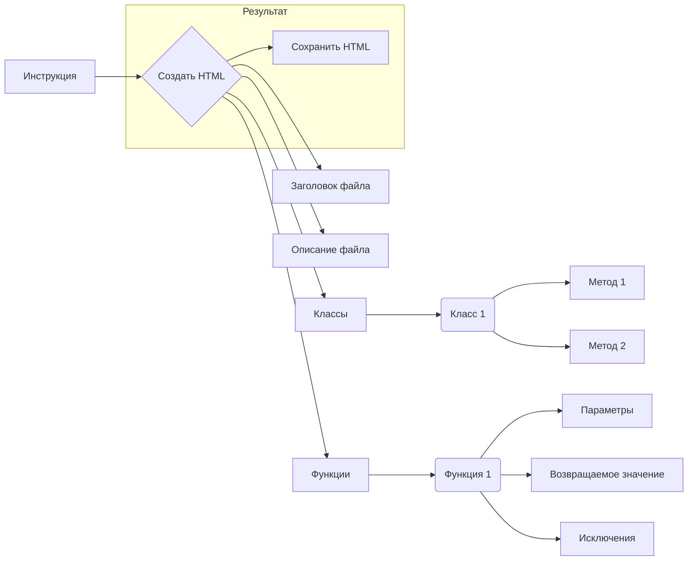

# Анализ кода для генерации HTML-документации Python-файлов

```markdown
## 1. <input code>

```html
<!-- INSTRUCTION -->

<p>Для каждого входного Python-файла создайте документацию в формате <code>HTML</code> для последующего использования. Документация должна соответствовать следующим требованиям:</p>

<ol>
  <li>
    <strong>Формат документации</strong>:
    <ul>
      <li>Используйте стандарт <code>HTML</code>.</li>
      <li>Каждый файл должен начинаться с заголовка и краткого описания его содержимого.</li>
      <li>Для всех классов и функций используйте следующий формат комментариев:
        <pre><code>python
def function(param: str, param1: Optional[str | dict | str] = None) -> dict | None:
    """
    Args:
        param (str): Описание параметра `param`.
        param1 (Optional[str | dict | str], optional): Описание параметра `param1`. По умолчанию значение равно `None`.

    Returns:
        dict | None: Описание возвращаемого значения. Возвращает словарь или `None`.

    Raises:
        SomeError: Описание ситуации, в которой возникает исключение `SomeError`.
    """
</code></pre>
      </li>
      <li>Используйте <code>ex</code> вместо <code>e</code> в блоках обработки исключений.</li>
    </ul>
  </li>

  <li>
    <strong>Оглавление (TOC)</strong>:
    <ul>
      <li>Включите раздел оглавления в начале каждого документа.</li>
      <li>Структура должна включать ссылки на все основные разделы документации модуля.</li>
    </ul>
  </li>

  <li>
    <strong>Форматирование документации</strong>:
    <ul>
      <li>Используйте правильный синтаксис <code>HTML</code> для всех заголовков, списков и ссылок.</li>
      <li>Для документирования классов, функций и методов включайте структурированные разделы с описаниями, деталями параметров, значениями возвращаемых данных и поднятыми исключениями. Пример:</li>
    </ul>
  </li>

</ol>
```

```markdown
## 2. <algorithm>

Этот код представляет собой инструкцию, а не исполняемый код.  Он описывает **формат** HTML-документации, которую нужно сгенерировать для Python-файлов.  Алгоритм заключается в создании структуры HTML-документа, включающего заголовки, описания, разделы для классов, функций и их параметров.  Нет циклов или условных конструкций, только описание желаемого результата.

**Пример (визуализировать в блок-схеме сложно, так как это не код, а описание):**

1. Создать HTML-файл
2. Добавить заголовок файла (h1)
3. Добавить раздел "Обзор" (h2) с кратким описанием
4. Добавить раздел "Классы" (h2)
5. Для каждого класса:
    - Добавить заголовок класса (h3)
    - Добавить описание класса
    - Добавить раздел "Методы" (h4)
    - Для каждого метода:
        - Добавить заголовок метода (h5)
        - Добавить описание
        - Добавить раздел "Параметры" (h6) с описанием каждого параметра
        - Добавить раздел "Возвращаемое значение" (h6)
        - Добавить раздел "Исключения" (h6)
6. Добавить раздел "Функции" (h2)
7. Для каждой функции:
    - Добавить заголовок функции (h3)
    - Добавить описание
    - Добавить раздел "Параметры" (h6) с описанием каждого параметра
    - Добавить раздел "Возвращаемое значение" (h6)
    - Добавить раздел "Исключения" (h6)
8. Сохранить HTML-файл

```markdown
## 3. <mermaid>



**Описание диаграммы:**

Диаграмма описывает процесс генерации HTML-документации.  ВХОД - инструкция, ВЫХОД - HTML-файл.  В процессе создаются заголовки, описания, разделы для классов и функций, списки параметров, значений возвращаемых данных и исключений.  Нет особых зависимостей, только структурирование информации.

```markdown
## 4. <explanation>

Этот код не содержит исполняемого кода. Он представляет собой инструкцию по написанию HTML-документации для Python-файлов.  Он описывает, как организовать и структурировать документацию.  В коде определяются требования к формату:

* **Структура HTML**:  Использование стандартных тегов HTML.
* **Форматирование комментариев**:  Предложенный стиль комментариев Python, чтобы описывать функции, классы, и методы.
* **Разделы**:  Организация документации в секции (заголовки уровней h1-h4).
* **Документация**:  Содержимое: обзор, классы, функции, методы, списки параметров, возвращаемых значений, и поднятых исключений.
* **Оглавление**:  Требуется оглавление (TOC) с гиперссылками на разделы документации.

**Возможности улучшения:**

* Нет реализации.  Этот код НЕ генерирует HTML-код.  Нужен код Python, чтобы сгенерировать документацию.
* Необходима обработка входящих Python-файлов.

**Связь с другими частями проекта:**

Эта инструкция  определяет *формат* документации, а не  *процесс* её генерации.  Чтобы использовать её, нужен инструмент (скрипт на Python), который прочитает Python-файлы, проанализирует комментарии и сгенерирует соответствующие HTML-страницы. Этот инструмент будет зависим от выбранного парсера Python-кода и генератора HTML.