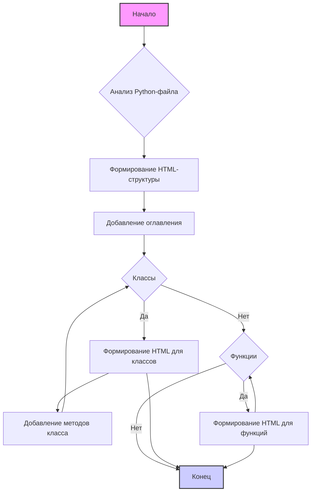

## ИНСТРУКЦИЯ:

### 1. **<алгоритм>**

Этот документ описывает процесс создания HTML-документации для Python-файлов. Основной алгоритм включает следующие шаги:

1.  **Получение входного Python-файла**: Принимается Python-файл, который необходимо задокументировать.

2.  **Разбор Python-файла**:
    - Анализируется структура Python-файла.
    - Извлекаются классы, функции, их параметры, возвращаемые значения и описания.
    - Замечания: Этот шаг выполняется кодом, который не входит в данный HTML файл, но результаты которого используются в рамках этого HTML.

3.  **Формирование HTML-структуры**:
    - Создается базовый HTML-шаблон с разделами оглавления, обзора, классов и функций.
    - Генерируется заголовок для документа (например, название модуля).
    - Заполняются разделы:
        - **Обзор**: Краткое описание модуля.
        - **Оглавление**: Ссылки на разделы классов и функций.
        - **Классы**: Для каждого класса создается подраздел с:
            - Описанием класса.
            - Списком его методов с кратким описанием.
        - **Функции**: Для каждой функции создается подраздел с:
            - Описанием функции.
            - Списком параметров с типами и описаниями.
            - Описанием возвращаемого значения.
            - Описанием исключений.

4.  **Форматирование**:
    - Используется правильный HTML-синтаксис для заголовков (`<h1>`, `<h2>`, `<h3>`, `<h4>`), списков (`<ul>`, `<li>`), и ссылок (`<a>`).
    - Код вставляется с помощью `<pre><code>` тегов для сохранения форматирования.
    - Заполненные разделы добавляются в HTML-документ.

5.  **Создание HTML-документа**:
    - Итоговый HTML-файл сохраняется в предназначенной для этого директории.

**Примеры**:
* Для `class MyClass:` будет создан HTML-раздел с заголовком `<h3>MyClass</h3>`, описанием, и списком методов.
* Для `def my_function(param: str, param1: int = 0):` будет создан HTML-раздел с заголовком `<h3>my_function</h3>`, параметрами `param` и `param1`, описанием возвращаемого значения и возможных исключений.
* Для `"""\nArgs:\nparam (str): Описание параметра param\n"""` будет создан HTML-список с `<li>param (str): Описание параметра param</li>`.

### 2. **<mermaid>**

**Объяснение:**

- **`flowchart TD`**: Указывает, что это диаграмма потока сверху вниз.
- **`A[Начало]`**: Начальная точка алгоритма.
- **`B{Анализ Python-файла}`**: Блок, представляющий анализ входного Python-файла.
- **`C[Формирование HTML-структуры]`**: Блок, представляющий формирование базовой HTML-структуры.
- **`D[Добавление оглавления]`**: Блок, добавляющий оглавление в HTML-структуру.
- **`E{Классы}`**: Блок, проверяющий наличие классов. Если есть классы, алгоритм идёт по ветви "Да".
- **`F[Формирование HTML для классов]`**: Блок, формирующий HTML-раздел для каждого класса, его описания и методов.
- **`G[Добавление методов класса]`**: Блок, формирующий HTML-разделы для методов класса.
- **`H{Функции}`**: Блок, проверяющий наличие функций. Если есть функции, алгоритм идёт по ветви "Да".
- **`I[Формирование HTML для функций]`**: Блок, формирующий HTML-раздел для каждой функции, её параметров, возвращаемого значения и возможных исключений.
- **`J[Конец]`**: Конечная точка алгоритма.

Эта диаграмма демонстрирует общий поток работы процесса создания HTML-документации. Важно отметить, что блоки `E` и `H` являются условными, а блоки `F` и `I` выполняются циклически для каждого класса и функции соответственно.
В данной диаграмме не показаны подробности разбора Python-файла, так как этот процесс происходит за пределами данного HTML-описания и относится к коду, обрабатывающему данный HTML файл.

### 3. **<объяснение>**

**Цель документа**:
Основная цель этого HTML-документа — предоставить четкие инструкции по созданию HTML-документации для Python-файлов. Эти инструкции определяют структуру HTML-документа, формат комментариев для классов и функций, а также требования к форматированию и оглавлению.

**Структура документа**:
Документ представлен в виде нумерованного списка `<ol>`, внутри которого каждый пункт определяет часть требований к HTML-документации:
1.  **Формат документации**:
    - Описывает использование стандартного HTML.
    - Указывает структуру документа (заголовок, описание).
    - Определяет формат комментариев для классов и функций.
    - Задает использование `ex` вместо `e` в блоках обработки исключений.
2.  **Оглавление (TOC)**:
    - Требует наличия оглавления в начале документа.
    - Определяет структуру оглавления как ссылки на основные разделы модуля.
3.  **Форматирование документации**:
    - Описывает использование HTML для заголовков, списков и ссылок.
    - Определяет формат разделов для классов, функций и методов.
4.  **Заголовки разделов**:
    - Определяет иерархию заголовков (`<h1>`, `<h2>`, `<h3>`, `<h4>`).
5.  **Пример файла**:
    - Приводит пример HTML-документа.

**Импорты**:
В данном HTML документе отсутствуют импорты как таковые, так как он описывает требования к генерации HTML, а не выполняет эту генерацию.

**Классы**:
В данном HTML документе нет классов, поскольку он представляет собой руководство по созданию документации, а не код для ее генерации.

**Функции**:
В этом HTML-документе нет функций.

**Переменные**:
В данном HTML-документе нет переменных в традиционном смысле.

**Потенциальные ошибки или области для улучшения**:
- **Отсутствие конкретной реализации парсера**: В документе описаны требования к HTML, но не приведен код, который будет парсить Python-файлы и генерировать HTML.
- **Недостаточно примеров**: Хоть и приведен пример структуры, необходимо больше примеров сложных случаев, например, вложенных классов и функций, или функций с различными типами параметров и исключениями.
- **Отсутствует описание генерации оглавления**: Хоть и указано требование на оглавление, не описано как именно оно должно быть построено (с автоматической генерацией якорей).

**Взаимосвязи с другими частями проекта**:
Этот HTML-документ напрямую связан с кодом, который будет реализовывать парсинг Python-файлов и генерацию HTML-документации. Он является частью спецификации для этого кода.