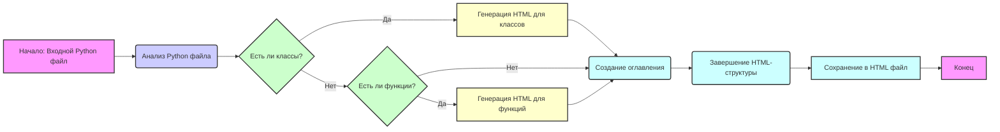

# Анализ инструкций по созданию HTML-документации для Python-файлов

## 1. <алгоритм>
Данная инструкция описывает процесс генерации HTML-документации для Python-кода. Вот пошаговая блок-схема, иллюстрирующая этот процесс:

1. **Начало**: Получить Python файл на вход.
   * Пример: `example.py`

2. **Анализ файла**: Разбор файла для извлечения классов, функций, их параметров, возвращаемых значений и исключений.
   * Пример:  `def my_function(param1: str, param2: int = 10) -> str:` будет разобрана для получения имени `my_function`, параметров `param1`, `param2` с их типами и значениями по умолчанию, а также типа возвращаемого значения `str`.

3. **Создание HTML-структуры**:
    * Начать с базовой структуры HTML, включая `<head>` и `<body>`.
    * Добавить заголовок первого уровня (`<h1>`) для названия модуля (имя файла без расширения).
      * Пример: `<h1>example</h1>`
    * Добавить раздел "Обзор" с кратким описанием модуля.
      * Пример:  `<h2>Обзор</h2><p>Описание модуля.</p>`

4. **Создание оглавления (TOC)**:
    * Создать HTML-список (например, `<ul>`) с ссылками (например, `<a>`) на все основные разделы документации модуля (классы и функции).
    *  Ссылки должны указывать на идентификаторы соответствующих разделов (например, `#classes`, `#functions`).

5. **Генерация документации для классов**:
   * Для каждого класса:
     * Создать заголовок третьего уровня (`<h3>`) с именем класса.
       * Пример: `<h3>ClassName</h3>`
     * Добавить описание класса в параграфе (`<p>`).
     * Добавить список методов класса, каждый в отдельном элементе списка `<li>`.
     * Для каждого метода - создать заголовок четвертого уровня `<h4>`, описание метода и описание его параметров, возвращаемых значений и исключений в соответствующих списках.
        * Пример:
         ```html
         <h3><code>ClassName</code></h3>
         <p><strong>Описание</strong>: Краткое описание класса.</p>
            <p><strong>Методы</strong>:</p>
                <ul>
                  <li><code>method_name</code>: Краткое описание метода.</li>
                </ul>
         ```

6. **Генерация документации для функций**:
   *  Для каждой функции:
     * Создать заголовок третьего уровня (`<h3>`) с именем функции.
       * Пример: `<h3>function_name</h3>`
     * Добавить описание функции в параграфе (`<p>`).
     *  Создать список параметров функции:
         * Для каждого параметра:
          * Создать элемент списка (`<li>`) с описанием параметра (имя, тип, значение по умолчанию).
     * Добавить описание возвращаемого значения в отдельном списке.
     * Добавить описание исключений, которые могут быть вызваны функцией в отдельном списке.
     *  Пример:
        ```html
         <h3><code>function_name</code></h3>
         <p><strong>Описание</strong>: Краткое описание функции.</p>

         <p><strong>Параметры</strong>:</p>
            <ul>
              <li><code>param</code> (str): Описание параметра <code>param</code>.</li>
              <li><code>param1</code> (Optional[str | dict | str], optional): Описание параметра <code>param1</code>. По умолчанию значение равно <code>None</code>.</li>
            </ul>
          <p><strong>Возвращаемое значение</strong>:</p>
             <ul>
               <li><code>dict | None</code>: Описание возвращаемого значения.</li>
             </ul>
           <p><strong>Исключения</strong>:</p>
            <ul>
              <li><code>SomeError</code>: Описание ситуации, в которой возникает исключение <code>SomeError</code>.</li>
            </ul>
         ```

7. **Завершение**: Закрыть все HTML-теги.
    * Пример: `</body></html>`

8. **Сохранение**: Сохранить сгенерированный HTML-код в файл с именем, соответствующим исходному Python файлу, но с расширением `.html`.
   * Пример: `example.html`

## 2. <mermaid>



**Анализ зависимостей:**
Диаграмма `mermaid` описывает последовательность операций, которые применяются к входному Python файлу для создания HTML документации. 
*   **Начало (A)**: Представляет собой входной Python файл, который является началом процесса.
*   **Анализ Python файла (B)**: Блок, где происходит разбор Python кода для извлечения информации о классах, функциях, их параметрах и прочего.
*   **Есть ли классы? (C)**: Условный блок, проверяющий наличие классов в проанализированном коде.
*   **Генерация HTML для классов (D)**: Блок, в котором создается HTML разметка для классов.
*   **Есть ли функции? (E)**: Условный блок, проверяющий наличие функций в проанализированном коде.
*  **Генерация HTML для функций (G)**: Блок, где создается HTML разметка для функций.
*   **Создание оглавления (F)**: Блок, в котором формируется оглавление (TOC) документации.
*   **Завершение HTML-структуры (H)**: Блок, где происходит завершение HTML документа.
*   **Сохранение в HTML файл (I)**: Блок, в котором сгенерированный HTML код сохраняется в файл.
*   **Конец (J)**: Блок завершения процесса.

## 3. <объяснение>
### Импорты:
Инструкция не требует импортов, так как является описанием процесса, а не программным кодом. Следовательно, нет связей с другими пакетами `src.`.

### Классы:
В данном случае, классы не используются в инструкции. Инструкция описывает, как необходимо структурировать генерируемую HTML документацию, но не использует классы для ее реализации.

### Функции:
Функции также не используются в самой инструкции. Однако подразумевается, что для реализации этого процесса потребуется создание функций, которые будут выполнять следующие задачи:
*   **`parse_python_file(file_path: str)`**: Принимает путь к Python файлу, анализирует его и возвращает структуру данных, представляющую классы, функции, их параметры, возвращаемые значения и исключения.
*   **`generate_html_for_class(class_data: dict) -> str`**: Принимает данные о классе и возвращает HTML-код для этого класса.
*   **`generate_html_for_function(function_data: dict) -> str`**: Принимает данные о функции и возвращает HTML-код для этой функции.
*   **`create_table_of_contents(data: list) -> str`**: Создает HTML-код для оглавления документации на основе данных о классах и функциях.
*   **`save_html(file_path: str, html_content: str)`**: Сохраняет HTML-контент в файл по указанному пути.

### Переменные:
Переменные, подразумеваемые в контексте данной инструкции:
*   `file_path`: `str`, путь к Python файлу, который нужно проанализировать.
*   `html_content`: `str`, строка, содержащая сгенерированный HTML-код.
*   `class_data`: `dict`, словарь с информацией о классе.
*    `function_data`: `dict`, словарь с информацией о функции.

### Ошибки и улучшения:
1.  **Отсутствие обработки ошибок:** Инструкция не описывает обработку возможных ошибок, таких как некорректный Python код, ошибки при создании HTML, ошибки при сохранении файлов.
2.  **Необходимость точного парсинга Python**: Для получения информации о классах, функциях и их описаний, необходимо разработать парсер Python-кода.
3.  **Отсутствие подробностей по генерации TOC:** Более детально расписать создание оглавления с ссылками на конкретные разделы документации.
4. **Не указано, как обрабатывать docstring**: Инструкция упоминает, что необходимо использовать docstring, но не объясняет подробно, как именно они должны быть извлечены и отформатированы.
5. **Не определен формат структуры данных**: Инструкция предполагает использование структуры данных, содержащей информацию о классах и функциях, но не определяет конкретный формат этой структуры.

### Взаимосвязи с другими частями проекта:
Предполагается, что этот модуль будет использоваться как часть системы документирования Python-проектов. Он может быть частью более крупного инструмента, который автоматически генерирует документацию для проекта на основе его исходного кода. Этот модуль будет взаимодействовать с другими модулями, которые занимаются, например, парсингом структуры проекта.