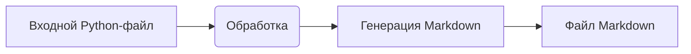

# Инструкция по написанию документации для Python-файлов

## Обзор

Данная инструкция описывает формат документации для Python-файлов, которая должна быть сгенерирована для последующего использования.  Документация должна быть написана в формате Markdown (.md) и содержать структурированную информацию о классах и функциях, а также ссылки на другие разделы.

## Требования к формату

1. **Формат документации**:
   - Используйте стандарт Markdown (.md).
   - Каждый файл должен начинаться с заголовка и краткого описания содержимого.
   - Для всех классов и функций используйте следующий формат комментариев:

     ```python
     def функция(параметр: str, параметр1: Optional[str | dict | str] = None) -> dict | None:
         """
         Аргументы:
             параметр (str): Описание параметра `параметр`.
             параметр1 (Optional[str | dict | str], optional): Описание параметра `параметр1`. По умолчанию `None`.

         Возвращает:
             dict | None: Описание возвращаемого значения. Возвращает словарь или `None`.

         Возможные исключения:
             SomeError: Описание ситуации, при которой возникает исключение `SomeError`.
         """
     ```
   - Используйте `ex` вместо `e` в блоках обработки исключений.

2. **Оглавление (Table of Contents - TOC)**:
   - В начале каждого файла документации должен быть раздел оглавления.
   - Структура должна включать ссылки на все основные разделы документации модуля.

3. **Форматирование документации**:
   - Используйте правильный синтаксис Markdown для всех заголовков, списков и ссылок.
   - При документировании классов, функций и методов включайте структурированные разделы с описаниями, подробностями о параметрах, возвращаемых значениях и возможных исключениях.  Пример:

     ```markdown
     ## Функции

     ### `функция_имени`

     **Описание**: Краткое описание функции.

     **Параметры**:
     - `параметр` (str): Описание параметра `параметр`.
     - `параметр1` (Optional[str | dict | str], optional): Описание параметра `параметр1`. По умолчанию `None`.

     **Возвращает**:
     - `dict | None`: Описание возвращаемого значения.

     **Возможные исключения**:
     - `SomeError`: Описание ситуации, при которой возникает исключение `SomeError`.
     ```

4. **Заголовки разделов**:
   - Используйте заголовки уровней 1 (`#`), 2 (`##`), 3 (`###`) и 4 (`####`) последовательно на протяжении всего файла.

5. **Пример файла**:
   ```markdown
   # Имя модуля

   ## Обзор

   Краткое описание назначения модуля.

   ## Классы

   ### `ИмяКласса`

   **Описание**: Краткое описание класса.

   **Методы**:
   - `метод_имени`: Краткое описание метода.

   ## Функции

   ### `функция_имени`

   **Описание**: Краткое описание функции.

   **Параметры**:
   - `параметр` (str): Описание параметра `параметр`.
   - `параметр1` (Optional[str | dict | str], optional): Описание параметра `параметр1`. По умолчанию `None`.

   **Возвращает**:
   - `dict | None`: Описание возвращаемого значения.

   **Возможные исключения**:
   - `SomeError`: Описание ситуации, при которой возникает исключение `SomeError`.
   ```

##  <mermaid>

## <explanation>

Эта инструкция описывает структуру и формат документации для Python-файлов.  Она не содержит кода, но определяет требования к формату документации, включающему заголовки, описание классов и функций, параметры, возвращаемые значения и возможные исключения. Она предоставляет примеры того, как должна выглядеть документация.

**Импорты:** В данном случае нет кода для анализа импортов.

**Классы, функции, переменные:**  Инструкция определяет, *как* должны быть документированы классы и функции, но не предоставляет их сами.

**Возможные ошибки или области для улучшений:** Инструкция не содержит кода, и поэтому нет возможности определить потенциальные ошибки или области улучшения.


**Цепочка взаимосвязей:**  Данная инструкция задаёт формат, но сама не является частью конкретного проекта.  Она будет использована другими частями проекта для создания документации.

**Примечание:**  Для анализа реального кода и создания соответствующей документации, необходимо предоставить сам код Python-файлов.