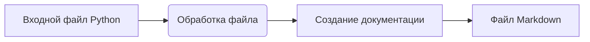

# Инструкция по написанию документации в формате Markdown для файлов Python

## Обзор

Данная инструкция описывает формат и структуру документации в формате Markdown для файлов Python.  Документация должна быть написана в соответствии с предложенными правилами для удобства использования и понимания кода.

## Требования к формату документации

1. **Формат документации:**
   - Используйте стандарт Markdown (.md).
   - Каждый файл должен начинаться с заголовка и краткого описания его содержимого.
   - Для всех классов и функций используйте следующий формат комментариев:

   ```python
   def функция(параметр: str, параметр1: Optional[str | dict | str] = None) -> dict | None:
       """
       Args:
           параметр (str): Описание параметра `параметр`.
           параметр1 (Optional[str | dict | str], optional): Описание параметра `параметр1`. По умолчанию `None`.

       Returns:
           dict | None: Описание возвращаемого значения. Возвращает словарь или `None`.

       Raises:
           SomeError: Описание ситуации, в которой возникает исключение `SomeError`.
       """
   ```
   - Используйте `ex` вместо `e` в блоках обработки исключений.

2. **Содержание (TOC):**
   - В начале каждого файла документации должен быть раздел со списком содержимого (TOC).
   - Структура должна включать ссылки на все основные разделы документации модуля.

3. **Форматирование документации:**
   - Используйте правильный синтаксис Markdown для всех заголовков, списков и ссылок.
   - При документировании классов, функций и методов включайте структурированные разделы с описаниями, параметрами, возвращаемыми значениями и исключениями.  Пример:

   ```markdown
   ## Функции

   ### `имя_функции`

   **Описание**: Краткое описание функции.

   **Параметры**:
   - `параметр` (str): Описание параметра `параметр`.
   - `параметр1` (Optional[str | dict | str], optional): Описание параметра `параметр1`. По умолчанию `None`.

   **Возвращает**:
   - `dict | None`: Описание возвращаемого значения.

   **Исключения**:
   - `SomeError`: Описание ситуации, в которой возникает исключение `SomeError`.
   ```

4. **Заголовки разделов:**
   - Используйте заголовки уровней 1 (`#`), 2 (`##`), 3 (`###`) и 4 (`####`) последовательно во всем файле.

5. **Пример файла:**
   ```markdown
   # Имя модуля

   ## Обзор

   Краткое описание назначения модуля.

   ## Классы

   ### `ИмяКласса`

   **Описание**: Краткое описание класса.

   **Методы**:
   - `метод_имя`: Краткое описание метода.

   ## Функции

   ### `имя_функции`

   **Описание**: Краткое описание функции.

   **Параметры**:
   - `параметр` (str): Описание параметра `параметр`.
   - `параметр1` (Optional[str | dict | str], optional): Описание параметра `параметр1`. По умолчанию `None`.

   **Возвращает**:
   - `dict | None`: Описание возвращаемого значения.

   **Исключения**:
   - `SomeError`: Описание ситуации, в которой возникает исключение `SomeError`.
   ```


## <mermaid>


## <explanation>

Эта инструкция предоставляет шаблон для создания документации в формате Markdown для Python-файлов.  Она  описывает, как структурировать документацию, включая заголовки, разделы, комментарии к функциям и классам, а также  правила написания описаний параметров, возвращаемых значений и возможных исключений.  Инструкция также подчеркивает важность использования ясного и структурированного языка для улучшения читабельности и поддержки проекта.

**Импорты**:  В данном коде нет импортов, т.к. это сама инструкция по документированию.

**Классы**:  Нет примеров кода, определяющего классы.  Инструкция фокусируется на *как* писать документацию для классов.

**Функции**:  Нет примеров кода для функций.  Инструкция фокусируется на *как* писать документацию для функций.

**Переменные**:  Нет примеров кода, использующего переменные.  Инструкция фокусируется на *как* документировать функции и классы.


**Возможные ошибки/улучшения**:  Инструкция не содержит примеров реализации, поэтому невозможно выявить конкретные ошибки или зоны улучшения в коде.  Не указаны требования к структуре проекта (например, расположение файлов). Инструкция фокусируется на формате документации, а не на конкретном коде.

**Взаимосвязь с другими частями проекта**: Инструкция определяет *как* писать документацию, а не описывает взаимосвязи с другими частями проекта.
```