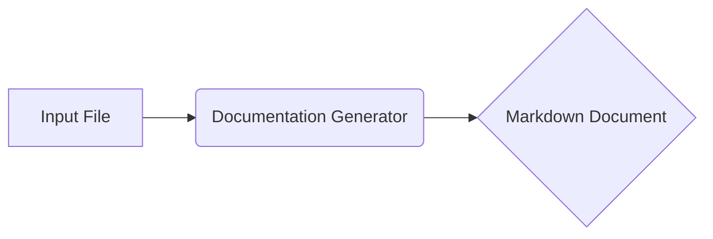

# ИНСТРУКЦИЯ по генерации документации для Python-файлов

## Обзор

Данная инструкция описывает формат и структуру Markdown-документации для Python-файлов. Документация должна быть подробной и структурированной, с использованием заголовков разных уровней, списков и примеров.

## Формат документации

Документация должна быть создана в формате Markdown (.md). Каждый файл должен начинаться с заголовка и краткого описания содержимого. Все классы и функции должны быть документированы в следующем формате:

```python
def функция(параметр: str, параметр1: Optional[str | dict | str] = None) -> dict | None:
    """
    Аргументы:
        параметр (str): Описание параметра `параметр`.
        параметр1 (Optional[str | dict | str], optional): Описание параметра `параметр1`. По умолчанию `None`.

    Возвращает:
        dict | None: Описание возвращаемого значения. Возвращает словарь или `None`.

    Исключения:
        SomeError: Описание ситуации, при которой возникает исключение `SomeError`.
    """
    # Тело функции
```

В блоках обработки исключений использовать `ex` вместо `e`.

## Структура документации

Каждый файл должен содержать следующие разделы:

- **Заголовок уровня 1 (#):** Имя модуля.
- **Обзор (##):** Краткое описание назначения модуля.
- **Содержание (##):** Таблица содержания (TOC) со ссылками на все основные разделы.
- **Классы (##):** Описание каждого класса с подробной информацией о методах.
    - **Заголовок уровня 3 (###):** Имя класса.
    - **Описание**: Краткое описание класса.
    - **Методы**: Список методов с кратким описанием.
- **Функции (##):** Описание каждой функции с подробной информацией об аргументах, возвращаемых значениях и исключениях.
    - **Заголовок уровня 3 (###):** Имя функции.
    - **Описание**: Краткое описание функции.
    - **Аргументы**: Список аргументов с описанием.
    - **Возвращаемые значения**: Описание возвращаемого значения.
    - **Исключения**: Список возможных исключений и условий их возникновения.

## Примеры форматирования

```markdown
# Модуль обработки данных

## Обзор

Модуль предоставляет функции для обработки данных.

## Содержание

- [Обзор](#обзор)
- [Классы](#классы)
- [Функции](#функции)

## Классы

### `КлассОбработки`

**Описание**: Класс для обработки данных.

**Методы**:
- `обработать_данные`: Обрабатывает входные данные.

## Функции

### `функция_обработки`

**Описание**: Функция обработки данных.

**Аргументы**:
- `данные` (list): Список данных для обработки.
- `параметр` (int, optional): Параметр обработки. По умолчанию 10.

**Возвращаемые значения**:
- list: Обработанный список данных.

**Исключения**:
- `ОшибкаОбработки`: Возникает при ошибке обработки.

```

## Дополнительные указания

- Следовать правилам форматирования Markdown.
- В документации использовать понятную и точную терминологию.
- Приводить примеры использования функций и классов.
-  Детализировать описание каждого аргумента и возвращаемого значения.
- Указывать возможные ошибки и области для улучшения кода.



**Описание диаграммы:**

В диаграмме представлена простая последовательность действий: входной Python-файл (A) обрабатывается генератором документации (B), который создает Markdown-документ (C).

**Пояснение импортов (отсутствуют в предоставленном коде, но это важно):**

* Примеры импортов, которые могут встретиться:
    * `typing`: для аннотаций типов (например, `Optional`, `List`).
    * `src.utils`: для собственных модулей, если есть.
    * `src.models`: для классов и структур данных.

**Пояснение классов, функций, переменных (отсутствуют в предоставленном коде, но это важно):**

* Классы, методы, функции, переменные должны быть описаны в рамках конкретного модуля.

**Возможные ошибки и улучшения:**

* Необходимо дополнить описание, когда приведён пример кода, чтобы было понятно, что он делает и в каких ситуациях его использовать.


```