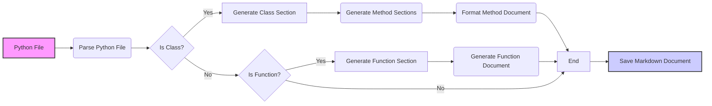

# Анализ Инструкции по Генерации Документации в Markdown

## <алгоритм>

1. **Начало**: Получаем на вход Python файл.
2. **Анализ файла**: Парсим Python файл, выделяя классы, функции и их docstring (комментарии).
3. **Генерация заголовка**: Создаем Markdown заголовок первого уровня `#` с именем модуля (файла).
4. **Генерация секции "Обзор"**: Создаем секцию второго уровня `## Overview` с кратким описанием содержимого модуля.
5. **Генерация TOC (Содержание)**:
   - Создаем TOC в начале документа.
   - Добавляем ссылки на основные разделы: классы и функции.
6. **Генерация секции "Классы"**:
   - Создаем заголовок второго уровня `## Classes`.
   - Для каждого класса в файле:
     - Создаем заголовок третьего уровня `### ClassName`.
     - Добавляем описание класса (из docstring).
     - Создаем секцию "Методы":
       - Для каждого метода в классе:
         - Добавляем описание метода.
7. **Генерация секции "Функции"**:
   - Создаем заголовок второго уровня `## Functions`.
   - Для каждой функции в файле:
     - Создаем заголовок третьего уровня `### function_name`.
     - Добавляем описание функции (из docstring).
     - Добавляем секцию "Параметры":
       - Для каждого параметра функции:
         - Описание параметра (из docstring).
     - Добавляем секцию "Возвращает":
       - Описание возвращаемого значения (из docstring).
     - Добавляем секцию "Вызывает":
       - Описание возможных исключений (из docstring).
8. **Форматирование**: Обеспечиваем правильное форматирование Markdown:
   - Заголовки, списки, ссылки, форматирование кода.
9. **Конец**: Сохраняем сгенерированный Markdown документ в файл.

**Пример обработки функции:**

Пусть у нас есть функция:

```python
def calculate_sum(a: int, b: int) -> int:
    """
    Args:
        a (int): The first number to add.
        b (int): The second number to add.

    Returns:
        int: The sum of a and b.
    """
    return a + b
```

Результатом обработки будет:

```markdown
### `calculate_sum`

**Description**: The function calculates sum of two numbers.

**Parameters**:
- `a` (int): The first number to add.
- `b` (int): The second number to add.

**Returns**:
- `int`: The sum of a and b.
```

## <mermaid>



**Зависимости `mermaid` диаграммы:**

- **`graph LR`**: Определяет тип диаграммы как направленный граф, где связи идут слева направо.
- **`A[Python File]`**: Начальный узел, представляющий входной Python файл.
- **`B(Parse Python File)`**: Узел, представляющий процесс разбора Python файла для извлечения классов и функций.
- **`C{Is Class?}`**: Узел принятия решений, проверяющий, является ли текущая сущность классом.
- **`D[Generate Class Section]`**: Узел, представляющий процесс генерации раздела документации для класса.
- **`E{Is Function?}`**: Узел принятия решений, проверяющий, является ли текущая сущность функцией.
- **`F[Generate Function Section]`**: Узел, представляющий процесс генерации раздела документации для функции.
- **`G[End]`**: Узел, представляющий конец обработки текущей сущности.
- **`H(Generate Method Sections)`**: Узел, представляющий генерацию секций методов внутри класса.
-  **`I(Format Method Document)`**: Узел, представляющий форматирование документации методов.
- **`J(Generate Function Document)`**: Узел, представляющий процесс генерации форматированной документации для функции.
- **`K[Save Markdown Document]`**: Узел, представляющий процесс сохранения сгенерированного Markdown документа.
- **`-->`**: Стрелки, показывающие поток управления и данных.
- **`style`**: Определяет визуальный стиль узлов (цвет заливки, обводки).

## <объяснение>

**Импорты**:
В этом фрагменте кода нет импортов, поскольку это инструкция, а не код Python.

**Классы**:
В данном контексте нет классов. Однако, инструкция описывает, как обрабатывать и документировать классы, если они встретятся в исходном коде. Инструкция определяет, как должна выглядеть документация для классов: описание, методы, и т.д.

**Функции**:
Инструкция сама по себе не содержит функций. Однако, она описывает, как документировать функции: параметры, описание, возвращаемые значения и исключения.

**Переменные**:
В этом фрагменте нет переменных.

**Объяснение**:
Инструкция определяет процесс создания документации в формате Markdown для Python кода. Основные моменты:
- **Формат документации**: Используется Markdown (.md).
- **Секции**: Документация делится на секции: Обзор, Классы, Функции.
- **Структура**: Для классов и функций предусмотрена детальная структура: описания, параметры, возвращаемые значения, исключения.
- **TOC (Table of Contents)**: Для каждой документации должен быть создан TOC.
- **Примеры**: В инструкции есть пример структуры документации.

**Цепочка взаимосвязей**:
Данная инструкция является частью процесса создания документации для проекта, и она связана со следующими элементами:

1. **Анализатор кода**: Парсит Python файлы.
2. **Генератор Markdown**: Форматирует документацию в Markdown.
3. **Система сборки документации**: Использует сгенерированные Markdown файлы для создания документации.

**Потенциальные ошибки и области для улучшения**:

1. **Неполная обработка**: Инструкция не включает обработку всех возможных элементов Python, например, декораторы.
2. **Сложность docstring**: Инструкция предполагает стандартный формат docstring. Она не охватывает все варианты docstring и их форматирование.
3. **Генерация TOC**: Инструкция описывает создание TOC, но не указывает, как именно генерировать ссылки на разделы внутри документа (с помощью якорей или других механизмов).
4. **Форматирование**: Можно добавить более подробные правила форматирования Markdown.
5. **Обработка ошибок**: Инструкция не определяет конкретные шаги по обработке ошибок, если, например, docstring отсутствует или имеет неправильный формат.

В целом, инструкция обеспечивает хорошую основу для создания автоматической документации, но нуждается в доработке для учета большего количества ситуаций и деталей.