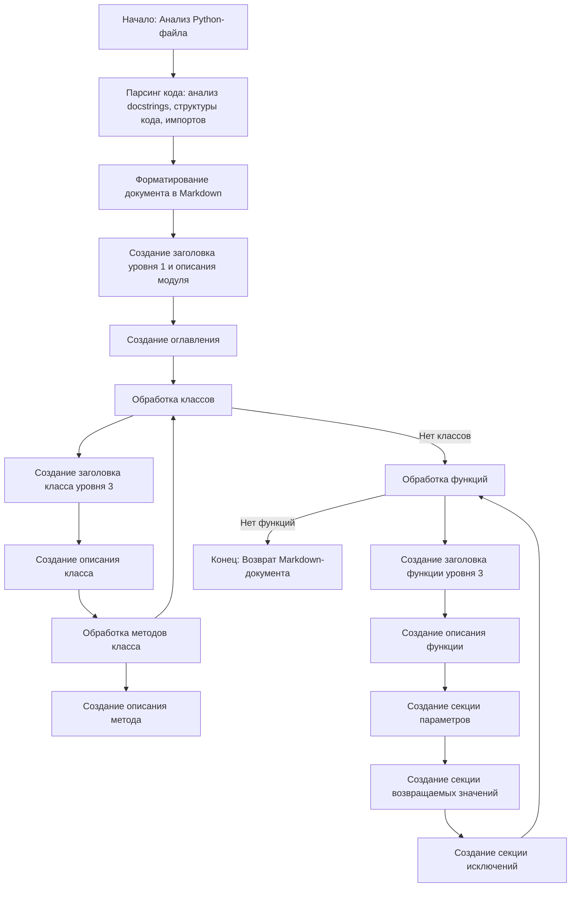

## <алгоритм>

1.  **Начало**: Получить на вход код на Python.
2.  **Анализ**: 
    *   Проверить наличие docstring у каждой функции и класса.
    *   Распарсить информацию из docstring (описание, параметры, возвращаемые значения, исключения).
    *   Собрать информацию о структуре кода (классы, методы, функции).
    *   Проверить наличие импортов.
3.  **Форматирование**:
    *   Создать заголовок документа `Markdown` уровня 1.
    *   Создать обзорный раздел (`## Overview`) с кратким описанием модуля.
    *   Создать оглавление, содержащее ссылки на разделы классов и функций.
    *   Для каждого класса:
        *   Создать заголовок уровня 3 (`### ClassName`).
        *   Создать описание класса.
        *   Создать раздел методов (`**Methods**:`) с описанием каждого метода.
    *   Для каждой функции:
        *   Создать заголовок уровня 3 (`### function_name`).
        *   Создать описание функции.
        *   Создать раздел `**Parameters**:`. Для каждого параметра добавить описание, тип и значение по умолчанию.
        *   Создать раздел `**Returns**:`, содержащий описание возвращаемого значения.
        *   Создать раздел `**Raises**:`, содержащий описание исключений.
    *   Использовать корректный синтаксис `Markdown` для всех заголовков, списков и ссылок.
4.  **Генерация**: Собрать все сформатированные блоки в `Markdown`-файл.
5.  **Вывод**: Вернуть полученный `Markdown`-файл.

Пример логического блока:
    Предположим, есть функция:
    ```python
    def calculate_sum(a: int, b: int) -> int:
        """
        Args:
            a (int): The first number.
            b (int): The second number.

        Returns:
            int: The sum of `a` and `b`.
        """
        return a + b
    ```
    Этот блок будет преобразован в следующий формат:

    ```markdown
    ### `calculate_sum`

    **Description**: 
    
    **Parameters**:
    - `a` (int): The first number.
    - `b` (int): The second number.

    **Returns**:
    - `int`: The sum of `a` and `b`.
    ```

## <mermaid>



**Объяснение `mermaid` диаграммы:**

*   `Start`: Начальная точка, обозначает начало процесса.
*   `ParseCode`: Этап анализа Python-файла, включающий парсинг docstring и извлечение структурных данных.
*   `FormatOutput`: Этап форматирования результатов анализа в Markdown.
*   `CreateHeader`: Создание заголовка уровня 1 и общего описания модуля.
*   `CreateTOC`: Этап создания оглавления, которое ссылается на основные разделы.
*   `ProcessClasses`: Блок обработки классов.
*   `CreateClassHeader`: Создание заголовка для каждого класса.
*   `CreateClassDescription`: Создание описания класса.
*   `ProcessMethods`: Блок обработки методов класса.
*    `CreateMethodDescription`: Создание описания для каждого метода.
*   `ProcessClasses`: Возврат к обработке следующего класса (если есть), иначе переход к обработке функций.
*   `ProcessFunctions`: Блок обработки функций.
*   `CreateFunctionHeader`: Создание заголовка для каждой функции.
*   `CreateFunctionDescription`: Создание описания функции.
*   `CreateParametersSection`: Создание раздела параметров функции.
*   `CreateReturnsSection`: Создание раздела возвращаемых значений функции.
*   `CreateRaisesSection`: Создание раздела исключений функции.
*   `ProcessFunctions`: Возврат к обработке следующей функции (если есть), иначе переход к завершению.
*   `End`: Конечная точка, обозначает завершение процесса и возврат Markdown-документа.

## <объяснение>

**Импорты**:

В данном коде не используются импорты.

**Классы**:

Данная инструкция не описывает конкретные классы, но задает формат для их документирования. Структура документации классов включает в себя:

*   `**Description**`: Краткое описание класса.
*   `**Methods**`: Описание методов класса.
    *   `method_name`: Имя метода и его описание.

**Функции**:

Инструкция задает формат документирования функций:

*   `**Description**`: Краткое описание функции.
*   `**Parameters**`: Описание параметров функции:
    *   `param` (type): Описание параметра.
*   `**Returns**`: Описание возвращаемого значения.
*   `**Raises**`: Описание возникающих исключений.

**Переменные**:

Данная инструкция не касается переменных в коде Python, а описывает, как документировать параметры функций, имеющие имена и типы.

**Потенциальные ошибки или области для улучшения:**

*   **Отсутствие обработки сложных docstrings**: Инструкция подразумевает простой формат docstring. Необходима обработка более сложных docstrings (например, с использованием `rst` или `google style`).
*   **Отсутствие обработки вложенных классов и функций**: Инструкция не описывает обработку вложенных классов или функций.
*   **Неучет наследования**: Не рассматривается документация наследования классов.
*   **Исключения, сгенерированные вложенными функциями**: Не обрабатываются исключения, которые могут быть сгенерированы при вызове других функций внутри функции.
*   **Отсутствие примеров**: Не включает в себя добавление примеров использования функций и классов.
*   **Ограниченная поддержка типов**: Документирование ограничено простыми типами, без учета сложных типов, таких как `TypedDict`, `List`, `Tuple`, и т.д.

**Взаимосвязь с другими частями проекта**:

Данная инструкция предназначена для генерации документации из исходных Python файлов. Это важная часть процесса разработки, поскольку она способствует поддержанию ясности и согласованности кода, а также помогает другим разработчикам понимать и использовать ваш код.

Эта инструкция может быть интегрирована с инструментами автоматической генерации документации, которые сканируют файлы и создают `Markdown`-документацию по заданному шаблону.