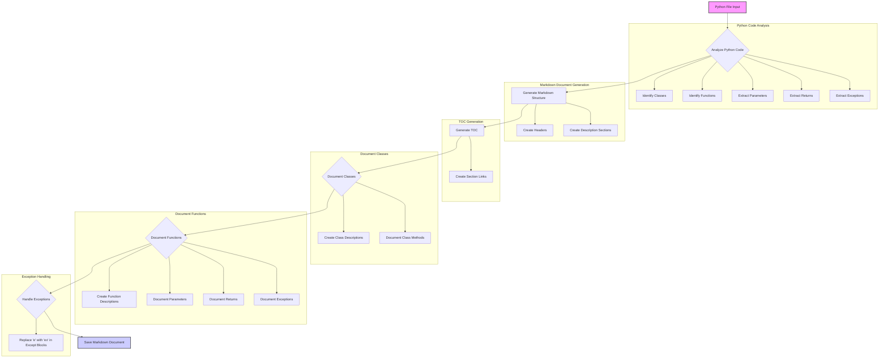

## ИНСТРУКЦИЯ: Анализ и документирование Python-кода

### 1. <алгоритм>

**Блок-схема процесса документирования:**

1.  **Начало:** Получение Python-файла в качестве входных данных.
    *   **Пример:** `my_module.py`
2.  **Анализ файла:** Разбор содержимого Python-файла для выявления классов, функций, их параметров, возвращаемых значений и исключений.
    *   **Пример:** `def my_function(arg1: str, arg2: int) -> list: ...`
3.  **Генерация Markdown-документа:** Создание структуры Markdown-документа на основе анализа файла.
    *   **Пример:** Создается заголовок `# my_module`, раздел `## Functions` и т.д.
4.  **Генерация TOC:** Создание содержания с ссылками на разделы.
    *   **Пример:** `[Functions](#functions)`
5.  **Документирование классов:** Создание разделов для каждой обнаруженной класса, с описанием, методами, их параметрами и возвращаемыми значениями.
    *   **Пример:** 
        ```markdown
        ### `MyClass`
        **Description**: ...
        **Methods**:
        - `method_name`: ...
        ```
6.  **Документирование функций:** Создание разделов для каждой функции с описанием, параметрами, возвращаемыми значениями и возможными исключениями.
    *    **Пример:**
        ```markdown
        ### `my_function`
        **Description**: ...
        **Parameters**:
        - `arg1` (str): ...
        - `arg2` (int): ...
        **Returns**:
        - `list`: ...
        **Raises**:
        - `ValueError`: ...
        ```
7.  **Обработка исключений:** Замена `e` на `ex` в блоках `except`.
    *   **Пример:** `except Exception as ex:`
8.  **Завершение:** Сохранение Markdown-документа.
    *  **Пример:** `my_module.md`

### 2. <mermaid>


**Объяснение:**
- `Python File Input`: Начальный этап, представляющий входной Python-файл.
- `Analyze Python Code`: Блок, отвечающий за разбор Python-кода на классы, функции, параметры, возвращаемые значения и исключения.
  -   `Identify Classes`: Идентификация всех классов в файле.
  -   `Identify Functions`: Идентификация всех функций в файле.
  -   `Extract Parameters`: Извлечение параметров для классов и функций.
  -   `Extract Returns`: Извлечение возвращаемых значений функций.
  -   `Extract Exceptions`: Извлечение исключений, которые могут быть сгенерированы.
- `Generate Markdown Structure`: Создание основной структуры Markdown-документа.
  - `Create Headers`: Создание заголовков для документа.
  - `Create Description Sections`: Создание разделов для описания классов и функций.
- `Generate TOC`: Создание содержания с ссылками на разделы.
  -  `Create Section Links`: Создание гиперссылок на разделы документа.
- `Document Classes`: Создание разделов для документирования классов.
  -  `Create Class Descriptions`: Создание описаний классов.
  -  `Document Class Methods`: Документирование методов класса.
- `Document Functions`: Создание разделов для документирования функций.
   - `Create Function Descriptions`: Создание описаний функций.
   -  `Document Parameters`: Документирование параметров функций.
   -  `Document Returns`: Документирование возвращаемых значений.
   -  `Document Exceptions`: Документирование возможных исключений.
- `Handle Exceptions`: Блок для обработки исключений.
  -  `Replace 'e' with 'ex' in Except Blocks`: Замена `e` на `ex` в блоках `except`.
- `Save Markdown Document`: Заключительный этап, представляющий сохранение сформированного Markdown-документа.

### 3. <объяснение>

**Импорты:**
В данном коде нет импортов, так как это инструкция, а не код.

**Классы:**
В данном контексте нет классов, так как инструкция описывает процесс документации, а не реализацию конкретного класса.

**Функции:**
В данном контексте нет функций, так как инструкция описывает процесс документации, а не реализацию конкретной функции.

**Переменные:**
В данном контексте нет переменных в традиционном смысле. Переменные, такие как `param`, `param1` - это примеры для документирования функций и классов. В процессе работы алгоритма будут созданы переменные для хранения анализируемого кода, сгенерированного Markdown-текста.

**Объяснение работы кода:**

Инструкция описывает процесс автоматической генерации документации в формате Markdown для Python кода. Алгоритм анализирует Python-файл, извлекает информацию о классах, функциях, их параметрах, возвращаемых значениях и исключениях. Затем он структурирует эту информацию в виде Markdown-документа, включая оглавление, разделы для классов и функций, описания, параметры, возвращаемые значения и исключения. Также, инструкция указывает на необходимость замены `e` на `ex` в блоках обработки исключений (`except`).

**Потенциальные ошибки и области для улучшения:**
1.  **Обработка сложных типов:** Инструкция не охватывает сложные типы, такие как `Union`, `TypeVar`, generics, и т.д. Необходимо добавить логику для правильной интерпретации и документирования этих типов.
2.  **Специальные декораторы:** Не обрабатываются декораторы, которые меняют поведение функций (например, `@staticmethod`, `@classmethod`, `@property`).
3.  **Вложенные классы и функции:** Необходимо обработать случаи вложенных классов и функций.
4.  **Docstrings:** Не обрабатывается информация из docstrings функций и классов. Необходимо извлекать эту информацию и добавлять в документацию.
5. **Анализ зависимостей:** Код не анализирует зависимости между модулями проекта.

**Взаимосвязь с другими частями проекта:**
Этот код является частью системы автоматической генерации документации. Он взаимодействует с парсером Python-кода (который должен быть реализован в другом модуле), а также с инструментами, генерирующими Markdown файлы. Данный модуль выступает в роли движка, который определяет формат и содержание генерируемой документации.