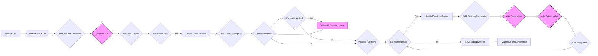

# Анализ Инструкции по Созданию Документации в Markdown

## 1. <алгоритм>

Инструкция описывает процесс генерации документации для Python-файлов в формате Markdown. Вот пошаговая блок-схема процесса:

1.  **Вход:** Python-файл.
    *   *Пример*: `my_module.py`

2.  **Инициализация:**
    *   Создание Markdown-файла для документации (имя файла  совпадает с исходным, но с расширением `.md`).
        *   *Пример*: `my_module.md`

3.  **Добавление заголовка и обзора:**
    *   Запись заголовка первого уровня ( `# Название модуля` ).
        *   *Пример*: `# my_module`
    *   Запись краткого описания модуля в раздел "Обзор" ( `## Обзор` ).
        *   *Пример*: `## Обзор \n\n Краткое описание назначения модуля.`

4.  **Генерация оглавления:**
    *   Создание раздела "Оглавление" (ссылки на основные разделы: классы, функции).
        *   *Пример*: `## Оглавление \n - [Классы](#классы)\n - [Функции](#функции)`

5.  **Обработка классов:**
    *   Для каждого класса:
        *   Создание раздела класса (`### ClassName`).
            *   *Пример*: `### MyClass`
        *   Запись описания класса (`**Описание**: Краткое описание класса.`).
        *   *Пример*: `**Описание**: Этот класс представляет собой пример`
        *   Для каждого метода класса:
            *   Запись описания метода (включая параметры, возвращаемые значения, вызываемые исключения).
             *  *Пример*:
                 ```markdown
                    **Методы**:\n
                    - `method_name`: Краткое описание метода.   \n
                    - `method_name`: Краткое описание метода.\n
                    **Параметры**:\n
                    - `param` (str): Описание параметра `param`.\n
                    - `param1` (Optional[str | dict | str], optional): Описание параметра `param1`. По умолчанию `None`.
                 ```

6.  **Обработка функций:**
    *   Для каждой функции:
        *   Создание раздела функции (`### function_name`).
            *   *Пример*: `### my_function`
        *   Запись описания функции (`**Описание**: Краткое описание функции.`).
        *   Запись параметров, их типов, описаний и значений по умолчанию.
           *   *Пример*:
                ```markdown
                    **Описание**: Краткое описание функции.\n
                    **Параметры**:\n
                    - `param` (str): Описание параметра `param`.\n
                    - `param1` (Optional[str | dict | str], optional): Описание параметра `param1`. По умолчанию `None`.
                 ```
        *   Запись возвращаемого значения и его типа.
             *  *Пример*:
                 ```markdown
                    **Возвращает**:\n
                    - `dict | None`: Описание возвращаемого значения.
                ```
        *   Запись возможных исключений.
             *  *Пример*:
                ```markdown
                   **Вызывает исключения**:\n
                    - `SomeError`: Описание ситуации, в которой возникает исключение `SomeError`.
                ```

7.  **Сохранение Markdown-файла:**
    *   Сохранение созданного Markdown-контента в `.md` файл.
        *   *Пример*: `my_module.md` с описанным выше содержимым.

8.  **Выход:** Markdown-документация для Python-файла.
    *   *Пример*: `my_module.md`

## 2. <mermaid>



**Описание:**
*  `A[Python File]` - **Входной файл Python**, для которого генерируется документация.
*  `B(Init Markdown File)` - **Инициализация** Markdown-файла.
* `C{Add Title and Overview}` - Добавление **заголовка** и **краткого описания** модуля.
* `D{Generate TOC}` - **Генерация** оглавления.
* `E{Process Classes}` -  **Обработка классов** из Python-файла.
* `F{For each Class}` - **Цикл** по каждому классу в файле.
* `G[Create Class Section]` - Создание **раздела для класса** в Markdown.
* `H{Add Class Description}` - Добавление **описания класса**.
* `I{Process Methods}` -  **Обработка методов** класса.
* `J{For each Method}` - **Цикл** по каждому методу в классе.
* `K[Add Method Description]` - Добавление **описания метода**, включая параметры, возвращаемые значения и исключения.
*  `L{Process Functions}` - **Обработка функций** из Python-файла.
* `M{For each Function}` - **Цикл** по каждой функции в файле.
* `N[Create Function Section]` - Создание **раздела для функции** в Markdown.
* `O{Add Function Description}` - Добавление **описания функции**.
* `P{Add Parameters}` - Добавление **информации о параметрах** функции.
* `Q{Add Return Value}` - Добавление **информации о возвращаемом значении** функции.
* `R{Add Exceptions}` - Добавление **информации о возможных исключениях**.
* `S[Save Markdown File]` - **Сохранение** Markdown-файла.
*  `T[Markdown Documentation]` - **Выходной Markdown-файл** с документацией.
 *  `classDef params fill:#f9f,stroke:#333,stroke-width:2px` -  определение стиля для классов `D`, `K`, `P`, `Q`.

**Зависимости:**

Диаграмма `mermaid` отображает последовательность шагов, которые зависят друг от друга. Например:

- Создание Markdown-файла зависит от наличия входного Python-файла.
- Добавление заголовка и обзора зависит от создания Markdown-файла.
- Обработка классов и функций зависит от добавления оглавления и т.д.
- Создание документации зависит от обработки всех классов и функций, и завершается сохранением файла.

## 3. <объяснение>

**Общее назначение:**
Инструкция определяет процесс генерации Markdown-документации из Python-файлов, обеспечивая структурированный и легко читаемый формат.

**Детали:**

- **Формат документации**: Документация должна быть в формате Markdown (`.md`) и соответствовать определённым правилам форматирования:
    - Наличие заголовков уровней 1-4.
    - Стандартизированное использование комментариев для классов и функций (docstring).
    - Использование `ex` вместо `e` в блоках `except`.
- **Оглавление (TOC)**:
    - Наличие оглавления в начале документации.
    - Ссылки на основные разделы документации модуля (классы, функции).
- **Форматирование:**
    - Использование правильного синтаксиса Markdown.
    - Разделы с описанием параметров, возвращаемых значений и вызываемых исключений для классов и функций.
- **Заголовки**: Использование последовательных заголовков (от # до ####).

**Содержание генерируемой документации:**

-   **Заголовок:** Название модуля.
-   **Обзор:** Краткое описание модуля.
-   **Оглавление:** Разделы: Классы и Функции.
-   **Классы:**
    -   Описание класса.
    -   Описание каждого метода класса, включая параметры и исключения.
-   **Функции:**
    -   Описание функции.
    -   Описание параметров функции, включая их типы и значения по умолчанию.
    -   Описание возвращаемого значения.
    -   Описание вызываемых исключений.

**Пример:**
Пример файла демонстрирует структуру и формат Markdown, который должен быть получен в результате процесса.

**Взаимосвязи:**

Данная инструкция является частью проекта, целью которого является автоматическая генерация документации.  Она напрямую влияет на формат и содержание генерируемой документации, которая будет использоваться разработчиками.

**Потенциальные ошибки и области для улучшения:**

-   **Недостаточная детализация типов параметров**: В инструкции используется `str | dict | str`, что может быть не совсем корректно. Лучше использовать `Union[str, dict]` или использовать аннотации типов более точно.
-  **Отсутствует автоматизация**: В инструкции не описано, как именно будет выполняться процесс генерации документации. Нужно добавить механизм парсинга Python-файлов и генерации Markdown на основе извлеченных данных.
-   **Обработка ошибок**: Не указано, как обрабатывать ситуации, когда не удается сгенерировать документацию или при разборе кода возникают ошибки.

**Цепочка взаимосвязей с другими частями проекта:**

1.  **Парсер Python-кода:** В данном проекте, должен быть парсер, который извлекает информацию из Python-файлов (классы, функции, параметры, docstring), чтобы сгенерировать документацию.
2.  **Модуль генерации Markdown**: Модуль, реализующий эту инструкцию, использует результаты работы парсера и создает Markdown-файлы.
3.  **Интерфейс пользователя/системы**: Пользователь или система запускает процесс генерации документации и получает готовые Markdown-файлы.
4.  **Система сборки документации**: В конечном итоге полученные Markdown-файлы могут быть использованы в более крупной системе для сборки полной документации проекта.

Эта инструкция служит подробным руководством для разработчика, которому поручено создать систему автоматизированной генерации Markdown-документации. Она определяет все аспекты структуры, формата и содержания генерируемой документации.