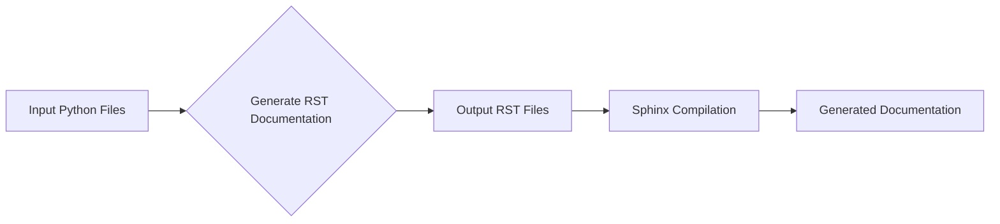

# Описание кода

**1. <input code>**

```
# INSTRUCTION

For each input Python file, create documentation in `rst` format for subsequent compilation with Sphinx. The documentation must meet the following requirements:

1. **Documentation Format**:
   - Use the `reStructuredText (rst)` standard.
   - Each file should begin with a header and a brief description of its contents.
   - For all classes and functions, use the following comment format:
     ```python
     def function(param: str, param1: Optional[str | dict | str] = None) -> dict | None:
         """
         Args:
             param (str): Description of the `param` parameter.
             param1 (Optional[str | dict | str], optional): Description of the `param1` parameter. Defaults to `None`.

         Returns:
             dict | None: Description of the return value. Returns a dictionary or `None`.

         Raises:
             SomeError: Description of the situation in which the `SomeError` exception is raised.
         """
     ```
   - Use `ex` instead of `e` in exception handling blocks.

2. **TOC Tree**:
   - Include sections in the documentation using `.. toctree::`.
   - The structure of the `index.rst` file should contain links to all module descriptions.

3. **Documentation Formatting**:
   - All class, function, and method headers should be documented using Sphinx directives (`autoclass`, `autofunction`).
   - Example:
     ```rst
     .. automodule:: module_name
         :members:
         :undoc-members:
         :show-inheritance:
     ```

4. **Section Headings**:
   - Use level 1 headers (`=`), level 2 headers (`-`), level 3 headers (`~`), and level 4 headers (`^`).

5. **Example File**:
   ```rst
   Module Name
   ===========\n\n   .. automodule:: module_name
       :members:
       :undoc-members:
       :show-inheritance:

   Functions
   ---------\n\n   .. autofunction:: module_name.function_name
   ```

Generate the corresponding documentation for each input Python file in `rst` format.
## Response format: `.md` (markdown)
# END OF INSTRUCTION
```

**2. <algorithm>**

Этот код не содержит алгоритма в виде исполняемого кода. Это инструкция по генерации документации в формате reStructuredText (rst) для Python-кода, используя Sphinx.  Алгоритм заключается в том, чтобы для каждого файла Python создать соответствующий файл rst с документацией, следуя заданным правилам форматирования, структурирования и использования Sphinx-директивы.  В алгоритме нет циклов или итераций. Он задаёт правила и примеры, следуя которым, пользователь может создать нужный формат документации.


**3. <mermaid>**



Эта диаграмма показывает, что входными данными являются файлы Python, из которых генерируется документация в формате RST, затем эта документация собирается с помощью Sphinx.


**4. <explanation>**

Этот код представляет собой инструкцию, описывающую, как генерировать документацию в формате reStructuredText (rst) для Python-кода, используя Sphinx.  Он не содержит собственно кода Python, а только инструкции, которые могут быть использованы как шаблон для создания `rst`-файлов.

* **Импорты:** Код не содержит импортов, т.к. это инструкция, а не выполняемый код.
* **Классы:** Инструкция описывает правила создания документации для классов (используя `autoclass`), но сам код классов отсутствует.
* **Функции:** Инструкция описывает правила для создания документации функций и методов (используя `autofunction`), но код функций отсутствует.
* **Переменные:** Инструкция не определяет переменных, так как это инструкция по написанию документации, а не выполнению программы.
* **Возможные ошибки или улучшения:** Инструкция не содержит кода, который может содержать ошибки. Единственным потенциальным источником ошибок является неправильное применение инструкций по генерации документации.  Инструкция могла бы быть улучшена, добавив примеры различных ситуаций (например, объявление исключения, использование декораторов), а также описание интеграции с системами контроля версий.

**Цепочка взаимосвязей:**

Инструкция предполагает наличие входных Python-файлов, для которых необходимо создать документацию. Выходная документация (RST-файлы) будет использоваться Sphinx для генерации окончательного документа.  Таким образом, инструкция связана с процессом документации и генерации документации для проекта, использующего Sphinx.